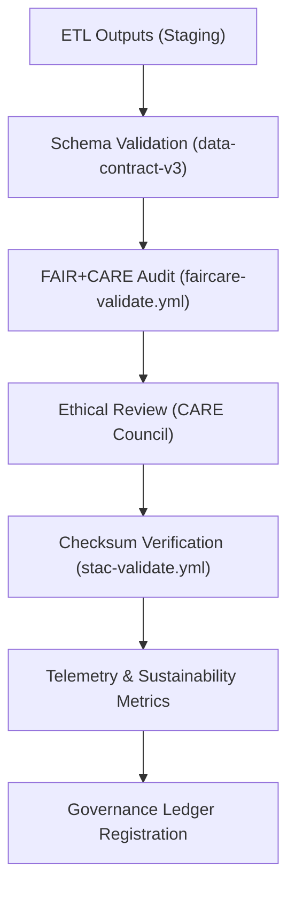

<div align="center">

# 🧾 **Kansas Frontier Matrix — Validation Reports for Archaeology Predictive Zones**  
`src/ai/models/archaeology/predictive-zones/data/validation/README.md`

**Purpose:**  
Provide a centralized documentation and governance reference for all **validation outputs, FAIR+CARE audits, and ISO 19115 metadata conformance checks** for the **Archaeology Predictive Zones** dataset pipeline.  
Ensures all derived datasets are **traceable, auditable, and ethically reviewed** under the **Master Coder Protocol v6.3** and **FAIR+CARE Council** oversight.

[](../../../../../../../docs/)
[](../../../../../../../LICENSE)
[](../../../../../../../docs/standards/faircare.md)
[](#)

</div>

---

## 📘 Overview

The **validation workspace** consolidates all reports from schema validation, FAIR+CARE audits, provenance verification, and checksum reconciliation for the Archaeology Predictive Zones model workflow.  
It provides a **verifiable trail** between:
- Input data → ETL outputs → processed artifacts → governance ledger entries.  
- Model artifacts → telemetry events → ethical certification.  

---

## 🗂️ Directory Layout

```plaintext
src/ai/models/archaeology/predictive-zones/data/validation/
├── README.md                          # This file — validation reports documentation
│
├── schema_validation.json              # Data contract and JSON Schema compliance
├── faircare_audit.json                 # FAIR+CARE compliance report
├── care_ethics_review.json             # Ethics and cultural governance review
├── provenance_verification.json        # Cross-check of transformation lineage
├── checksum_registry.json              # SHA-256 integrity registry for processed files
├── energy_metrics.json                 # Sustainability telemetry (ISO 50001)
└── validation_summary.json             # Aggregated validation + telemetry summary
```

---

## ⚙️ Validation Workflow



### Validation Scripts
- `src/pipelines/validation/schema_validator.py`  
- `src/pipelines/validation/faircare_audit.py`  
- `src/pipelines/validation/provenance_checker.py`  
- `src/pipelines/telemetry/export_telemetry.py`

---

## 🧩 Example: `validation_summary.json`

```json
{
  "dataset_id": "predictive_zones_v9.9.0",
  "total_records": 185420,
  "schema_valid": true,
  "faircare_compliance": "passed",
  "checksum_verified": true,
  "ethics_review_status": "approved",
  "energy_wh": 48.2,
  "carbon_gco2e": 21.3,
  "validation_timestamp": "2025-11-08T16:12:00Z",
  "auditor": "@kfm-validation",
  "governance_ref": "../../../../../../../docs/standards/faircare.md",
  "telemetry_ref": "../../../../../../../releases/v9.9.0/focus-telemetry.json"
}
```

---

## ⚖️ FAIR+CARE Governance Matrix

| Principle | Validation Test | Reference |
|------------|----------------|------------|
| **Findable** | Dataset ID verified and registered in STAC/DCAT catalogs. | `schema_validation.json` |
| **Accessible** | Metadata open; raw data gated by care_tag. | `faircare_audit.json` |
| **Interoperable** | GeoTIFF / GeoJSON / Parquet format compliance. | `schema_validation.json` |
| **Reusable** | SPDX license present; complete metadata and checksum. | `checksum_registry.json` |
| **CARE — Responsibility** | Governance audit trail retained for all datasets. | `provenance_verification.json` |
| **CARE — Ethics** | Sensitive or sacred site data masked prior to release. | `care_ethics_review.json` |

All validations logged under:
```
releases/v9.9.0/governance/ledger_snapshot.json
```

---

## 🧮 Sustainability Metrics (ISO 50001)

| Metric | Description | Example |
|--------|--------------|---------|
| `energy_wh` | Energy usage during validation run. | 11.6 |
| `duration_min` | Validation job duration (minutes). | 9.2 |
| `carbon_gco2e` | Estimated carbon emission (grams CO₂e). | 5.2 |
| `validation_jobs` | Number of validation modules executed. | 6 |
| `workflow_ref` | Workflow file associated with metrics. | `faircare-validate.yml` |

---

## 📊 Telemetry Integration

All validation and sustainability metrics merge into `focus-telemetry.json`.

| Event | Source | Output |
|--------|---------|--------|
| `validation_completed` | schema_validator.py | `validation_summary.json` |
| `audit_passed` | faircare_audit.py | `faircare_audit.json` |
| `checksum_verified` | provenance_checker.py | `checksum_registry.json` |
| `telemetry_recorded` | export_telemetry.py | `focus-telemetry.json` |

Telemetry schema:  
`schemas/telemetry/src-ai-models-archaeology-predictivezones-validation-v1.json`

---

## 🧾 Citation

```text
Kansas Frontier Matrix (2025). Validation Reports for Archaeology Predictive Zones (v9.9.0).
Consolidated FAIR+CARE audit, schema compliance, and sustainability validation framework ensuring provenance and governance alignment in archaeology AI data pipelines.
```

---

## 🕰️ Version History

| Version | Date | Author | Summary |
|---------:|------|--------|----------|
| v9.9.0 | 2025-11-08 | `@kfm-validation` | Created archaeology predictive zone validation documentation; added FAIR+CARE, telemetry, and governance integrations. |

---

<div align="center">

**Kansas Frontier Matrix**  
*Ethical Validation × FAIR+CARE Auditing × Sustainable Provenance*  
© 2025 Kansas Frontier Matrix · CC-BY 4.0 · Master Coder Protocol v6.3 · FAIR+CARE Certified · Diamond⁹ Ω / Crown∞Ω Ultimate Certified  

[Back to Predictive Zones Data](../README.md) · [Governance Charter](../../../../../../../docs/standards/governance/ROOT-GOVERNANCE.md)

</div>

