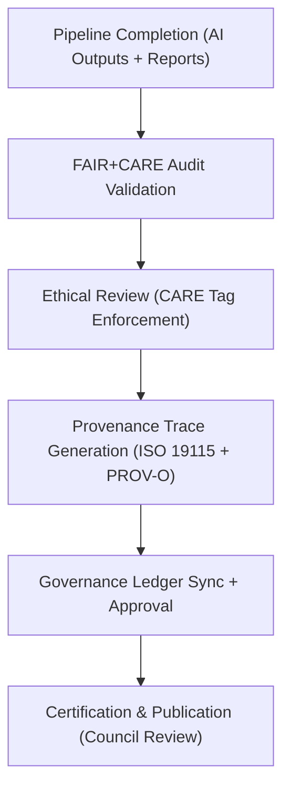

<div align="center">

# ⚖️ **Kansas Frontier Matrix — Archaeology Predictive Zones · Governance Records**  
`src/ai/models/archaeology/predictive-zones/governance/README.md`

**Purpose:**  
Provide the **central ethical and regulatory record** for all governance artifacts, council reviews, and audit certifications related to the **Archaeology Predictive Zones AI system**.  
This directory ensures full traceability of decisions, compliance with **FAIR+CARE principles**, and integration with **ISO 19115** and **ISO 50001** governance standards under **MCP-DL v6.3**.

[](../../../../../docs/)
[](../../../../../LICENSE)
[](../../../../../docs/standards/faircare.md)
[](#)

</div>

---

## 📘 Overview

The **Governance Directory** consolidates the documentation and records that ensure the **Predictive Zones AI project** meets FAIR+CARE ethical standards, sustainability targets, and provenance integrity.  
All validations, cultural ethics approvals, and audit results are registered here for Council review and long-term compliance tracking.

This repository integrates with:
- **Governance Ledger:** `releases/v9.9.0/governance/ledger_snapshot.json`  
- **Telemetry Ledger:** `releases/v9.9.0/focus-telemetry.json`  
- **FAIR+CARE Validation Pipelines:** `faircare-validate.yml`  
- **Ethics Council Records:** `ROOT-GOVERNANCE.md`

---

## 🗂️ Directory Layout

```plaintext
src/ai/models/archaeology/predictive-zones/governance/
├── README.md                             # This file — governance documentation
│
├── council_audit_summary.json            # FAIR+CARE Council audit records
├── ethics_review.json                    # Cultural and ethical review report
├── governance_validation.json            # Final approval and compliance summary
├── provenance_trace.json                 # PROV-O compliant data lineage record
├── ledger_sync_log.json                  # Synchronization events with governance ledger
└── care_masking_report.json              # Documentation of heritage data masking operations
```

---

## ⚙️ Governance Validation Workflow



### Pipeline Functions
- **Audit:** FAIR+CARE compliance verification and score assignment.  
- **Ethics Review:** CARE tag validation for cultural data sensitivity.  
- **Provenance:** Creation of a data lineage record linking datasets, models, and outputs.  
- **Ledger Sync:** Automated update of governance and telemetry ledgers.  
- **Council Approval:** Final decision archived and signed by FAIR+CARE Council.

---

## 🧩 Example: Governance Validation (`governance_validation.json`)

```json
{
  "governance_id": "gov_2025_11_08_008",
  "workflow": "predictive_zones_ai_governance_v9.9.0",
  "datasets_reviewed": 6,
  "models_certified": 2,
  "faircare_score": 98.9,
  "care_violations_detected": 0,
  "cultural_mask_applied": true,
  "reviewed_by": "@faircare-council",
  "approval_status": "certified",
  "energy_wh": 18.9,
  "carbon_gco2e": 9.4,
  "timestamp": "2025-11-08T19:58:00Z"
}
```

---

## ⚖️ FAIR+CARE Compliance Matrix

| Principle | Implementation | Verification |
|------------|----------------|--------------|
| **Findable** | Governance IDs linked to ledger UUIDs and provenance metadata. | `ledger_sync_log.json` |
| **Accessible** | Internal FAIR+CARE archives with open documentation summaries. | `ROOT-GOVERNANCE.md` |
| **Interoperable** | JSON-LD + PROV-O + ISO 19115 compliant schema. | `schema_validation.py` |
| **Reusable** | CC-BY 4.0 license; reproducible under MCP-DL v6.3. | SPDX Manifest |
| **CARE – Responsibility** | Monitors CARE tag enforcement and redaction logs. | `care_masking_report.json` |
| **CARE – Ethics** | Ensures cultural and Indigenous data integrity. | `ethics_review.json` |

---

## 🧮 Telemetry & Sustainability Metrics

| Metric | Description | Example |
|--------|-------------|----------|
| `audits_completed` | Number of governance audits finalized. | 3 |
| `care_violations_detected` | CARE tag violations found in validation. | 0 |
| `energy_wh` | Power consumption during governance review. | 18.9 |
| `carbon_gco2e` | Carbon footprint (ISO 50001). | 9.4 |
| `faircare_score` | Governance compliance percentage. | 98.9 |
| `status` | Certification outcome. | certified |

Telemetry data linked to:  
`releases/v9.9.0/focus-telemetry.json`  
Schema: `schemas/telemetry/src-ai-models-archaeology-predictivezones-governance-v1.json`

---

## 🔐 Provenance & Ledger Integration

- **Provenance Trace:** `provenance_trace.json` — full lineage from raw data to outputs.  
- **Governance Ledger:** `releases/v9.9.0/governance/ledger_snapshot.json` — Council-reviewed approval records.  
- **Audit Reports:** `council_audit_summary.json` — Quarterly compliance review logs.  

### Example Provenance Record
```json
{
  "artifact_id": "predictive_zones_ai_v9.9.0",
  "linked_inputs": [
    "data/raw/lidar_dem_1m_kansas.tif",
    "data/raw/cultural_sites_inventory.geojson"
  ],
  "linked_outputs": [
    "artifacts/models/predictive_zones_ai_v9.9.0.onnx",
    "outputs/maps/predictive_zones_overlay.geojson"
  ],
  "reviewed_by": "@faircare-council",
  "status": "approved",
  "timestamp": "2025-11-08T19:58:00Z"
}
```

---

## 🧾 Citation

```text
Kansas Frontier Matrix (2025). Archaeology Predictive Zones · Governance Records (v9.9.0).
Provides FAIR+CARE and ISO-compliant governance records ensuring ethical, sustainable, and transparent AI management for archaeological predictive systems in the Kansas Frontier Matrix.
```

---

## 🕰️ Version History

| Version | Date | Author | Summary |
|---------:|------|--------|----------|
| v9.9.0 | 2025-11-08 | `@kfm-governance` | Created governance records documentation; added FAIR+CARE integration, provenance logs, and telemetry schema references. |

---

<div align="center">

**Kansas Frontier Matrix**  
*Ethical AI Governance × FAIR+CARE Oversight × Sustainable Transparency*  
© 2025 Kansas Frontier Matrix · CC-BY 4.0 · Master Coder Protocol v6.3 · FAIR+CARE Certified · Diamond⁹ Ω / Crown∞Ω Ultimate Certified  

[Back to Predictive Zones Index](../README.md) · [Governance Charter](../../../../../docs/standards/governance/ROOT-GOVERNANCE.md)

</div>

