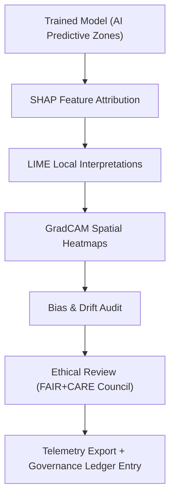

<div align="center">

# 🧩 **Kansas Frontier Matrix — Archaeology Predictive Zones · Explainability Notebooks**  
`src/ai/models/archaeology/predictive-zones/notebooks/explainability/README.md`

**Purpose:**  
Provide documentation for the **explainability and model interpretation notebooks** that analyze bias, drift, and feature attributions in the **Archaeology Predictive Zones AI models**.  
These notebooks advance **AI transparency**, **FAIR+CARE ethics**, and **sustainable interpretability** under **Master Coder Protocol v6.3** and **ISO 50001 telemetry tracking**.

[](../../../../../../../docs/)
[](../../../../../../../LICENSE)
[](../../../../../../../docs/standards/faircare.md)
[](#)

</div>

---

## 📘 Overview

The **Explainability Notebook Suite** enables transparent and ethical understanding of predictive modeling outcomes for archaeological site probability estimation.  
All explainability workflows operate under **FAIR+CARE governance**, ensuring cultural sensitivity, data integrity, and interpretability transparency.

### Core Functions
- Generate **SHAP**, **LIME**, and **GradCAM** visualizations.  
- Quantify **bias and drift** across cultural, environmental, and geographic features.  
- Report explainability telemetry and integrate outputs into the unified ledger.  
- Automate FAIR+CARE Council review for sensitive or potentially biased outputs.

---

## 🗂️ Directory Layout

```plaintext
src/ai/models/archaeology/predictive-zones/notebooks/explainability/
├── README.md                         # This file — explainability documentation
│
├── shap_summary_plot.ipynb           # SHAP-based feature attribution overview
├── lime_artifact_classification.ipynb# LIME explainability for artifact image models
├── gradcam_visualizer.ipynb          # Grad-CAM visualization for CNNs
├── bias_audit_report.ipynb           # Automated fairness & bias summary generation
└── explainability_summary.ipynb      # Aggregates results, prepares governance report
```

---

## ⚙️ Explainability Workflow



### Key Tools and Libraries
- 🧮 `SHAP`, `LIME`, `Captum` — Feature importance and model reasoning  
- 📊 `matplotlib`, `seaborn`, `folium`, `kepler.gl` — Visualization of model influence maps  
- ⚖️ `faircare_validator.py` — CARE tagging and audit trace generator  
- 🧭 `telemetry_logger.py` — Real-time explainability telemetry export  

---

## 🧠 FAIR+CARE Metadata Example

```json
{
  "notebook_id": "shap_summary_plot",
  "title": "SHAP Feature Attribution for Predictive Zones Model",
  "author": "@kfm-ai",
  "reviewed_by": "@faircare-council",
  "care_tag": "restricted",
  "ethical_status": "approved",
  "bias_score": 0.05,
  "explainability_stability": 0.92,
  "telemetry_ref": "../../../../../../../releases/v9.9.0/focus-telemetry.json"
}
```

> ⚠️ **CARE Tag Enforcement:** Outputs visualizing sensitive heritage zones must remain `restricted` and masked prior to export.

---

## 🧩 Explainability Outputs

| File | Description | Purpose |
|------|--------------|----------|
| `shap_summary.png` | Feature importance visualization (SHAP summary). | Quantify model feature contributions. |
| `lime_explanations.json` | Local instance interpretability explanations. | Identify model decisions for specific features. |
| `gradcam_maps.geojson` | Spatial GradCAM overlays. | Visualize CNN feature activation over geography. |
| `bias_audit.json` | Comprehensive bias metrics (Gini, KL divergence, fairness gap). | Evaluate model impartiality. |
| `explainability_report.md` | Combined interpretability summary. | FAIR+CARE Council review artifact. |

---

## ⚖️ Governance & Ethical Oversight

| Principle | Implementation | Validator |
|------------|----------------|------------|
| **Findable** | Explainability artifacts indexed with telemetry UUIDs. | `telemetry-export.yml` |
| **Accessible** | Restricted to FAIR+CARE reviewers for sensitive maps. | Governance ledger |
| **Interoperable** | JSON, PNG, and GeoJSON outputs standardized. | ISO 19115 metadata schema |
| **Reusable** | CC-BY 4.0 license for methods and visualization scripts. | MCP-DL v6.3 |
| **CARE – Responsibility** | Bias and interpretability results published transparently. | `bias_audit_report.ipynb` |
| **CARE – Ethics** | Cultural sensitivity checks for visual outputs. | `faircare-validate.yml` |

---

## 🧮 Telemetry Metrics

Telemetry logs generated from explainability notebooks track computational cost and interpretability stability.

| Metric | Description | Example |
|--------|-------------|---------|
| `runtime_sec` | Total runtime per notebook. | 792 |
| `energy_wh` | Energy consumption. | 28.7 |
| `carbon_gco2e` | CO₂ equivalent footprint. | 13.1 |
| `explainability_stability` | SHAP variance ratio. | 0.92 |
| `bias_score` | Mean feature bias index. | 0.05 |
| `restricted_visualizations` | Count of sensitive maps masked. | 3 |

All metrics are merged into `releases/v9.9.0/focus-telemetry.json`  
Schema: `schemas/telemetry/src-ai-models-archaeology-predictivezones-notebooks-explainability-v1.json`

---

## 🧭 Best Practices

- Use **consistent color scales** and label legends for SHAP and LIME charts.  
- Always **blur sensitive coordinates** before map visualization.  
- Include a **metadata header cell** with care_tag and provenance info.  
- Validate explainability outputs with `faircare-validate.yml` prior to presentation.  
- Upload all governance-approved results to `reports/explainability/`.

---

## 🧾 Citation

```text
Kansas Frontier Matrix (2025). Archaeology Predictive Zones — Explainability Notebooks (v9.9.0).
FAIR+CARE-compliant explainability notebook suite ensuring transparent, ethical, and sustainable AI interpretation for archaeological predictive modeling within the Kansas Frontier Matrix.
```

---

## 🕰️ Version History

| Version | Date | Author | Summary |
|---------:|------|--------|----------|
| v9.9.0 | 2025-11-08 | `@kfm-ai` | Created documentation for explainability notebooks; added FAIR+CARE compliance, telemetry integration, and governance matrix. |

---

<div align="center">

**Kansas Frontier Matrix**  
*Explainable AI × FAIR+CARE Governance × Ethical Archaeological Modeling*  
© 2025 Kansas Frontier Matrix · CC-BY 4.0 · Master Coder Protocol v6.3 · FAIR+CARE Certified · Diamond⁹ Ω / Crown∞Ω Ultimate Certified  

[Back to Notebooks Index](../README.md) · [Governance Charter](../../../../../../../docs/standards/governance/ROOT-GOVERNANCE.md)

</div>

