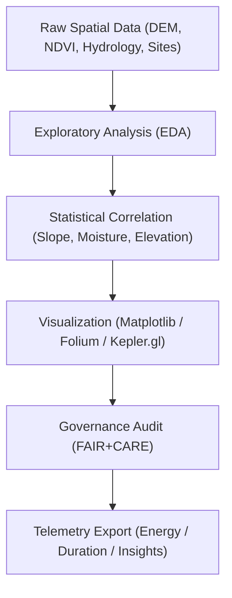

<div align="center">

# 🔍 **Kansas Frontier Matrix — Archaeology Predictive Zones · Exploratory Notebooks**  
`src/ai/models/archaeology/predictive-zones/notebooks/exploration/README.md`

**Purpose:**  
Provide documentation for **exploratory Jupyter notebooks** used in the early-stage data analysis, visualization, and feature correlation studies for **Archaeology Predictive Zones** in the Kansas Frontier Matrix (KFM).  
Supports **FAIR+CARE-compliant exploratory research**, reproducible workflows, and ethical geospatial data interpretation under **MCP-DL v6.3**.

[](../../../../../../../docs/)
[](../../../../../../../LICENSE)
[](../../../../../../../docs/standards/faircare.md)
[](#)

</div>

---

## 📘 Overview

The **Exploration Notebook Suite** enables researchers to perform **pre-modeling analyses** on raw and intermediate datasets used in the **Archaeology Predictive Zones** AI system.  
Each notebook aligns with FAIR+CARE, ISO 19115, and ISO 50001 for **data stewardship**, **accessibility**, and **sustainability tracking**.

These exploratory studies guide feature engineering, spatial correlation, and data ethics evaluation before full-scale model training.

---

## 🗂️ Directory Layout

```plaintext
src/ai/models/archaeology/predictive-zones/notebooks/exploration/
├── README.md                       # This file — exploration notebook index
│
├── lidar_terrain_analysis.ipynb     # Terrain morphology and slope visualization
├── hydrology_features.ipynb         # Stream network and floodplain proximity analysis
├── vegetation_ndvi_trends.ipynb     # NDVI temporal trend study (Sentinel-2 / MODIS)
├── cultural_sites_overlay.ipynb     # Overlay of cultural site inventory and environmental layers
└── exploration_summary.ipynb        # Aggregated data summaries, correlations, and metadata audit
```

---

## ⚙️ Exploratory Workflow



### Primary Tools:
- 🐍 **Python Libraries:** `pandas`, `geopandas`, `rasterio`, `folium`, `matplotlib`, `shapely`  
- 🧭 **GIS APIs:** `pyproj`, `GDAL`, `Kepler.gl`  
- ⚖️ **Governance Modules:** FAIR+CARE audit hooks (`faircare_validator.py`, `telemetry_logger.py`)

---

## 🧩 FAIR+CARE Metadata Structure

Each notebook must contain a metadata header cell defining its provenance and ethics compliance:

```json
{
  "notebook_id": "lidar_terrain_analysis",
  "title": "LIDAR Terrain Analysis for Archaeological Predictive Zones",
  "version": "v9.9.0",
  "author": "@kfm-research",
  "reviewed_by": "@faircare-council",
  "care_tag": "restricted",
  "ethical_status": "approved",
  "telemetry_ref": "../../../../../../../releases/v9.9.0/focus-telemetry.json"
}
```

> ⚠️ All notebooks that visualize sensitive or heritage data must be marked `care_tag: restricted` and approved by the **FAIR+CARE Council**.

---

## 🧮 Example: LIDAR Terrain Analysis Workflow

```python
import rasterio
import matplotlib.pyplot as plt
from rasterio.plot import show
from shapely.geometry import box
import geopandas as gpd

dem_path = "../../../data/raw/lidar_dem_1m_kansas.tif"
with rasterio.open(dem_path) as dem:
    fig, ax = plt.subplots(figsize=(10, 6))
    show(dem, ax=ax, cmap="terrain", title="LIDAR DEM (Kansas, 1m)")
    plt.show()
```

- Computes slope and aspect from DEM layers.
- Exports results as GeoTIFF and Parquet feature slices.
- Records run telemetry (`runtime_sec`, `energy_wh`, `carbon_gco2e`) in the unified ledger.

---

## 📊 Telemetry Metrics

Telemetry fields logged from exploratory notebooks:

| Metric | Description | Example |
|--------|-------------|----------|
| `runtime_sec` | Total notebook runtime. | 489 |
| `energy_wh` | Estimated power usage. | 14.8 |
| `carbon_gco2e` | CO₂ equivalent emissions. | 6.9 |
| `cells_executed` | Count of executed code cells. | 102 |
| `visualizations_created` | Number of map/chart outputs. | 12 |
| `care_tag` | Ethical classification (public/restricted). | restricted |

Telemetry schema reference:  
`scripts/telemetry/src-ai-models-archaeology-predictivezones-notebooks-exploration-v1.json`

---

## ⚖️ FAIR+CARE & Accessibility Compliance

| Aspect | Standard | Enforcement |
|--------|-----------|--------------|
| **Accessibility** | WCAG 2.1 AA — readable plots, colorblind-friendly palettes. | Automated linter checks |
| **Ethics** | Heritage-sensitive geometries blurred ≥ 1 km. | Council review |
| **Reproducibility** | Deterministic seeds and environment metadata recorded. | MCP-DL standard |
| **Governance** | Metadata registered in ledger for every executed notebook. | FAIR+CARE workflow integration |

---

## 🧭 Best Practices

- Use **relative data paths** within project hierarchy.  
- Log provenance for all visualizations.  
- Minimize computational overhead; prefer lightweight analysis.  
- Tag sensitive outputs `restricted` in the notebook header.  
- Always export metadata to telemetry after each major analysis run.

---

## 🧾 Citation

```text
Kansas Frontier Matrix (2025). Archaeology Predictive Zones — Exploratory Notebooks (v9.9.0).
FAIR+CARE-compliant exploratory Jupyter notebooks supporting geospatial feature analysis and ethical archaeological data discovery within the Kansas Frontier Matrix.
```

---

## 🕰️ Version History

| Version | Date | Author | Summary |
|---------:|------|--------|----------|
| v9.9.0 | 2025-11-08 | `@kfm-research` | Created documentation for exploratory notebooks; added FAIR+CARE metadata and telemetry integration. |

---

<div align="center">

**Kansas Frontier Matrix**  
*Exploratory Research × FAIR+CARE Ethics × Sustainable Data Science*  
© 2025 Kansas Frontier Matrix · CC-BY 4.0 · Master Coder Protocol v6.3 · FAIR+CARE Certified · Diamond⁹ Ω / Crown∞Ω Ultimate Certified  

[Back to Notebooks Index](../README.md) · [Governance Charter](../../../../../../../docs/standards/governance/ROOT-GOVERNANCE.md)

</div>

