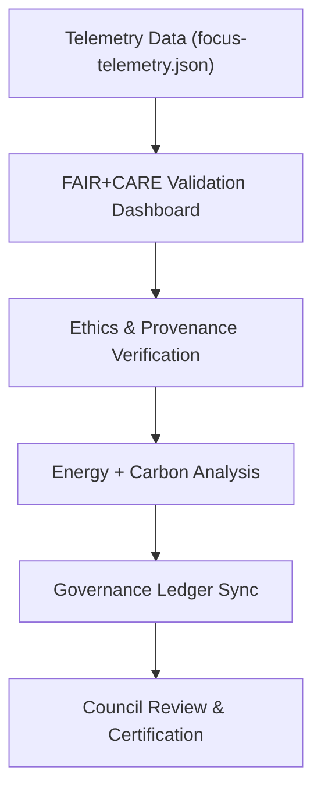

<div align="center">

# ⚖️ **Kansas Frontier Matrix — Archaeology Predictive Zones · Governance Notebooks**  
`src/ai/models/archaeology/predictive-zones/notebooks/governance/README.md`

**Purpose:**  
Document the **FAIR+CARE governance, audit, and sustainability notebooks** that oversee the Archaeology Predictive Zones AI subsystem.  
These notebooks provide transparent governance dashboards, sustainability analytics, and audit-ready reports for **FAIR+CARE Council review** and **ISO 50001 sustainability validation**.

[](../../../../../../../docs/)
[](../../../../../../../LICENSE)
[](../../../../../../../docs/standards/faircare.md)
[](#)

</div>

---

## 📘 Overview

The **Governance Notebook Suite** ensures that all Archaeology Predictive Zone models and datasets meet the ethical, legal, and sustainability requirements established by the **FAIR+CARE Council**.  
It enables Council reviewers and data stewards to perform oversight of **data ethics**, **telemetry verification**, and **provenance auditing** through reproducible notebooks.

### Core Objectives
- Automate FAIR+CARE audits with reproducible, human-readable notebooks.  
- Visualize energy usage, carbon footprint, and sustainability telemetry.  
- Verify provenance and data contracts for AI training pipelines.  
- Prepare compliance evidence for quarterly governance reviews.  

---

## 🗂️ Directory Layout

```plaintext
src/ai/models/archaeology/predictive-zones/notebooks/governance/
├── README.md                              # This file — governance notebooks index
│
├── faircare_validation_dashboard.ipynb    # FAIR+CARE audit dashboard with ethics tagging
├── energy_telemetry_report.ipynb          # ISO 50001 energy + sustainability visualization
├── provenance_trace_viewer.ipynb          # PROV-O provenance graph visualization
├── governance_audit_summary.ipynb         # Quarterly audit summary generator
└── ledger_snapshot_analysis.ipynb         # Governance ledger integrity validation tool
```

---

## ⚙️ Governance Workflow



### Notebooks & Functions

| Notebook | Function | Output |
|-----------|-----------|--------|
| `faircare_validation_dashboard.ipynb` | Displays FAIR+CARE compliance, violations, and care_tags. | `reports/faircare_audit.html` |
| `energy_telemetry_report.ipynb` | Tracks ISO 50001 energy and CO₂ metrics from telemetry. | `reports/energy_summary.json` |
| `provenance_trace_viewer.ipynb` | Visualizes dataset lineage using PROV-O graph schema. | `reports/provenance_graph.png` |
| `ledger_snapshot_analysis.ipynb` | Compares governance ledger entries for drift or mismatch. | `reports/ledger_diff.json` |
| `governance_audit_summary.ipynb` | Compiles quarterly FAIR+CARE governance metrics. | `reports/governance_audit_summary.json` |

---

## 🧩 FAIR+CARE & Governance Metadata

```json
{
  "notebook_id": "faircare_validation_dashboard",
  "title": "FAIR+CARE Governance Validation Dashboard",
  "author": "@kfm-governance",
  "reviewed_by": "@faircare-council",
  "care_tag": "public",
  "ethical_status": "approved",
  "validation_period": "2025-Q4",
  "telemetry_ref": "../../../../../../../releases/v9.9.0/focus-telemetry.json"
}
```

---

## ⚖️ Governance Metrics Tracked

| Metric | Description | Source |
|--------|--------------|---------|
| `datasets_reviewed` | Number of datasets validated under FAIR+CARE. | `faircare_validation_dashboard.ipynb` |
| `violations_detected` | Total number of CARE or schema violations. | `faircare_validation_dashboard.ipynb` |
| `energy_wh` | Energy usage across AI + data pipelines. | `energy_telemetry_report.ipynb` |
| `carbon_gco2e` | Carbon footprint for workflow executions. | `energy_telemetry_report.ipynb` |
| `ledger_entries_validated` | Governance ledger entries verified against reports. | `ledger_snapshot_analysis.ipynb` |
| `audit_certification_status` | Council approval result. | `governance_audit_summary.ipynb` |

---

## 🧮 Telemetry Integration

Governance notebooks use telemetry data to assess sustainability and compliance:

| Field | Description | Example |
|--------|-------------|----------|
| `event_type` | Workflow or model event (train, validate, explain). | `"ai_train"` |
| `energy_wh` | Power usage per workflow. | 26.4 |
| `carbon_gco2e` | Equivalent carbon emissions. | 12.9 |
| `faircare_score` | FAIR+CARE compliance percentage. | 98.7 |
| `audit_result` | Outcome of validation audit. | `"passed"` |

Telemetry schema:  
`schemas/telemetry/src-ai-models-archaeology-predictivezones-notebooks-governance-v1.json`

---

## 🧠 Governance Standards Alignment

| Standard | Objective | Reference |
|-----------|------------|------------|
| **FAIR+CARE** | Enforce ethical, transparent governance for all AI data workflows. | `docs/standards/faircare.md` |
| **ISO 50001** | Measure sustainability and energy performance. | `docs/standards/telemetry_standards.md` |
| **MCP-DL v6.3** | Ensure reproducibility and data contract consistency. | `docs/standards/data-contracts.md` |
| **ISO 19115** | Maintain geospatial metadata for audits. | `docs/architecture/data-architecture.md` |
| **SPDX 2.3** | Manage open license integrity through SBOMs. | `releases/v9.9.0/sbom.spdx.json` |

---

## 🧾 Citation

```text
Kansas Frontier Matrix (2025). Archaeology Predictive Zones — Governance Notebooks (v9.9.0).
Provides FAIR+CARE-compliant notebooks for ethics, provenance, and sustainability governance of archaeology predictive AI models in the Kansas Frontier Matrix ecosystem.
```

---

## 🕰️ Version History

| Version | Date | Author | Summary |
|---------:|------|--------|----------|
| v9.9.0 | 2025-11-08 | `@kfm-governance` | Added governance notebooks documentation; linked telemetry, FAIR+CARE audit dashboards, and ledger validation processes. |

---

<div align="center">

**Kansas Frontier Matrix**  
*Governed AI × FAIR+CARE Oversight × Sustainable Accountability*  
© 2025 Kansas Frontier Matrix · CC-BY 4.0 · Master Coder Protocol v6.3 · FAIR+CARE Certified · Diamond⁹ Ω / Crown∞Ω Ultimate Certified  

[Back to Notebooks Index](../README.md) · [Governance Charter](../../../../../../../docs/standards/governance/ROOT-GOVERNANCE.md)

</div>

