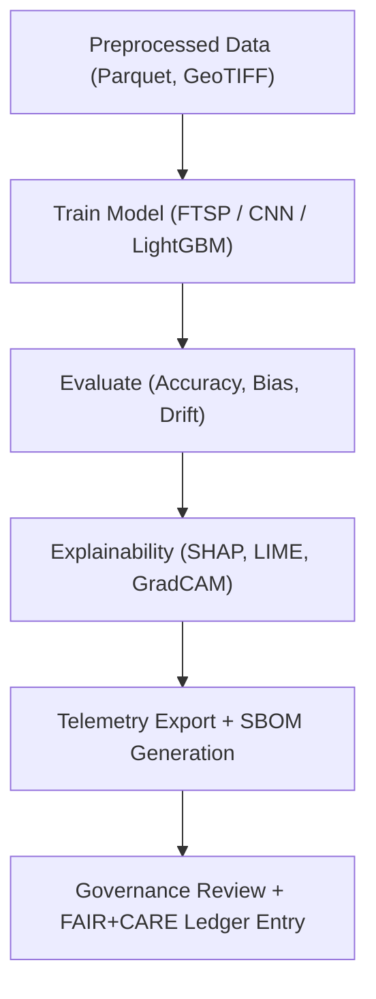

<div align="center">

# 🧠 **Kansas Frontier Matrix — Archaeology Predictive Zones · Modeling Notebooks**  
`src/ai/models/archaeology/predictive-zones/notebooks/modeling/README.md`

**Purpose:**  
Document the **model training, evaluation, and predictive experimentation notebooks** that power the **Archaeology Predictive Zones** AI system.  
These notebooks are the core of the **Focus Transformer for Spatial Prediction (FTSP)** workflow — combining tabular, raster, and cultural data under **FAIR+CARE governance**, **MCP-DL v6.3 reproducibility**, and **ISO 50001 sustainability**.

[](../../../../../../../docs/)
[](../../../../../../../LICENSE)
[](../../../../../../../docs/standards/faircare.md)
[](#)

</div>

---

## 📘 Overview

The **Modeling Notebook Suite** forms the experimental and production-grade backbone of the Archaeology Predictive Zones AI subsystem.  
It supports **model design, hyperparameter optimization, training reproducibility, evaluation explainability**, and **telemetry emission** for each trained model.

### Primary Goals
- Train and validate predictive models using ethically filtered data.  
- Log all parameters, provenance, and energy metrics to `focus-telemetry.json`.  
- Support explainability through **SHAP/LIME** integration.  
- Automate export of checkpoints and SBOM manifests for governance and SLSA verification.  
- Enable FAIR+CARE audit reproducibility under **Master Coder Protocol**.

---

## 🗂️ Directory Layout

```plaintext
src/ai/models/archaeology/predictive-zones/notebooks/modeling/
├── README.md                         # This file — documentation for modeling notebooks
│
├── predictive_zones_train.ipynb       # Model training and tuning for site probability prediction
├── predictive_zones_eval.ipynb        # Evaluation notebook (metrics, drift, accuracy)
├── feature_importance_analysis.ipynb  # SHAP/LIME feature attribution and bias auditing
├── hyperparameter_optimization.ipynb  # Bayesian optimization and reproducibility checks
├── model_registry_update.ipynb        # Registers new models and updates telemetry
└── export_pipeline_summary.ipynb      # Generates model card + governance compliance pack
```

---

## ⚙️ Modeling Workflow



**Frameworks Used:**  
- 🧠 **PyTorch / Lightning / HuggingFace Transformers**  
- 📊 **LightGBM / Scikit-learn / XGBoost**  
- 🧩 **SHAP / LIME / Captum**  
- 🌍 **GeoPandas / Rasterio / NumPy / Pandas**  
- 🔒 **FAIR+CARE Validator + Telemetry SDK**

---

## 🧩 FAIR+CARE Metadata Example

```json
{
  "notebook_id": "predictive_zones_train",
  "title": "Training Archaeology Predictive Zones Model",
  "model_version": "v9.9.0",
  "author": "@kfm-ai",
  "reviewed_by": "@faircare-council",
  "care_tag": "restricted",
  "ethical_status": "approved",
  "dataset_ref": "../../../../data/processed/feature_stack.parquet",
  "telemetry_ref": "../../../../../../../releases/v9.9.0/focus-telemetry.json"
}
```

---

## 🧮 Example Notebook Snippet

```python
from lightgbm import LGBMClassifier
import pandas as pd
from sklearn.metrics import roc_auc_score
import json

df = pd.read_parquet("../../../../data/processed/feature_stack.parquet")
X = df.drop(columns=["target"])
y = df["target"]

model = LGBMClassifier(
    n_estimators=500,
    learning_rate=0.05,
    num_leaves=64,
    subsample=0.8,
    random_state=42
)
model.fit(X, y)

auc = roc_auc_score(y, model.predict_proba(X)[:, 1])
telemetry = {"auc": auc, "records": len(df), "energy_wh": 22.4}
with open("../../../../../../../releases/v9.9.0/focus-telemetry.json", "a") as f:
    json.dump(telemetry, f)
```

---

## ⚖️ FAIR+CARE & ISO Compliance Matrix

| Principle | Implementation | Enforcement |
|------------|----------------|--------------|
| **Findable** | Registered models in `registry.json` and telemetry ledger. | `ai-train.yml` |
| **Accessible** | FAIR+CARE approved models only published to Neo4j registry. | Governance ledger |
| **Interoperable** | JSON / Parquet / STAC metadata formats. | Data contracts |
| **Reusable** | Versioned model weights and configs under SPDX license. | MCP-DL |
| **CARE — Responsibility** | Drift and bias metrics logged in telemetry. | FAIR+CARE Council |
| **CARE — Ethics** | Restricted data usage approved by cultural authorities. | `care_ethics_review.json` |

---

## 📊 Telemetry Metrics

All modeling notebooks emit telemetry events conforming to sustainability and governance standards.

| Metric | Description | Example |
|--------|--------------|---------|
| `train_time_min` | Duration of model training. | 340 |
| `energy_wh` | Power consumed during model run. | 1423 |
| `bias_score` | Mean model bias index. | 0.04 |
| `drift_flag` | True if dataset drift detected. | false |
| `validation_accuracy` | Accuracy (%) of validation dataset. | 94.2 |
| `carbon_gco2e` | Estimated CO₂ equivalent. | 650.2 |

Telemetry logged under:  
`releases/v9.9.0/focus-telemetry.json`  
Schema: `schemas/telemetry/src-ai-models-archaeology-predictivezones-notebooks-modeling-v1.json`

---

## 🔐 Governance Integration

- Each model training session is **attested** using **SLSA provenance**.  
- SBOM manifests created via **Syft** and attached to model release.  
- `faircare-validate.yml` ensures data inputs conform to ethical contracts.  
- Council reviews and signs off before public model exposure.  
- Outputs recorded in `releases/v9.9.0/governance/ledger_snapshot.json`.

---

## 🧾 Citation

```text
Kansas Frontier Matrix (2025). Archaeology Predictive Zones — Modeling Notebooks (v9.9.0).
FAIR+CARE and MCP-DL compliant modeling notebooks for ethical and sustainable AI training, evaluation, and explainability of archaeological predictive systems.
```

---

## 🕰️ Version History

| Version | Date | Author | Summary |
|---------:|------|--------|----------|
| v9.9.0 | 2025-11-08 | `@kfm-ai` | Created documentation for modeling notebooks; integrated FAIR+CARE governance, telemetry schema, and sustainability tracking. |

---

<div align="center">

**Kansas Frontier Matrix**  
*Predictive Intelligence × FAIR+CARE Ethics × Sustainable Archaeological Modeling*  
© 2025 Kansas Frontier Matrix · MIT · Master Coder Protocol v6.3 · FAIR+CARE Certified · Diamond⁹ Ω / Crown∞Ω Ultimate Certified  

[Back to Notebooks Index](../README.md) · [Governance Charter](../../../../../../../docs/standards/governance/ROOT-GOVERNANCE.md)

</div>

