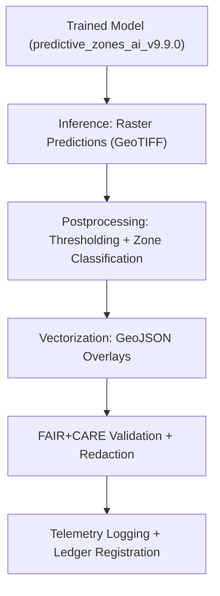

<div align="center">

# 🌐 **Kansas Frontier Matrix — Archaeology Predictive Zones · Outputs Directory**  
`src/ai/models/archaeology/predictive-zones/outputs/README.md`

**Purpose:**  
Document and organize all **exported outputs, probability maps, vector overlays, and governance-approved reports** generated by the **Archaeology Predictive Zones AI system**.  
These files provide FAIR+CARE-certified and ISO-compliant predictive results for **Focus Mode**, research dashboards, and governance auditing under **MCP-DL v6.3**.

[](../../../../../docs/)
[](../../../../../LICENSE)
[](../../../../../docs/standards/faircare.md)
[](#)

</div>

---

## 📘 Overview

The **Outputs Directory** contains all predictive results, including **geospatial raster maps, vector overlays, and summary tables** representing areas of archaeological potential.  
Each output is validated, masked, and ethically approved in alignment with **FAIR+CARE**, **ISO 19115**, and **ISO 50001** governance standards.  

Outputs from this directory are used in:
- 🧭 **Focus Mode visualization** (MapLibre and Cesium UI layers)  
- 📊 **Governance validation dashboards**  
- ⚖️ **FAIR+CARE Council reports**  
- 🌱 **Sustainability and telemetry analytics**

---

## 🗂️ Directory Layout

```plaintext
src/ai/models/archaeology/predictive-zones/outputs/
├── README.md                            # This file — outputs documentation
│
├── maps/                                # Raster and vector map outputs
│   ├── predictive_zones_probability.tif
│   ├── predictive_zones_overlay.geojson
│   └── restricted_zones_mask.geojson
│
├── analytics/                           # Derived tabular and statistical summaries
│   ├── model_predictions.csv
│   ├── summary_statistics.json
│   └── feature_contributions.json
│
├── governance/                          # Council-reviewed metadata and audits
│   ├── output_metadata.json
│   ├── faircare_audit.json
│   └── checksum_registry.json
│
└── visualization/                       # Ready-to-load map layers and charts
    ├── predictive_zones_map_style.json
    ├── ndvi_overlay_preview.png
    └── focusmode_layer_manifest.json
```

---

## ⚙️ Output Generation Workflow



### Pipeline Steps
1. **Inference:** Generates raster probabilities from trained AI model.  
2. **Postprocessing:** Normalizes probabilities and applies geospatial thresholds.  
3. **Vectorization:** Converts raster tiles into GeoJSON zone polygons.  
4. **Governance Validation:** Verifies ethics and CARE mask compliance.  
5. **Telemetry Merge:** Logs performance, bias, and sustainability metrics.  

---

## 🧩 Example Output Metadata (`governance/output_metadata.json`)

```json
{
  "output_id": "predictive_zones_output_v9.9.0",
  "model_ref": "predictive_zones_ai_v9.9.0",
  "formats": ["GeoTIFF", "GeoJSON", "CSV"],
  "extent": {
    "spatial": { "bbox": [-102.1, 36.9, -94.6, 40.1] },
    "temporal": { "interval": ["1850-01-01T00:00:00Z", "2025-11-08T00:00:00Z"] }
  },
  "records": 12418,
  "restricted_zones": 217,
  "reviewed_by": "@faircare-council",
  "faircare_compliance": "certified",
  "checksum_sha256": "sha256:b45cf9d17d89a4a9f7b6b3d2ac1183e4e...",
  "telemetry_ref": "../../../../../releases/v9.9.0/focus-telemetry.json"
}
```

---

## ⚖️ FAIR+CARE Governance Matrix

| Principle | Implementation | Verification |
|------------|----------------|---------------|
| **Findable** | Outputs registered in STAC/DCAT metadata catalog. | `stac-validate.yml` |
| **Accessible** | Public probability maps; restricted cultural overlays. | `faircare-validate.yml` |
| **Interoperable** | GeoTIFF/GeoJSON/CSV formats following OGC + ISO standards. | ISO 19115 Validation |
| **Reusable** | CC-BY 4.0 license; provenance and checksum included. | SPDX Manifest |
| **CARE – Responsibility** | Ensures redaction of cultural data prior to release. | Governance Ledger |
| **CARE – Ethics** | Indigenous heritage layers masked or generalized. | FAIR+CARE Council Audit |

---

## 📊 Sustainability & Telemetry Metrics

| Metric | Description | Example |
|--------|-------------|----------|
| `inference_runtime_sec` | Duration of AI inference. | 520 |
| `energy_wh` | Energy used during inference and map generation. | 27.8 |
| `carbon_gco2e` | CO₂ emissions equivalent. | 12.4 |
| `faircare_score` | FAIR+CARE compliance percentage. | 98.7 |
| `restricted_zones` | Count of heritage-sensitive areas masked. | 217 |
| `governance_status` | Ethics approval outcome. | approved |

Telemetry data appended to:  
`releases/v9.9.0/focus-telemetry.json`  
Schema: `schemas/telemetry/src-ai-models-archaeology-predictivezones-outputs-v1.json`

---

## 🔐 Provenance & Governance Links

All outputs link to:
- **Model Manifest:** `../artifacts/models/model_manifest.json`  
- **Checksum Registry:** `../artifacts/governance/checksum_registry.json`  
- **Governance Ledger:** `releases/v9.9.0/governance/ledger_snapshot.json`  
- **Telemetry Ledger:** `releases/v9.9.0/focus-telemetry.json`  

Example FAIR+CARE Ledger Entry:
```json
{
  "entry_id": "ledger_2025q4_output_zones",
  "reviewed_by": "@faircare-council",
  "ethics_status": "certified",
  "timestamp": "2025-11-08T19:10:00Z"
}
```

---

## 🧾 Citation

```text
Kansas Frontier Matrix (2025). Archaeology Predictive Zones · Outputs Directory (v9.9.0).
FAIR+CARE-governed predictive outputs enabling transparent and sustainable archaeological modeling and visualization under ISO 19115 and MCP-DL v6.3.
```

---

## 🕰️ Version History

| Version | Date | Author | Summary |
|---------:|------|--------|----------|
| v9.9.0 | 2025-11-08 | `@kfm-ai` | Created output directory documentation; included governance metadata, telemetry schema, and FAIR+CARE validation details. |

---

<div align="center">

**Kansas Frontier Matrix**  
*Predictive Mapping × FAIR+CARE Governance × Sustainable Intelligence*  
© 2025 Kansas Frontier Matrix · CC-BY 4.0 · Master Coder Protocol v6.3 · FAIR+CARE Certified · Diamond⁹ Ω / Crown∞Ω Ultimate Certified  

[Back to Predictive Zones Suite](../README.md) · [Governance Charter](../../../../../docs/standards/governance/ROOT-GOVERNANCE.md)

</div>

