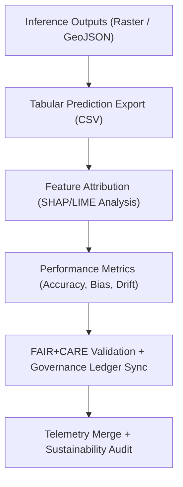

<div align="center">

# 📊 **Kansas Frontier Matrix — Archaeology Predictive Zones · Analytics Outputs**  
`src/ai/models/archaeology/predictive-zones/outputs/analytics/README.md`

**Purpose:**  
Document the **quantitative and statistical outputs** derived from the **Archaeology Predictive Zones AI model**, including probability tables, feature analyses, and predictive summaries.  
These analytics support explainable, FAIR+CARE-aligned decision-making, ensuring **transparency, reproducibility, and ethical accountability** under **MCP-DL v6.3**.

[](../../../../../../docs/)
[](../../../../../../LICENSE)
[](../../../../../../docs/standards/faircare.md)
[](#)

</div>

---

## 📘 Overview

The **Analytics Outputs Directory** hosts processed datasets and statistical reports generated after model inference.  
These files summarize **model accuracy**, **feature importance**, **bias detection**, and **predictive coverage**, while enforcing ethical masking rules for sensitive heritage data.

Outputs here are reviewed by the **FAIR+CARE Council** and linked to the official **Governance Ledger** for transparency and reproducibility.

---

## 🗂️ Directory Layout

```plaintext
src/ai/models/archaeology/predictive-zones/outputs/analytics/
├── README.md                          # This file — analytics documentation
│
├── model_predictions.csv              # Tabular predictions for each spatial grid cell
├── summary_statistics.json            # Aggregate model performance and prediction metrics
├── feature_contributions.json         # SHAP and LIME feature importance data
├── bias_metrics.json                  # Bias and drift analysis summary
└── validation_results.json            # Validation set performance and explainability audit
```

---

## ⚙️ Analytics Workflow



### Steps:
1. **Prediction Export:** Converts spatial predictions to tabular format.  
2. **Feature Analysis:** Quantifies variable importance and sensitivity.  
3. **Bias Detection:** Evaluates disparities across feature categories.  
4. **Validation:** Confirms reproducibility and governance compliance.  
5. **Telemetry:** Aggregates metrics for sustainability reporting.  

---

## 🧩 Example: Summary Statistics (`summary_statistics.json`)

```json
{
  "model_id": "predictive_zones_ai_v9.9.0",
  "version": "v9.9.0",
  "records_evaluated": 185420,
  "mean_probability": 0.342,
  "max_probability": 0.985,
  "accuracy": 0.942,
  "f1_score": 0.912,
  "auc_score": 0.946,
  "bias_score": 0.05,
  "faircare_compliance": "certified",
  "reviewed_by": "@faircare-council",
  "telemetry_ref": "../../../../../../releases/v9.9.0/focus-telemetry.json"
}
```

---

## ⚖️ FAIR+CARE Governance Integration

| Principle | Implementation | Validator |
|------------|----------------|------------|
| **Findable** | Analytics results registered with unique model ID and run UUID. | `stac-validate.yml` |
| **Accessible** | CSV/JSON outputs published under CC-BY; restricted where applicable. | FAIR+CARE Council |
| **Interoperable** | ISO 19115 and DCAT metadata compatible formats. | `schema_validation.py` |
| **Reusable** | Machine-readable outputs with telemetry references. | SPDX Manifest |
| **CARE – Responsibility** | Cultural sensitivity maintained during analytics processing. | `faircare-validate.yml` |
| **CARE – Ethics** | Bias metrics disclosed to governance ledger. | `governance_validation.json` |

---

## 🧮 Core Metrics

| Metric | Description | Example |
|--------|-------------|----------|
| `records_evaluated` | Count of analyzed prediction instances. | 185,420 |
| `accuracy` | Model accuracy on validation/test data. | 0.942 |
| `f1_score` | Harmonic mean of precision and recall. | 0.912 |
| `auc_score` | ROC AUC — discrimination power of the model. | 0.946 |
| `bias_score` | Average bias detected across features. | 0.05 |
| `energy_wh` | Power consumed during analytics computation. | 28.6 |
| `carbon_gco2e` | Carbon emissions equivalent. | 12.8 |

Telemetry metrics appended to:  
`releases/v9.9.0/focus-telemetry.json`  
Schema: `schemas/telemetry/src-ai-models-archaeology-predictivezones-outputs-analytics-v1.json`

---

## 🔍 Example: Feature Contributions (`feature_contributions.json`)

```json
{
  "top_features": [
    { "feature": "slope", "importance": 0.38 },
    { "feature": "distance_to_water", "importance": 0.22 },
    { "feature": "soil_moisture", "importance": 0.15 },
    { "feature": "vegetation_index", "importance": 0.11 }
  ],
  "explainability_stability": 0.93,
  "method": "SHAP",
  "energy_wh": 15.2,
  "reviewed_by": "@faircare-council"
}
```

---

## 🔐 Provenance & Governance Trace

Each analytics output references:
- **Model Manifest:** `../../artifacts/models/model_manifest.json`  
- **Governance Ledger:** `releases/v9.9.0/governance/ledger_snapshot.json`  
- **Checksum Registry:** `../../artifacts/governance/checksum_registry.json`  

### Example Ledger Record
```json
{
  "entry_id": "ledger_2025q4_analytics_outputs",
  "auditor": "@kfm-governance",
  "status": "approved",
  "timestamp": "2025-11-08T19:15:00Z"
}
```

---

## 🧾 Citation

```text
Kansas Frontier Matrix (2025). Archaeology Predictive Zones · Analytics Outputs (v9.9.0).
Provides FAIR+CARE-compliant statistical outputs for transparency, bias detection, and explainability in archaeology predictive AI modeling within the Kansas Frontier Matrix.
```

---

## 🕰️ Version History

| Version | Date | Author | Summary |
|---------:|------|--------|----------|
| v9.9.0 | 2025-11-08 | `@kfm-ai` | Created analytics outputs documentation; added FAIR+CARE integration, telemetry linkage, and governance provenance references. |

---

<div align="center">

**Kansas Frontier Matrix**  
*Data Transparency × FAIR+CARE Ethics × Sustainable AI Analytics*  
© 2025 Kansas Frontier Matrix · CC-BY 4.0 · Master Coder Protocol v6.3 · FAIR+CARE Certified · Diamond⁹ Ω / Crown∞Ω Ultimate Certified  

[Back to Outputs Index](../README.md) · [Governance Charter](../../../../../../docs/standards/governance/ROOT-GOVERNANCE.md)

</div>

