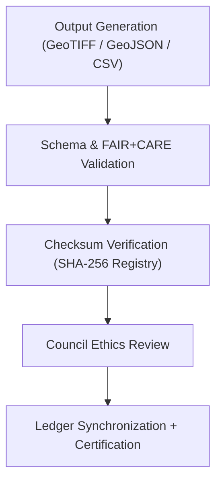

<div align="center">

# ⚖️ **Kansas Frontier Matrix — Archaeology Predictive Zones · Output Governance Records**  
`src/ai/models/archaeology/predictive-zones/outputs/governance/README.md`

**Purpose:**  
Document the **governance, ethics audits, checksum registries, and validation records** associated with the **Predictive Zones AI model outputs**.  
This directory forms the ethical backbone of the Predictive Zones publication system, ensuring **transparency, cultural protection, and reproducibility** under **FAIR+CARE** and **MCP-DL v6.3**.

[](../../../../../../docs/)
[](../../../../../../LICENSE)
[](../../../../../../docs/standards/faircare.md)
[](#)

</div>

---

## 📘 Overview

The **Output Governance Directory** contains metadata and ethical validation documents that certify predictive outputs as **FAIR+CARE-compliant**, **ISO 19115-compatible**, and **ethically governed**.  
Each file supports transparent linkage between data products, governance decisions, and sustainability telemetry.

This directory is maintained by the **FAIR+CARE Council** in coordination with the **KFM Governance Subcommittee**, and linked to:
- Governance Ledger (`releases/v9.9.0/governance/ledger_snapshot.json`)
- Telemetry Ledger (`releases/v9.9.0/focus-telemetry.json`)
- SPDX SBOM (`releases/v9.9.0/sbom.spdx.json`)

---

## 🗂️ Directory Layout

```plaintext
src/ai/models/archaeology/predictive-zones/outputs/governance/
├── README.md                             # This file — output governance documentation
│
├── output_metadata.json                   # Metadata registry for generated outputs
├── faircare_audit.json                    # FAIR+CARE ethics and compliance report
├── checksum_registry.json                 # SHA-256 integrity records for published outputs
└── validation_report.json                 # Schema validation and approval results
```

---

## ⚙️ Governance Workflow



### Process Summary
1. **Validation:** Confirms schema integrity and metadata completeness.  
2. **Checksum Registry:** Records file hashes and cryptographic validation.  
3. **Audit Review:** FAIR+CARE Council reviews cultural, ethical, and environmental impacts.  
4. **Ledger Entry:** Certification results logged to governance and telemetry ledgers.

---

## 🧩 Example: FAIR+CARE Audit (`faircare_audit.json`)

```json
{
  "audit_id": "output_audit_2025_11_08_004",
  "workflow": "predictive_zones_output_validation_v9.9.0",
  "datasets_reviewed": ["predictive_zones_probability.tif", "predictive_zones_overlay.geojson"],
  "faircare_score": 98.7,
  "care_violations_detected": 0,
  "cultural_mask_applied": true,
  "reviewed_by": "@faircare-council",
  "ethics_status": "approved",
  "approval_timestamp": "2025-11-08T19:45:00Z",
  "telemetry_ref": "../../../../../../releases/v9.9.0/focus-telemetry.json"
}
```

---

## ⚖️ FAIR+CARE & ISO Compliance Matrix

| Principle | Implementation | Verification |
|------------|----------------|---------------|
| **Findable** | Metadata registered with STAC/DCAT IDs. | `stac-validate.yml` |
| **Accessible** | Outputs available under CC-BY license (restricted maps masked). | Governance Ledger |
| **Interoperable** | JSON-LD, GeoTIFF, and CSV formats validated to ISO 19115. | `validation_report.json` |
| **Reusable** | SPDX-licensed, reproducible datasets with lineage logs. | SPDX Manifest |
| **CARE – Responsibility** | FAIR+CARE Council oversight for cultural data use. | `faircare_audit.json` |
| **CARE – Ethics** | Sensitive Indigenous and heritage data masked. | `checksum_registry.json` |

---

## 🧮 Telemetry Metrics

| Metric | Description | Example |
|--------|-------------|----------|
| `validation_runtime_sec` | Duration of validation process. | 274 |
| `energy_wh` | Power used for validation and checksum verification. | 19.4 |
| `carbon_gco2e` | Equivalent carbon emission for validation run. | 8.9 |
| `faircare_score` | FAIR+CARE compliance index. | 98.7 |
| `care_violations_detected` | Number of ethics violations found. | 0 |
| `governance_status` | Certification outcome. | approved |

Telemetry integrated into:  
`releases/v9.9.0/focus-telemetry.json`  
Schema: `schemas/telemetry/src-ai-models-archaeology-predictivezones-outputs-governance-v1.json`

---

## 🔐 Provenance & Ledger Integration

All validation records link to:
- **Governance Ledger:** `releases/v9.9.0/governance/ledger_snapshot.json`  
- **Checksum Registry:** `checksum_registry.json`  
- **Audit Reports:** `faircare_audit.json`  
- **SBOM Manifest:** `releases/v9.9.0/sbom.spdx.json`  

### Example Ledger Entry
```json
{
  "ledger_id": "ledger_2025q4_output_governance",
  "auditor": "@kfm-governance",
  "reviewed_by": "@faircare-council",
  "status": "approved",
  "timestamp": "2025-11-08T19:50:00Z",
  "notes": "Outputs validated; restricted maps approved for internal use."
}
```

---

## 🧾 Citation

```text
Kansas Frontier Matrix (2025). Archaeology Predictive Zones · Output Governance Records (v9.9.0).
FAIR+CARE and ISO-aligned governance documentation ensuring traceable, ethical, and transparent publication of archaeological predictive outputs within the Kansas Frontier Matrix.
```

---

## 🕰️ Version History

| Version | Date | Author | Summary |
|---------:|------|--------|----------|
| v9.9.0 | 2025-11-08 | `@kfm-governance` | Added documentation for output governance; included FAIR+CARE audit integration, checksum validation, and ledger linkage. |

---

<div align="center">

**Kansas Frontier Matrix**  
*Ethical Data Stewardship × FAIR+CARE Oversight × Transparent Publication Governance*  
© 2025 Kansas Frontier Matrix · CC-BY 4.0 · Master Coder Protocol v6.3 · FAIR+CARE Certified · Diamond⁹ Ω / Crown∞Ω Ultimate Certified  

[Back to Outputs Index](../README.md) · [Governance Charter](../../../../../../docs/standards/governance/ROOT-GOVERNANCE.md)

</div>

