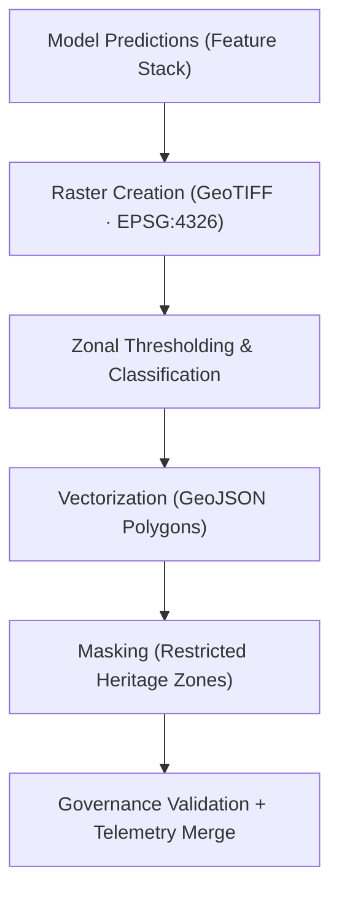

<div align="center">

# 🗺️ **Kansas Frontier Matrix — Archaeology Predictive Zones · Map Outputs**  
`src/ai/models/archaeology/predictive-zones/outputs/maps/README.md`

**Purpose:**  
Provide detailed documentation for all **raster and vector map outputs** generated by the **Archaeology Predictive Zones AI subsystem**.  
These maps visualize **archaeological probability zones**, **environmental correlations**, and **cultural sensitivity layers**, ensuring compliance with **FAIR+CARE**, **ISO 19115**, and **MCP-DL v6.3** data standards.

[](../../../../../../docs/)
[](../../../../../../LICENSE)
[](../../../../../../docs/standards/faircare.md)
[](#)

</div>

---

## 📘 Overview

The **Map Outputs Directory** hosts the geospatial data products of the **Predictive Zones AI model**, combining environmental and cultural indicators into interpretable layers.  
All raster and vector outputs undergo ethical review to ensure compliance with the **FAIR+CARE Council’s** data governance policies.  

These maps feed directly into:
- 🧭 **Focus Mode visualizations**  
- 🛰️ **Cesium 3D geospatial rendering**  
- 🗺️ **MapLibre layer exports for interactive exploration**  
- ⚖️ **FAIR+CARE governance review dashboards**

---

## 🗂️ Directory Layout

```plaintext
src/ai/models/archaeology/predictive-zones/outputs/maps/
├── README.md                            # This file — map outputs documentation
│
├── predictive_zones_probability.tif      # Raster layer of site probability (0–1)
├── predictive_zones_overlay.geojson      # Vector overlay of predicted zones
├── restricted_zones_mask.geojson         # Mask for restricted cultural heritage areas
└── map_metadata.json                     # FAIR+CARE and spatial metadata for outputs
```

---

## ⚙️ Map Generation Workflow



### Steps:
1. **Raster Creation:** Generates continuous probability raster (0–1).  
2. **Classification:** Categorizes raster cells into predictive classes.  
3. **Vectorization:** Converts significant zones into polygons.  
4. **Masking:** Applies ethical redaction for Indigenous or heritage sites.  
5. **Governance Validation:** FAIR+CARE Council approves before release.

---

## 🧩 Example Map Metadata (`map_metadata.json`)

```json
{
  "map_id": "predictive_zones_map_v9.9.0",
  "version": "v9.9.0",
  "crs": "EPSG:4326",
  "spatial_resolution_m": 10,
  "extent_bbox": [-102.1, 36.9, -94.6, 40.1],
  "layers": [
    "predictive_zones_probability.tif",
    "predictive_zones_overlay.geojson",
    "restricted_zones_mask.geojson"
  ],
  "care_tag": "restricted",
  "reviewed_by": "@faircare-council",
  "governance_status": "approved",
  "checksum_sha256": "sha256:b8d7c1f3a1c4b56e93f3d1b5c2a7f2e1d5a8c3e9...",
  "telemetry_ref": "../../../../../../releases/v9.9.0/focus-telemetry.json"
}
```

---

## ⚖️ FAIR+CARE & ISO Compliance Matrix

| Principle | Implementation | Verification |
|------------|----------------|---------------|
| **Findable** | Indexed in STAC/DCAT metadata registry. | `stac-validate.yml` |
| **Accessible** | Raster data public; restricted zones under CARE protection. | Governance Ledger |
| **Interoperable** | GeoTIFF and GeoJSON formats (OGC/ISO 19115 compliant). | `schema_validation.py` |
| **Reusable** | CC-BY 4.0 license; provenance and checksum metadata. | SPDX Manifest |
| **CARE – Responsibility** | Sensitive sites generalized to prevent exploitation. | `care_masking_report.json` |
| **CARE – Ethics** | Maps approved by FAIR+CARE Council before publication. | `governance_validation.json` |

---

## 📊 Telemetry Metrics

| Metric | Description | Example |
|--------|-------------|----------|
| `map_generation_runtime_sec` | Duration of map creation process. | 614 |
| `energy_wh` | Energy used during geospatial export. | 27.5 |
| `carbon_gco2e` | CO₂ equivalent emissions. | 12.1 |
| `restricted_features` | Number of restricted heritage polygons masked. | 217 |
| `faircare_score` | FAIR+CARE compliance rating. | 98.7 |
| `validation_status` | Governance approval result. | certified |

Telemetry linked to:  
`releases/v9.9.0/focus-telemetry.json`  
Schema: `schemas/telemetry/src-ai-models-archaeology-predictivezones-outputs-maps-v1.json`

---

## 🔐 Provenance & Governance Integration

Each map is tracked through:
- **Checksum Registry:** `artifacts/governance/checksum_registry.json`  
- **Governance Ledger:** `releases/v9.9.0/governance/ledger_snapshot.json`  
- **Telemetry Ledger:** `releases/v9.9.0/focus-telemetry.json`  
- **Audit Trail:** `artifacts/governance/audit_report.json`  

### Example Ledger Entry
```json
{
  "ledger_id": "ledger_2025q4_map_outputs",
  "approved_by": "@faircare-council",
  "ethics_status": "certified",
  "timestamp": "2025-11-08T19:30:00Z"
}
```

---

## 🧾 Citation

```text
Kansas Frontier Matrix (2025). Archaeology Predictive Zones · Map Outputs (v9.9.0).
FAIR+CARE and ISO-compliant map outputs ensuring transparent, ethical, and sustainable geospatial visualization for archaeological predictive modeling within the Kansas Frontier Matrix.
```

---

## 🕰️ Version History

| Version | Date | Author | Summary |
|---------:|------|--------|----------|
| v9.9.0 | 2025-11-08 | `@kfm-ai` | Created map outputs documentation; integrated FAIR+CARE compliance, governance metadata, and telemetry schema. |

---

<div align="center">

**Kansas Frontier Matrix**  
*Responsible Mapping × FAIR+CARE Ethics × Sustainable Cultural Data Visualization*  
© 2025 Kansas Frontier Matrix · CC-BY 4.0 · Master Coder Protocol v6.3 · FAIR+CARE Certified · Diamond⁹ Ω / Crown∞Ω Ultimate Certified  

[Back to Outputs Index](../README.md) · [Governance Charter](../../../../../../docs/standards/governance/ROOT-GOVERNANCE.md)

</div>

