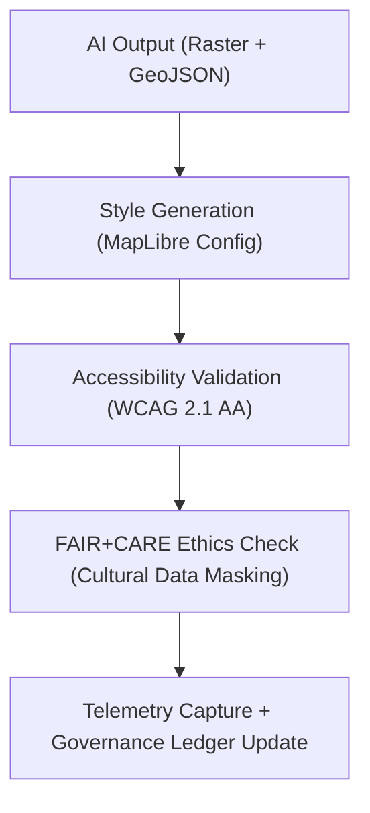

<div align="center">

# 🧭 **Kansas Frontier Matrix — Archaeology Predictive Zones · Visualization Outputs**  
`src/ai/models/archaeology/predictive-zones/outputs/visualization/README.md`

**Purpose:**  
Provide documentation for all **visualization-ready assets, map layer styles, and Focus Mode visual integrations** generated by the **Archaeology Predictive Zones AI pipeline**.  
These assets ensure **FAIR+CARE-compliant presentation**, **ISO 19115 interoperability**, and **WCAG 2.1 accessibility** for transparent data communication under **MCP-DL v6.3**.

[](../../../../../../docs/)
[](../../../../../../LICENSE)
[](../../../../../../docs/standards/faircare.md)
[](#)

</div>

---

## 📘 Overview

The **Visualization Outputs Directory** hosts Focus Mode map layers, UI assets, and preview renderings generated from the **Predictive Zones AI system**.  
These visualizations make archaeological predictions **accessible, interpretable, and ethically governed**, integrating sustainability and cultural sensitivity reviews.

Outputs are optimized for:
- 🌍 **MapLibre and Cesium 3D viewers**  
- 📊 **Focus Mode narrative panels and story overlays**  
- ♿ **FAIR+CARE Council-approved visual publication**  
- ⚖️ **Governance Ledger and Telemetry tracking**

---

## 🗂️ Directory Layout

```plaintext
src/ai/models/archaeology/predictive-zones/outputs/visualization/
├── README.md                             # This file — visualization documentation
│
├── predictive_zones_map_style.json        # MapLibre/Focus Mode style configuration
├── ndvi_overlay_preview.png               # NDVI-based vegetation overlay (preview)
├── focusmode_layer_manifest.json          # Layer manifest for Focus Mode timeline integration
├── map_thumbnail.png                      # Compressed preview for documentation
└── visualization_metadata.json            # FAIR+CARE metadata and provenance trace
```

---

## ⚙️ Visualization Workflow



### Pipeline Functions
1. **Style Configuration:** Generates MapLibre/Cesium styles with accessible legends and palettes.  
2. **Preview Rendering:** Produces map thumbnails and NDVI overlays.  
3. **Accessibility Validation:** Ensures WCAG 2.1 AA and color-contrast compliance.  
4. **Ethics Review:** FAIR+CARE Council certifies visual safety of sensitive content.  
5. **Telemetry Export:** Logs energy, runtime, and cultural ethics review metrics.  

---

## 🧩 Example Visualization Metadata (`visualization_metadata.json`)

```json
{
  "visualization_id": "predictive_zones_visual_v9.9.0",
  "title": "Archaeology Predictive Zones — Focus Mode Visualization",
  "crs": "EPSG:4326",
  "formats": ["MapLibre JSON", "PNG"],
  "accessibility_compliance": "WCAG 2.1 AA",
  "faircare_status": "certified",
  "restricted_layers": ["restricted_zones_mask.geojson"],
  "reviewed_by": "@faircare-council",
  "energy_wh": 12.7,
  "carbon_gco2e": 5.6,
  "checksum_sha256": "sha256:cc27f48e73b9e6d512fa4d4e3baf93d3b2a8df6e...",
  "telemetry_ref": "../../../../../../releases/v9.9.0/focus-telemetry.json"
}
```

---

## ⚖️ FAIR+CARE & Accessibility Matrix

| Category | Implementation | Validation |
|-----------|----------------|-------------|
| **Findable** | Registered under Focus Mode visualization registry. | `focusmode_layer_manifest.json` |
| **Accessible** | WCAG 2.1 AA validated color contrast and ARIA roles. | FAIR+CARE Council Review |
| **Interoperable** | Compatible with MapLibre GL JSON and Cesium 3D formats. | ISO 19115 Validator |
| **Reusable** | CC-BY 4.0 licensed, telemetered metadata included. | SPDX SBOM |
| **CARE – Responsibility** | Ethical masking for cultural and Indigenous data zones. | `faircare-validate.yml` |
| **CARE – Ethics** | FAIR+CARE audit before public visualization release. | Governance Ledger |

---

## 🧮 Telemetry Metrics

| Metric | Description | Example |
|--------|-------------|----------|
| `render_runtime_sec` | Duration of visualization rendering. | 154 |
| `energy_wh` | Power consumption during rendering. | 12.7 |
| `carbon_gco2e` | CO₂ equivalent emissions. | 5.6 |
| `faircare_score` | FAIR+CARE compliance rating. | 98.9 |
| `accessibility_compliance` | WCAG 2.1 AA audit result. | passed |
| `restricted_layers` | Number of restricted heritage zones hidden. | 1 |

All telemetry entries merged into:  
`releases/v9.9.0/focus-telemetry.json`  
Schema: `schemas/telemetry/src-ai-models-archaeology-predictivezones-outputs-visualization-v1.json`

---

## 🔐 Provenance & Governance Integration

- **Governance Ledger:** `releases/v9.9.0/governance/ledger_snapshot.json`  
- **Telemetry Ledger:** `releases/v9.9.0/focus-telemetry.json`  
- **Checksum Verification:** `../governance/checksum_registry.json`  
- **SBOM Reference:** `releases/v9.9.0/sbom.spdx.json`  

### Example Governance Record
```json
{
  "ledger_entry_id": "ledger_2025q4_visual_outputs",
  "auditor": "@kfm-governance",
  "reviewed_by": "@faircare-council",
  "ethics_status": "certified",
  "timestamp": "2025-11-08T19:55:00Z"
}
```

---

## 🧾 Citation

```text
Kansas Frontier Matrix (2025). Archaeology Predictive Zones · Visualization Outputs (v9.9.0).
FAIR+CARE-certified visualization documentation ensuring ethical, accessible, and sustainable presentation of archaeological AI predictions within the Kansas Frontier Matrix.
```

---

## 🕰️ Version History

| Version | Date | Author | Summary |
|---------:|------|--------|----------|
| v9.9.0 | 2025-11-08 | `@kfm-ai` | Created visualization outputs documentation; added FAIR+CARE ethics integration, accessibility validation, and telemetry schema. |

---

<div align="center">

**Kansas Frontier Matrix**  
*Accessible Visualization × FAIR+CARE Ethics × Sustainable Cultural Intelligence*  
© 2025 Kansas Frontier Matrix · CC-BY 4.0 · Master Coder Protocol v6.3 · FAIR+CARE Certified · Diamond⁹ Ω / Crown∞Ω Ultimate Certified  

[Back to Outputs Index](../README.md) · [Governance Charter](../../../../../../docs/standards/governance/ROOT-GOVERNANCE.md)

</div>

