<div align="center">

# 🔄 **Kansas Frontier Matrix — Archaeology Predictive Zones · AI Pipeline**  
`src/ai/models/archaeology/predictive-zones/pipeline/README.md`

**Purpose:**  
Describe the **end-to-end AI pipeline** for the **Archaeology Predictive Zones** subsystem of the Kansas Frontier Matrix (KFM), integrating FAIR+CARE-compliant data ingestion, feature engineering, AI model training, explainability, and governance telemetry under **MCP-DL v6.3**.

[](../../../../../../docs/)
[](../../../../../../LICENSE)
[](../../../../../../docs/standards/faircare.md)
[](#)

</div>

---

## 📘 Overview

The **Archaeology Predictive Zones AI Pipeline** is a modular, reproducible workflow designed to:
- Detect and map **archaeological site probability zones** using multi-modal data.  
- Enforce **FAIR+CARE** governance at every transformation step.  
- Log energy, bias, and drift telemetry for sustainable AI operations.  
- Support explainability, provenance, and ethical transparency across model iterations.

This pipeline operates within the broader **KFM architecture**, linking directly to **ETL**, **validation**, **governance**, and **telemetry** subsystems.

---

## 🗂️ Directory Layout

```plaintext
src/ai/models/archaeology/predictive-zones/pipeline/
├── README.md                            # This file — AI pipeline documentation
│
├── etl/                                 # Data ingestion and feature engineering modules
│   ├── etl_predictive_zones.py          # Aggregates and normalizes input layers
│   └── preprocess_features.py           # Computes derived spatial metrics
│
├── training/                            # AI model training and optimization
│   ├── train_predictive_model.py        # Main training script (LightGBM/CNN hybrid)
│   ├── config.yaml                      # Training parameters and governance metadata
│   └── registry_updater.py              # Updates model registry after training
│
├── explainability/                      # Explainable AI modules
│   ├── shap_analysis.py                 # Global SHAP importance scoring
│   ├── lime_analysis.py                 # Local explanation generator
│   └── bias_audit.py                    # FAIR+CARE bias evaluation
│
├── governance/                          # FAIR+CARE and ethics integration
│   ├── care_validator.py                # Applies cultural/ethical filters
│   ├── governance_logger.py             # Logs Council-approved audit results
│   └── ledger_sync.py                   # Pushes results to governance ledger
│
└── telemetry/                           # Telemetry and sustainability tracking
    ├── export_metrics.py                # ISO 50001-compliant energy metrics
    ├── merge_telemetry.py               # Merges telemetry to unified ledger
    └── schema_validation.py             # Ensures compliance with telemetry schema
```

---

## ⚙️ End-to-End Pipeline Overview

```mermaid
flowchart TD
  A["Raw Data (LIDAR · Hydrology · Soil · NDVI · Cultural Sites)"] --> B["ETL & Feature Engineering"]
  B --> C["Training (AI Predictive Model)"]
  C --> D["Evaluation + Explainability"]
  D --> E["FAIR+CARE Governance Validation"]
  E --> F["Telemetry Export + Governance Ledger Sync"]
  F --> G["Focus Mode Integration & Predictive Map Publication"]
```



### Key Pipeline Components

| Stage | Function | Workflow Link |
|--------|-----------|----------------|
| **ETL Normalization** | Aggregates geospatial & tabular layers; applies CRS normalization. | `docs/workflows/stac-validate.yml.md` |
| **Feature Engineering** | Extracts slope, NDVI, hydrology, and proximity indices. | `etl_predictive_zones.py` |
| **Training & Validation** | Trains AI models using FAIR+CARE-compliant datasets. | `ai-train.yml` |
| **Explainability** | Runs SHAP/LIME + CARE bias audits. | `docs/workflows/faircare-validate.yml.md` |
| **Governance Sync** | Logs audit results to FAIR+CARE ledger. | `docs/workflows/telemetry-export.yml.md` |
| **Telemetry Merge** | Aggregates sustainability metrics to `focus-telemetry.json`. | `telemetry/export_metrics.py` |

---

## 🧩 FAIR+CARE Integration Matrix

| Principle | Implementation | Validator |
|------------|----------------|------------|
| **Findable** | Each dataset & model assigned STAC/DCAT UUIDs. | `stac-validate.yml` |
| **Accessible** | Restricted data gated by CARE tags (`public`, `restricted`, `sensitive`). | `care_validator.py` |
| **Interoperable** | STAC/DCAT/RDF-compatible outputs with metadata schemas. | `schema_validation.py` |
| **Reusable** | Full provenance & reproducibility ensured by MCP workflows. | `governance_logger.py` |
| **CARE – Responsibility** | Logs AI bias/drift reports for Council review. | `bias_audit.py` |
| **CARE – Ethics** | Flags and redacts sacred or heritage-sensitive data. | `care_validator.py` |

---

## 🧠 Example: Model Training Configuration (`training/config.yaml`)

```yaml
model:
  name: "predictive_zones_ai_v9.9.0"
  framework: "LightGBM"
  objective: "binary"
  metrics: ["AUC", "F1", "precision", "recall"]
  random_seed: 42
  explainability: true

data:
  input: "../../data/processed/feature_stack.parquet"
  target_column: "site_presence"
  test_size: 0.2

governance:
  care_tag: "restricted"
  reviewer: "@faircare-council"
  ethics_status: "approved"
  telemetry_ref: "../../../../../../releases/v9.9.0/focus-telemetry.json"
```

---

## 📊 Telemetry Metrics

Pipeline stages emit telemetry conforming to ISO 50001 and FAIR+CARE sustainability standards.

| Metric | Description | Example |
|--------|-------------|----------|
| `etl_runtime_sec` | Duration of data ingestion + feature engineering. | 640 |
| `train_time_min` | Model training duration. | 315 |
| `energy_wh` | Energy consumed during workflow. | 1487 |
| `bias_score` | Detected model bias index. | 0.04 |
| `drift_flag` | Whether model drift was detected. | false |
| `faircare_score` | Compliance rating (%). | 98.5 |
| `carbon_gco2e` | CO₂ emissions equivalent. | 640.2 |

All telemetry metrics appended to:  
`releases/v9.9.0/focus-telemetry.json`  
Schema: `schemas/telemetry/src-ai-models-archaeology-predictivezones-pipeline-v1.json`

---

## 🔐 Provenance & Security

- Each pipeline stage includes **SHA-256 checksums** and **SLSA provenance attestations**.  
- All AI models undergo **bias and ethics certification** by the FAIR+CARE Council.  
- SBOM and provenance logs stored in `releases/v9.9.0/sbom.spdx.json` and `manifest.zip`.  
- Restricted datasets governed by CARE tags; public data remains openly reusable.

---

## 🧾 Citation

```text
Kansas Frontier Matrix (2025). Archaeology Predictive Zones AI Pipeline (v9.9.0).
Defines the FAIR+CARE-aligned AI pipeline for ethical, sustainable, and explainable predictive modeling of archaeological zones within the Kansas Frontier Matrix.
```

---

## 🕰️ Version History

| Version | Date | Author | Summary |
|---------:|------|--------|----------|
| v9.9.0 | 2025-11-08 | `@kfm-ai` | Created end-to-end pipeline documentation; added FAIR+CARE integration, telemetry schema, and governance linkage. |

---

<div align="center">

**Kansas Frontier Matrix**  
*Ethical AI Pipelines × FAIR+CARE Governance × Sustainable Predictive Modeling*  
© 2025 Kansas Frontier Matrix · MIT · Master Coder Protocol v6.3 · FAIR+CARE Certified · Diamond⁹ Ω / Crown∞Ω Ultimate Certified  

[Back to Archaeology AI Suite](../README.md) · [Governance Charter](../../../../../../docs/standards/governance/ROOT-GOVERNANCE.md)

</div>

