<div align="center">

# 🧱 **Kansas Frontier Matrix — Archaeology Predictive Zones ETL Pipeline**  
`src/ai/models/archaeology/predictive-zones/pipeline/etl/README.md`

**Purpose:**  
Document the **Extract, Transform, and Load (ETL)** components responsible for data harmonization, normalization, and preprocessing for the **Archaeology Predictive Zones** AI workflow in the Kansas Frontier Matrix (KFM).  
Ensures reproducible FAIR+CARE-compliant transformations, provenance tracking, and ISO 19115 metadata consistency across all input datasets.

[](../../../../../../../docs/)
[](../../../../../../../LICENSE)
[](../../../../../../../docs/standards/faircare.md)
[](#)

</div>

---

## 📘 Overview

The **ETL sub-pipeline** orchestrates ingestion, transformation, and preparation of raw archaeological, environmental, and historical data sources into structured, AI-ready formats.  
This layer functions as the **foundation of the predictive modeling pipeline**, ensuring every dataset complies with FAIR+CARE governance, MCP-DL v6.3 reproducibility, and ISO 50001 sustainability standards.

---

## 🗂️ Directory Layout

```plaintext
src/ai/models/archaeology/predictive-zones/pipeline/etl/
├── README.md                          # This file — ETL pipeline documentation
│
├── etl_predictive_zones.py             # Primary ETL orchestrator script
├── preprocess_features.py              # Feature extraction (slope, aspect, NDVI, proximity)
├── merge_datasets.py                   # Merges multiple sources into unified feature stack
├── care_masking.py                     # Applies CARE-tagged data masking and ethical redaction
├── validate_schema.py                  # Ensures compliance with data-contract-v3 schema
└── logs/
    ├── etl_log.json                    # Process execution summary
    ├── validation_report.json          # Schema and FAIR+CARE audit summary
    └── provenance_trace.json           # Transformation lineage and metadata
```

---

## ⚙️ ETL Workflow Overview

```mermaid
flowchart TD
  A["Raw Data (DEM · Soil · Vegetation · Hydrology · Cultural Sites)"]
  --> B["Extract (load rasters, vectors, tabular)"]
  B --> C["Transform (reproject, clip, normalize CRS)"]
  C --> D["Feature Engineering (slope, NDVI, distance metrics)"]
  D --> E["Ethical Masking (CARE-tag filtering, heritage protection)"]
  E --> F["Schema Validation (data-contract-v3.json)"]
  F --> G["Load to Staging (feature_stack.parquet · predictive_zones_raster.tif)"]
  G --> H["Telemetry Export (energy, runtime, validation status)"]
```



### Processing Stages
1. **Extract:** Load raster, tabular, and vector datasets; harmonize CRS to EPSG:4326 or EPSG:5070.  
2. **Transform:** Regrid spatial layers, clip to Kansas boundary, normalize pixel values.  
3. **Feature Engineering:** Generate slope, aspect, NDVI, hydrological proximity, and soil indices.  
4. **Ethical Masking:** Apply FAIR+CARE filters to sensitive cultural or Indigenous data zones.  
5. **Validation:** Run schema + checksum verification using `data-contract-v3.json`.  
6. **Load:** Write harmonized datasets to staging and processed directories.  

---

## 🧩 Key Scripts

| Script | Function | Output |
|--------|-----------|--------|
| `etl_predictive_zones.py` | Orchestrates entire ETL process. | `logs/etl_log.json` |
| `preprocess_features.py` | Computes derived features from environmental layers. | `data/staging/feature_importance.json` |
| `merge_datasets.py` | Merges feature tables into unified stack. | `data/processed/feature_stack.parquet` |
| `care_masking.py` | Applies ethical filters per CARE tag. | Masked outputs + audit log |
| `validate_schema.py` | Validates output schemas vs. data-contract-v3. | `logs/validation_report.json` |

---

## 🧮 Example Log Output (`logs/etl_log.json`)

```json
{
  "etl_run_id": "etl_2025_11_08_001",
  "datasets_ingested": 6,
  "features_computed": ["slope", "aspect", "distance_to_water", "ndvi"],
  "records_output": 185420,
  "energy_wh": 32.6,
  "carbon_gco2e": 14.7,
  "checksum_validated": true,
  "care_masked_features": 14,
  "runtime_sec": 892,
  "validated": true,
  "telemetry_ref": "../../../../../../../releases/v9.9.0/focus-telemetry.json"
}
```

---

## ⚖️ FAIR+CARE & Governance Integration

| Principle | Implementation | Verification |
|------------|----------------|---------------|
| **Findable** | Each dataset assigned STAC/DCAT IDs; metadata appended to provenance log. | `stac-validate.yml` |
| **Accessible** | Masked sensitive data by CARE tag classification. | `faircare-validate.yml` |
| **Interoperable** | Uses OGC-compliant GeoTIFF, GeoJSON, Parquet formats. | ISO 19115 validation |
| **Reusable** | Full metadata lineage, checksum, and SBOM records. | SPDX manifest |
| **CARE – Responsibility** | Logs ethical masking and cultural data redactions. | `care_masking.py` |
| **CARE – Ethics** | Prevents sensitive geometry propagation into training data. | Governance Ledger |

---

## 📊 Telemetry Metrics

Telemetry events captured during ETL processing:

| Metric | Description | Example |
|--------|--------------|---------|
| `datasets_processed` | Number of raw datasets normalized. | 6 |
| `features_computed` | Derived features engineered for AI. | 8 |
| `runtime_sec` | Duration of ETL run. | 892 |
| `energy_wh` | Power used during ETL process. | 32.6 |
| `carbon_gco2e` | CO₂ emission equivalent. | 14.7 |
| `validation_status` | Schema & FAIR+CARE result. | `passed` |
| `care_masked_features` | Count of features redacted by governance filters. | 14 |

Telemetry schema reference:  
`schemas/telemetry/src-ai-models-archaeology-predictivezones-pipeline-etl-v1.json`

---

## 🔐 Provenance & Security

- Every transformation step produces **checksum** and **provenance trace records**.  
- SBOM entries reference input and output datasets (SPDX).  
- ETL runs digitally signed with OIDC tokens for CI/CD reproducibility.  
- Governance ledger records review timestamp, reviewer, and outcome.

Example governance entry (ledger):
```json
{
  "entry_id": "governance_2025q4_etl_predictive_zones",
  "reviewed_by": "@faircare-council",
  "status": "approved",
  "timestamp": "2025-11-08T16:30:00Z"
}
```

---

## 🧾 Citation

```text
Kansas Frontier Matrix (2025). Archaeology Predictive Zones ETL Pipeline (v9.9.0).
Defines FAIR+CARE and ISO-compliant ETL processes ensuring ethical, traceable, and sustainable data integration for archaeological predictive modeling in the Kansas Frontier Matrix.
```

---

## 🕰️ Version History

| Version | Date | Author | Summary |
|---------:|------|--------|----------|
| v9.9.0 | 2025-11-08 | `@kfm-data` | Added ETL pipeline documentation with FAIR+CARE, telemetry, and provenance validation details. |

---

<div align="center">

**Kansas Frontier Matrix**  
*Reproducible ETL × FAIR+CARE Ethics × Sustainable Data Governance*  
© 2025 Kansas Frontier Matrix · MIT · Master Coder Protocol v6.3 · FAIR+CARE Certified · Diamond⁹ Ω / Crown∞Ω Ultimate Certified  

[Back to Pipeline Index](../README.md) · [Governance Charter](../../../../../../../docs/standards/governance/ROOT-GOVERNANCE.md)

</div>

