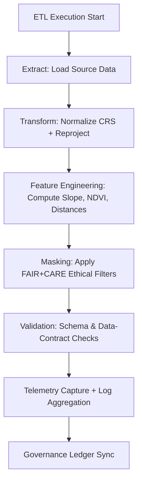

<div align="center">

# 📜 **Kansas Frontier Matrix — ETL Logs for Archaeology Predictive Zones**  
`src/ai/models/archaeology/predictive-zones/pipeline/etl/logs/README.md`

**Purpose:**  
Provide a **centralized reference** for all **ETL (Extract, Transform, Load) execution logs, validation results, and telemetry metadata** produced during Archaeology Predictive Zones data processing.  
These logs establish **provenance, reproducibility, and FAIR+CARE accountability** across ETL and feature engineering operations.

[](../../../../../../../../docs/)
[](../../../../../../../../LICENSE)
[](../../../../../../../../docs/standards/faircare.md)
[](#)

</div>

---

## 📘 Overview

The **ETL Logs Directory** stores all metadata and audit records generated during the Archaeology Predictive Zones ETL pipeline.  
These logs capture:
- Data ingestion, transformation, and masking events.  
- Schema and FAIR+CARE validation outcomes.  
- Runtime telemetry (energy use, emissions, timing).  
- Governance and provenance trace entries for ethical reproducibility.

All logs are validated under **MCP-DL v6.3** and follow **ISO 19115 / PROV-O** metadata standards.

---

## 🗂️ Directory Layout

```plaintext
src/ai/models/archaeology/predictive-zones/pipeline/etl/logs/
├── README.md                         # This file — ETL logs documentation
│
├── etl_log.json                      # Complete ETL run summary and process metadata
├── validation_report.json            # Schema + FAIR+CARE audit results
├── provenance_trace.json             # Lineage and transformation metadata
├── care_masking_report.json          # Redaction/masking summary for sensitive data
└── telemetry_metrics.json            # Sustainability + performance metrics for ETL runs
```

---

## ⚙️ ETL Logging Workflow



### Logging Modules
- `etl_log.json`: Main execution summary.  
- `validation_report.json`: Results from schema validator and FAIR+CARE auditor.  
- `care_masking_report.json`: Records redacted zones or restricted geometries.  
- `telemetry_metrics.json`: Runtime, energy, and sustainability results.  

---

## 🧩 Example ETL Log (`etl_log.json`)

```json
{
  "etl_run_id": "etl_2025_11_08_003",
  "workflow": "predictive_zones_etl_v9.9.0",
  "datasets_ingested": [
    "lidar_dem_1m_kansas.tif",
    "hydrology_vector.geojson",
    "vegetation_density_2024.tif"
  ],
  "records_output": 185420,
  "care_masked_features": 12,
  "runtime_sec": 893,
  "validation_status": "passed",
  "telemetry": {
    "energy_wh": 33.8,
    "carbon_gco2e": 14.9
  },
  "reviewed_by": "@kfm-data",
  "governance_ref": "../../../../../../../../docs/standards/faircare.md"
}
```

---

## ⚖️ FAIR+CARE Integration

| Principle | Implementation | Verified By |
|------------|----------------|--------------|
| **Findable** | ETL logs indexed with run UUID and workflow ID. | `stac-validate.yml` |
| **Accessible** | Internal FAIR+CARE-controlled archive; no public exposure. | `@kfm-governance` |
| **Interoperable** | JSON format with DCAT/PROV-O metadata compatibility. | ISO 19115 Validator |
| **Reusable** | Logs reproducible under same seed/environment. | MCP-DL Validator |
| **CARE — Responsibility** | Tracks every data masking and transformation event. | FAIR+CARE Council |
| **CARE — Ethics** | Enforces approval for restricted datasets. | Governance Ledger |

---

## 🧮 Validation and Telemetry Metrics

| Metric | Description | Example |
|--------|-------------|---------|
| `runtime_sec` | ETL processing time in seconds. | 893 |
| `energy_wh` | Energy used during run (ISO 50001). | 33.8 |
| `carbon_gco2e` | CO₂ emission equivalent. | 14.9 |
| `records_output` | Total processed features generated. | 185,420 |
| `validation_status` | Schema and FAIR+CARE check result. | passed |
| `care_masked_features` | Count of masked or redacted features. | 12 |

Telemetry appended to `releases/v9.9.0/focus-telemetry.json`  
Schema: `schemas/telemetry/src-ai-models-archaeology-predictivezones-pipeline-etl-logs-v1.json`

---

## 🔐 Provenance & Governance Trace

Example from `provenance_trace.json`:
```json
{
  "source_data": [
    "data/raw/lidar_dem_1m_kansas.tif",
    "data/raw/vegetation_density_2024.tif"
  ],
  "transformations": [
    "Resampled DEM to 10m grid",
    "Computed NDVI using NIR/Red channels",
    "Generated slope and aspect maps"
  ],
  "outputs": [
    "data/staging/feature_stack.parquet",
    "data/processed/predictive_zones_raster.tif"
  ],
  "reviewed_by": "@kfm-validation",
  "timestamp": "2025-11-08T16:15:00Z"
}
```

Governance ledger references:  
`releases/v9.9.0/governance/ledger_snapshot.json`

---

## 🧾 Citation

```text
Kansas Frontier Matrix (2025). ETL Logs for Archaeology Predictive Zones (v9.9.0).
Comprehensive FAIR+CARE-compliant logging and telemetry framework for reproducible, ethical, and sustainable ETL operations in archaeological predictive modeling.
```

---

## 🕰️ Version History

| Version | Date | Author | Summary |
|---------:|------|--------|----------|
| v9.9.0 | 2025-11-08 | `@kfm-data` | Created ETL logs documentation with FAIR+CARE compliance, telemetry integration, and provenance governance. |

---

<div align="center">

**Kansas Frontier Matrix**  
*Traceable Workflows × FAIR+CARE Ethics × Sustainable Data Engineering*  
© 2025 Kansas Frontier Matrix · Internal FAIR+CARE Certified · Master Coder Protocol v6.3 · Diamond⁹ Ω / Crown∞Ω Ultimate Certified  

[Back to ETL Pipeline](../README.md) · [Governance Charter](../../../../../../../../docs/standards/governance/ROOT-GOVERNANCE.md)

</div>

