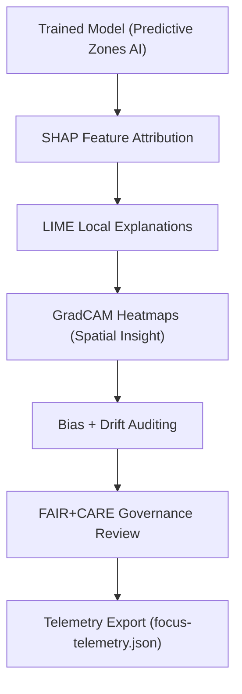

<div align="center">

# 🧠 **Kansas Frontier Matrix — Archaeology Predictive Zones · Explainability Pipeline**  
`src/ai/models/archaeology/predictive-zones/pipeline/explainability/README.md`

**Purpose:**  
Detail the **Explainable AI (XAI) sub-pipeline** responsible for bias auditing, model interpretability, and explainability visualization in the **Archaeology Predictive Zones AI system**.  
This pipeline integrates **SHAP**, **LIME**, and **GradCAM** explainability tools into the FAIR+CARE-governed architecture, ensuring **ethical transparency** and **reproducibility** under **MCP-DL v6.3**.

[](../../../../../../../docs/)
[](../../../../../../../LICENSE)
[](../../../../../../../docs/standards/faircare.md)
[](#)

</div>

---

## 📘 Overview

The **Explainability Pipeline** provides tools to interpret AI models used for archaeological site probability mapping.  
Its main goals are:
- Quantify **feature importance** and **model transparency**.  
- Detect and document **bias, drift, and cultural sensitivities**.  
- Create **interpretable visualizations** for governance and public communication.  
- Report metrics to FAIR+CARE Council via **governance ledger** and **telemetry reports**.

---

## 🗂️ Directory Layout

```plaintext
src/ai/models/archaeology/predictive-zones/pipeline/explainability/
├── README.md                         # This file — explainability pipeline documentation
│
├── shap_analysis.py                   # Global SHAP importance and feature interaction analysis
├── lime_analysis.py                   # Local explainability per instance
├── gradcam_visualization.py           # Spatial heatmaps for CNN feature relevance
├── bias_audit.py                      # Bias and fairness metric generation
├── drift_monitor.py                   # Drift detection and fairness stability tracking
└── logs/
    ├── shap_summary.json              # Feature importance results
    ├── lime_explanations.json         # Local explanation outputs
    ├── bias_report.json               # Bias and fairness report
    └── explainability_summary.json    # Combined explainability audit and telemetry record
```

---

## ⚙️ Explainability Workflow



### Core Components
- **`shap_analysis.py`** — Computes global feature importance & SHAP variance.  
- **`lime_analysis.py`** — Produces local interpretability outputs.  
- **`gradcam_visualization.py`** — Generates CNN heatmaps for geographic layers.  
- **`bias_audit.py`** — Evaluates cultural or geographic bias within datasets.  
- **`drift_monitor.py`** — Detects model performance drift over time.  

---

## 🧩 Example Explainability Log (`logs/explainability_summary.json`)

```json
{
  "model_id": "predictive_zones_ai_v9.9.0",
  "explainability_methods": ["SHAP", "LIME", "GradCAM"],
  "top_features": ["slope", "distance_to_water", "soil_moisture"],
  "bias_score": 0.04,
  "drift_flag": false,
  "explainability_stability": 0.91,
  "energy_wh": 26.4,
  "carbon_gco2e": 11.9,
  "care_tag": "restricted",
  "reviewed_by": "@faircare-council",
  "telemetry_ref": "../../../../../../../releases/v9.9.0/focus-telemetry.json"
}
```

---

## ⚖️ FAIR+CARE Integration Matrix

| Principle | Implementation | Validator |
|------------|----------------|------------|
| **Findable** | SHAP/LIME outputs linked to telemetry UUIDs. | `telemetry-export.yml` |
| **Accessible** | Masked explainability results for sensitive areas. | FAIR+CARE Council |
| **Interoperable** | JSON + GeoJSON outputs standardized to ISO 19115. | `stac-validate.yml` |
| **Reusable** | Visualizations CC-BY 4.0 licensed; metadata stored in ledger. | SPDX Manifest |
| **CARE – Responsibility** | Bias and fairness metrics reviewed quarterly. | `bias_audit.py` |
| **CARE – Ethics** | Explainability maps redacted if culturally sensitive. | `faircare-validate.yml` |

---

## 🧮 Telemetry Metrics

Explainability pipeline contributes sustainability and interpretability statistics to the unified ledger.

| Metric | Description | Example |
|--------|--------------|---------|
| `runtime_sec` | Duration of explainability pipeline run. | 682 |
| `energy_wh` | Energy used to compute SHAP/LIME analyses. | 26.4 |
| `carbon_gco2e` | Carbon footprint of explainability process. | 11.9 |
| `bias_score` | Bias level detected during audit. | 0.04 |
| `drift_flag` | Indicates performance drift presence. | false |
| `restricted_visuals` | Count of restricted outputs. | 2 |
| `reviewed_by` | Council or reviewer responsible. | `@faircare-council` |

Telemetry appended to `focus-telemetry.json`  
Schema: `schemas/telemetry/src-ai-models-archaeology-predictivezones-pipeline-explainability-v1.json`

---

## 🔐 Governance & Provenance

- **Explainability runs logged in FAIR+CARE Ledger** (`ledger_snapshot.json`).  
- **Bias reports** undergo review and approval prior to public release.  
- **Sensitive imagery** (e.g., sacred or Indigenous heritage areas) blurred or excluded.  
- **SBOM entries** ensure dependency transparency for interpretability libraries.  
- **ISO 50001 compliance** ensures energy-efficient model introspection.

---

## 🧾 Citation

```text
Kansas Frontier Matrix (2025). Archaeology Predictive Zones · Explainability Pipeline (v9.9.0).
Defines FAIR+CARE and ISO-compliant explainability workflows for transparent, ethical, and sustainable AI interpretation of archaeological predictive models.
```

---

## 🕰️ Version History

| Version | Date | Author | Summary |
|---------:|------|--------|----------|
| v9.9.0 | 2025-11-08 | `@kfm-ai` | Added explainability pipeline documentation; FAIR+CARE bias and drift metrics integrated with sustainability telemetry. |

---

<div align="center">

**Kansas Frontier Matrix**  
*Explainable Intelligence × FAIR+CARE Ethics × Sustainable Archaeological Modeling*  
© 2025 Kansas Frontier Matrix · MIT · Master Coder Protocol v6.3 · FAIR+CARE Certified · Diamond⁹ Ω / Crown∞Ω Ultimate Certified  

[Back to Pipeline Index](../README.md) · [Governance Charter](../../../../../../../docs/standards/governance/ROOT-GOVERNANCE.md)

</div>

