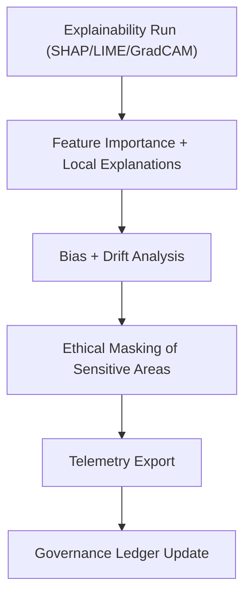

<div align="center">

# 🧾 **Kansas Frontier Matrix — Explainability Logs for Archaeology Predictive Zones**  
`src/ai/models/archaeology/predictive-zones/pipeline/explainability/logs/README.md`

**Purpose:**  
Provide a detailed reference for all **explainability logs, bias audits, and telemetry outputs** generated by the **Archaeology Predictive Zones Explainability Pipeline**.  
These logs document **FAIR+CARE ethical compliance**, **bias transparency**, and **sustainability metrics** for every interpretability run under **MCP-DL v6.3** and **ISO 50001** standards.

[](../../../../../../../../docs/)
[](../../../../../../../../LICENSE)
[](../../../../../../../../docs/standards/faircare.md)
[](#)

</div>

---

## 📘 Overview

The **Explainability Logs Directory** archives outputs from **SHAP**, **LIME**, and **GradCAM** explainability modules for archaeological predictive modeling.  
It ensures **traceability, bias accountability, and transparency** in model interpretability processes, providing the FAIR+CARE Council with full auditability of each explainability execution.

These logs are merged into the unified **KFM Telemetry Ledger (`focus-telemetry.json`)** and linked to the **Governance Ledger Snapshot**.

---

## 🗂️ Directory Layout

```plaintext
src/ai/models/archaeology/predictive-zones/pipeline/explainability/logs/
├── README.md                             # This file — explainability logs documentation
│
├── shap_summary.json                     # SHAP feature importance results
├── lime_explanations.json                # LIME interpretability records
├── gradcam_maps.geojson                  # Geo-spatial heatmaps for CNN model regions
├── bias_report.json                      # Bias and fairness audit output
├── drift_stability.json                  # Drift stability and fairness consistency metrics
└── explainability_summary.json           # Aggregated explainability audit and telemetry log
```

---

## ⚙️ Explainability Logging Workflow



### Core Logging Stages
- **Feature Attribution:** SHAP summary and feature ranking.  
- **Local Interpretations:** LIME and GradCAM explanations.  
- **Bias & Drift Metrics:** Statistical fairness validation.  
- **Governance Trace:** Ethical review linkage.  
- **Telemetry Export:** Sustainability and runtime performance reporting.

---

## 🧩 Example Explainability Log (`explainability_summary.json`)

```json
{
  "run_id": "xai_2025_11_08_003",
  "model_id": "predictive_zones_ai_v9.9.0",
  "explainability_methods": ["SHAP", "LIME", "GradCAM"],
  "top_features": ["slope", "soil_moisture", "distance_to_water"],
  "bias_score": 0.04,
  "drift_flag": false,
  "restricted_visuals": 3,
  "energy_wh": 26.4,
  "carbon_gco2e": 11.9,
  "care_tag": "restricted",
  "reviewed_by": "@faircare-council",
  "telemetry_ref": "../../../../../../../../releases/v9.9.0/focus-telemetry.json"
}
```

---

## ⚖️ FAIR+CARE Governance Matrix

| Principle | Implementation | Verified By |
|------------|----------------|--------------|
| **Findable** | Logs indexed by model ID and telemetry UUID. | `telemetry-export.yml` |
| **Accessible** | Internal access for FAIR+CARE reviewers. | `@kfm-governance` |
| **Interoperable** | JSON + GeoJSON outputs compliant with ISO 19115. | `stac-validate.yml` |
| **Reusable** | Methods documented, reproducible via `explainability_summary.json`. | MCP-DL v6.3 |
| **CARE — Responsibility** | Records of restricted visualizations and ethical reviews. | FAIR+CARE Council |
| **CARE — Ethics** | Sensitive heatmaps blurred or generalized ≥ 1 km. | Governance Ledger |

---

## 🧮 Telemetry Metrics

| Metric | Description | Example |
|--------|-------------|---------|
| `runtime_sec` | Duration of explainability run. | 683 |
| `energy_wh` | Energy used by explainability processes. | 26.4 |
| `carbon_gco2e` | Carbon footprint (ISO 50001). | 11.9 |
| `bias_score` | Measured bias index of model predictions. | 0.04 |
| `drift_stability` | Stability of fairness across datasets. | 0.93 |
| `restricted_visuals` | Sensitive heatmaps requiring masking. | 3 |
| `validation_status` | Result of audit and schema validation. | passed |

All explainability telemetry merged into  
`releases/v9.9.0/focus-telemetry.json`  
Schema:  
`schemas/telemetry/src-ai-models-archaeology-predictivezones-pipeline-explainability-logs-v1.json`

---

## 🔐 Provenance & Security

- Each explainability output hashed (SHA-256) and logged under SPDX.  
- Telemetry UUIDs trace every visual artifact to model version.  
- Ethical reviews stored in `releases/v9.9.0/governance/ledger_snapshot.json`.  
- SBOM entries verify all XAI dependencies for transparency.  

### Example Provenance Record (`bias_report.json`)
```json
{
  "report_id": "bias_2025_11_08",
  "model_version": "v9.9.0",
  "reviewed_by": "@faircare-council",
  "bias_index": 0.04,
  "geographical_disparity": "low",
  "ethics_approved": true,
  "timestamp": "2025-11-08T15:55:00Z"
}
```

---

## 🧾 Citation

```text
Kansas Frontier Matrix (2025). Explainability Logs for Archaeology Predictive Zones (v9.9.0).
Provides FAIR+CARE-compliant bias, drift, and explainability audit logs with telemetry and ethical governance traceability for AI transparency in archaeological predictive modeling.
```

---

## 🕰️ Version History

| Version | Date | Author | Summary |
|---------:|------|--------|----------|
| v9.9.0 | 2025-11-08 | `@kfm-ai` | Created documentation for explainability logs; integrated FAIR+CARE, telemetry schema, and bias governance workflow. |

---

<div align="center">

**Kansas Frontier Matrix**  
*Transparent AI × FAIR+CARE Governance × Sustainable Explainability*  
© 2025 Kansas Frontier Matrix · Internal FAIR+CARE Certified · Master Coder Protocol v6.3 · Diamond⁹ Ω / Crown∞Ω Ultimate Certified  

[Back to Explainability Pipeline](../README.md) · [Governance Charter](../../../../../../../../docs/standards/governance/ROOT-GOVERNANCE.md)

</div>

