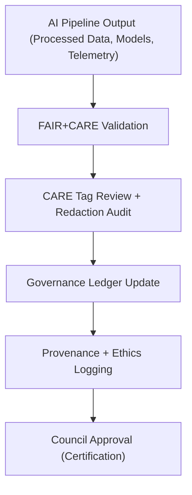

<div align="center">

# ⚖️ **Kansas Frontier Matrix — Archaeology Predictive Zones · Governance Pipeline**  
`src/ai/models/archaeology/predictive-zones/pipeline/governance/README.md`

**Purpose:**  
Document the **governance automation subsystem** of the **Archaeology Predictive Zones AI model**, responsible for ethical validation, FAIR+CARE certification, provenance recording, and ledger synchronization across the Kansas Frontier Matrix (KFM).  
Implements **FAIR+CARE Council oversight**, **ISO 19115 provenance**, and **ISO 50001 sustainability audits** within the AI pipeline governance layer.

[](../../../../../../../docs/)
[](../../../../../../../LICENSE)
[](../../../../../../../docs/standards/faircare.md)
[](#)

</div>

---

## 📘 Overview

The **Governance Pipeline** forms the compliance and validation layer of the **Archaeology Predictive Zones** system.  
It automates ethical governance tasks including:
- FAIR+CARE validation and Council approval tracking.  
- CARE-tag enforcement and data masking verification.  
- Provenance ledger synchronization with telemetry and audit logs.  
- Generation of sustainability and governance reports for Council sessions.  

This ensures the entire modeling process remains transparent, explainable, and ethically governed from ingestion to release.

---

## 🗂️ Directory Layout

```plaintext
src/ai/models/archaeology/predictive-zones/pipeline/governance/
├── README.md                           # This file — governance pipeline documentation
│
├── care_validator.py                   # Enforces FAIR+CARE tagging, ethics filters, and masking
├── governance_logger.py                # Records validation events and ledger entries
├── ledger_sync.py                      # Synchronizes governance data with main FAIR+CARE ledger
├── audit_summary.py                    # Compiles governance audits and validation reports
└── logs/
    ├── governance_audit.json           # Detailed audit outcomes
    ├── care_masking_report.json        # Sensitive data redaction tracking
    ├── ethics_review.json              # Council review decisions and timestamps
    └── ledger_sync_log.json            # Ledger synchronization history
```

---

## ⚙️ Governance Workflow Overview



### Pipeline Steps
1. **Validation:** Ensures all artifacts conform to FAIR+CARE and data-contract standards.  
2. **CARE Review:** Applies cultural, Indigenous, and ethical filters to prevent misuse.  
3. **Ledger Sync:** Uploads audit results to the FAIR+CARE governance ledger.  
4. **Provenance Record:** Logs every modification, reviewer, and certification.  
5. **Council Approval:** FAIR+CARE Council certifies ethical release readiness.  

---

## 🧩 Example Governance Audit (`logs/governance_audit.json`)

```json
{
  "audit_id": "gov_2025_11_08_004",
  "workflow": "predictive_zones_governance_v9.9.0",
  "datasets_reviewed": 6,
  "models_reviewed": 2,
  "care_violations_detected": 0,
  "masking_operations": 3,
  "energy_wh": 18.4,
  "carbon_gco2e": 9.1,
  "approved_by": "@faircare-council",
  "status": "certified",
  "timestamp": "2025-11-08T16:35:00Z",
  "telemetry_ref": "../../../../../../../releases/v9.9.0/focus-telemetry.json"
}
```

---

## ⚖️ FAIR+CARE Governance Matrix

| Principle | Implementation | Validation Source |
|------------|----------------|-------------------|
| **Findable** | Governance artifacts and ledger logs indexed under unique audit IDs. | `audit_summary.py` |
| **Accessible** | Internal FAIR+CARE dashboard for council review. | `ledger_sync.py` |
| **Interoperable** | DCAT, JSON-LD, and PROV-O schema mappings. | `governance_logger.py` |
| **Reusable** | Licensed CC-BY 4.0; all governance events reproducible under MCP-DL. | `care_validator.py` |
| **CARE – Responsibility** | Continuous cultural and ethical compliance monitoring. | `faircare-validate.yml` |
| **CARE – Ethics** | Cultural data redactions validated and timestamped. | `care_masking_report.json` |

---

## 🧮 Telemetry Metrics

Governance logs contribute energy, time, and compliance metrics to the unified telemetry ledger.

| Metric | Description | Example |
|--------|--------------|---------|
| `audits_run` | Number of audits executed in session. | 3 |
| `care_violations_detected` | CARE-tag violations during validation. | 0 |
| `ledger_entries_added` | New records appended to governance ledger. | 5 |
| `energy_wh` | Energy consumption during governance checks. | 18.4 |
| `carbon_gco2e` | Equivalent CO₂ footprint. | 9.1 |
| `status` | Certification result. | certified |

Telemetry reference:  
`releases/v9.9.0/focus-telemetry.json`  
Schema:  
`schemas/telemetry/src-ai-models-archaeology-predictivezones-pipeline-governance-v1.json`

---

## 🔐 Provenance & Ledger Integration

Each governance run syncs metadata with:
- `releases/v9.9.0/governance/ledger_snapshot.json`  
- `docs/standards/governance/ROOT-GOVERNANCE.md`  

**Provenance Example:**
```json
{
  "governance_event": "ledger_sync",
  "ledger_id": "ledger_2025q4_predictive_zones",
  "reviewed_by": "@kfm-governance",
  "status": "approved",
  "timestamp": "2025-11-08T17:00:00Z"
}
```

All entries cryptographically signed (SHA-256) and verified by FAIR+CARE Council.

---

## 🧾 Citation

```text
Kansas Frontier Matrix (2025). Archaeology Predictive Zones · Governance Pipeline (v9.9.0).
Defines the FAIR+CARE and ISO-aligned governance automation layer ensuring ethical validation, provenance integrity, and sustainable auditing across archaeology predictive AI systems.
```

---

## 🕰️ Version History

| Version | Date | Author | Summary |
|---------:|------|--------|----------|
| v9.9.0 | 2025-11-08 | `@kfm-governance` | Created governance pipeline documentation; added ledger sync, audit integration, and FAIR+CARE Council validation details. |

---

<div align="center">

**Kansas Frontier Matrix**  
*Ethical Governance × FAIR+CARE Oversight × Sustainable AI Auditing*  
© 2025 Kansas Frontier Matrix · CC-BY 4.0 · Master Coder Protocol v6.3 · FAIR+CARE Certified · Diamond⁹ Ω / Crown∞Ω Ultimate Certified  

[Back to Pipeline Index](../README.md) · [Governance Charter](../../../../../../../docs/standards/governance/ROOT-GOVERNANCE.md)

</div>

