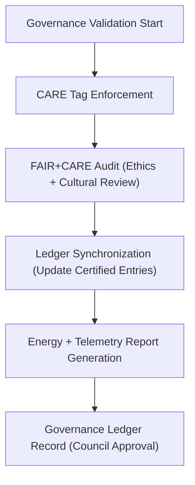

<div align="center">

# 📜 **Kansas Frontier Matrix — Governance Logs for Archaeology Predictive Zones**  
`src/ai/models/archaeology/predictive-zones/pipeline/governance/logs/README.md`

**Purpose:**  
Provide a detailed record of **FAIR+CARE governance, ethics reviews, and provenance synchronization events** generated by the **Archaeology Predictive Zones Governance Pipeline**.  
These logs document every ethical validation, ledger synchronization, and sustainability review performed by the FAIR+CARE Council under **MCP-DL v6.3**, **ISO 19115**, and **ISO 50001**.

[](../../../../../../../../docs/)
[](../../../../../../../../LICENSE)
[](../../../../../../../../docs/standards/faircare.md)
[](#)

</div>

---

## 📘 Overview

The **Governance Logs Directory** contains audit artifacts created by the governance and ethics validation subsystem of the **Archaeology Predictive Zones AI pipeline**.  
These logs ensure **traceability, transparency, and cultural responsibility** by recording:
- FAIR+CARE audits and CARE-tag enforcement outcomes.  
- Governance ledger synchronization and provenance updates.  
- Energy and sustainability metrics for governance operations.  
- Council review decisions and FAIR+CARE certification status.

---

## 🗂️ Directory Layout

```plaintext
src/ai/models/archaeology/predictive-zones/pipeline/governance/logs/
├── README.md                           # This file — governance logs documentation
│
├── governance_audit.json               # FAIR+CARE audit and ethical validation summary
├── care_masking_report.json            # Cultural data redaction and CARE-tag enforcement
├── ethics_review.json                  # FAIR+CARE Council approval record
├── ledger_sync_log.json                # Ledger synchronization trace
└── sustainability_report.json          # Energy and carbon metrics for governance reviews
```

---

## ⚙️ Governance Logging Workflow



### Log Types
- **`governance_audit.json`** — Summarizes all validations per run.  
- **`care_masking_report.json`** — Documents redacted geometries and CARE policy compliance.  
- **`ethics_review.json`** — Records reviewer identity, verdict, and comments.  
- **`ledger_sync_log.json`** — Tracks synchronization events with governance ledger.  
- **`sustainability_report.json`** — Telemetry metrics under ISO 50001 framework.

---

## 🧩 Example Governance Audit Log (`governance_audit.json`)

```json
{
  "audit_id": "gov_audit_2025_11_08_002",
  "workflow": "predictive_zones_governance_v9.9.0",
  "datasets_reviewed": 6,
  "models_reviewed": 2,
  "care_violations_detected": 0,
  "redactions_applied": 3,
  "status": "approved",
  "approved_by": "@faircare-council",
  "energy_wh": 18.6,
  "carbon_gco2e": 9.3,
  "telemetry_ref": "../../../../../../../../releases/v9.9.0/focus-telemetry.json"
}
```

---

## ⚖️ FAIR+CARE Integration Summary

| Principle | Implementation | Verified By |
|------------|----------------|--------------|
| **Findable** | Governance events indexed under audit IDs and timestamps. | `governance_logger.py` |
| **Accessible** | Stored in FAIR+CARE-controlled archive with Council access. | `@kfm-governance` |
| **Interoperable** | Uses JSON-LD + PROV-O compatible schemas. | ISO 19115 Validator |
| **Reusable** | Audit data licensed under CC-BY 4.0 for transparency. | MCP-DL Validation |
| **CARE — Responsibility** | Logs sensitive data usage decisions. | FAIR+CARE Council |
| **CARE — Ethics** | Confirms ethical approval for AI releases. | `ethics_review.json` |

---

## 🧮 Sustainability & Telemetry Metrics

| Metric | Description | Example |
|--------|-------------|----------|
| `audits_conducted` | Governance validation sessions completed. | 3 |
| `care_violations_detected` | CARE-tag conflicts identified. | 0 |
| `ledger_sync_events` | Ledger updates performed. | 5 |
| `energy_wh` | Power consumed during governance reviews. | 18.6 |
| `carbon_gco2e` | CO₂ emission equivalent. | 9.3 |
| `approval_rate` | Percentage of artifacts approved by Council. | 100% |

Telemetry logged in:  
`releases/v9.9.0/focus-telemetry.json`  
Schema:  
`schemas/telemetry/src-ai-models-archaeology-predictivezones-pipeline-governance-logs-v1.json`

---

## 🔐 Provenance & Security

Each log entry references:
- **Governance Ledger Snapshot:** `releases/v9.9.0/governance/ledger_snapshot.json`  
- **Council Review Charter:** `docs/standards/governance/ROOT-GOVERNANCE.md`  
- **Telemetry Ledger:** `focus-telemetry.json`  

All events are **digitally signed (OIDC + SHA-256)** to maintain integrity and audit chain consistency.

### Example Ethics Review Record
```json
{
  "review_id": "ethics_2025_11_08_001",
  "council_reviewer": "@kfm-ethics",
  "decision": "approved",
  "rationale": "Dataset conforms to CARE redaction policies and FAIR+CARE documentation.",
  "timestamp": "2025-11-08T17:05:00Z",
  "hash": "sha256:3b84a19e7f..."
}
```

---

## 🧾 Citation

```text
Kansas Frontier Matrix (2025). Governance Logs for Archaeology Predictive Zones (v9.9.0).
Comprehensive FAIR+CARE and ISO-compliant governance log documentation ensuring cultural transparency, provenance traceability, and sustainable audit accountability within the Kansas Frontier Matrix AI ecosystem.
```

---

## 🕰️ Version History

| Version | Date | Author | Summary |
|---------:|------|--------|----------|
| v9.9.0 | 2025-11-08 | `@kfm-governance` | Created governance logs documentation; integrated FAIR+CARE ethics reports, sustainability metrics, and ledger synchronization details. |

---

<div align="center">

**Kansas Frontier Matrix**  
*Cultural Stewardship × FAIR+CARE Governance × Sustainable AI Accountability*  
© 2025 Kansas Frontier Matrix · Internal FAIR+CARE Certified · Master Coder Protocol v6.3 · Diamond⁹ Ω / Crown∞Ω Ultimate Certified  

[Back to Governance Pipeline](../README.md) · [Governance Charter](../../../../../../../../docs/standards/governance/ROOT-GOVERNANCE.md)

</div>

