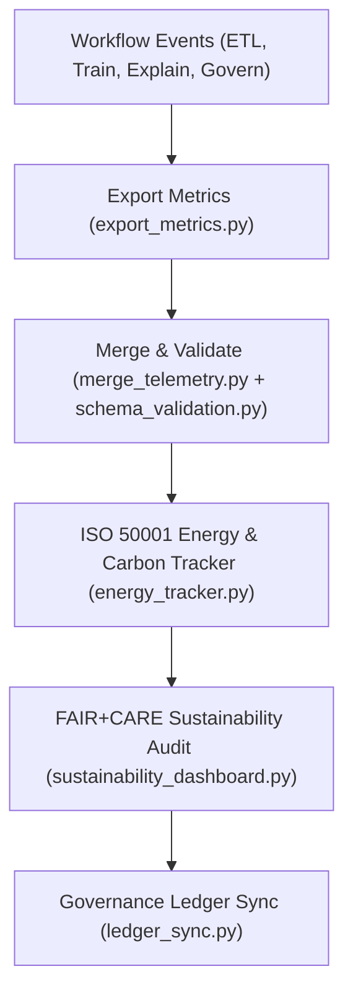

<div align="center">

# 📈 **Kansas Frontier Matrix — Archaeology Predictive Zones · Telemetry Pipeline**  
`src/ai/models/archaeology/predictive-zones/pipeline/telemetry/README.md`

**Purpose:**  
Document the **telemetry aggregation and sustainability monitoring subsystem** for the **Archaeology Predictive Zones AI pipeline** within the Kansas Frontier Matrix (KFM).  
This pipeline captures **energy usage**, **FAIR+CARE compliance**, and **sustainability metrics** across ETL, training, explainability, and governance workflows under **ISO 50001** and **MCP-DL v6.3**.

[](../../../../../../../docs/)
[](../../../../../../../LICENSE)
[](../../../../../../../docs/standards/faircare.md)
[](#)

</div>

---

## 📘 Overview

The **Telemetry Pipeline** centralizes metrics from all Archaeology Predictive Zones subsystems — including **ETL**, **training**, **explainability**, and **governance** — into the unified **focus-telemetry.json** ledger.  
It enables real-time monitoring of energy efficiency, runtime, bias, and ethics performance for reproducible, sustainable AI operations.

### Core Objectives
- Consolidate FAIR+CARE-aligned telemetry events across pipelines.  
- Track energy (Wh) and emissions (gCO₂e) under **ISO 50001**.  
- Provide FAIR+CARE Council with transparent sustainability dashboards.  
- Synchronize telemetry records with governance and provenance ledgers.  

---

## 🗂️ Directory Layout

```plaintext
src/ai/models/archaeology/predictive-zones/pipeline/telemetry/
├── README.md                           # This file — telemetry pipeline documentation
│
├── export_metrics.py                   # Collects and formats telemetry data
├── merge_telemetry.py                  # Merges per-stage metrics into unified ledger
├── schema_validation.py                # Validates telemetry JSON structure
├── energy_tracker.py                   # Estimates energy (Wh) and emissions (gCO₂e)
├── sustainability_dashboard.py         # Visualization notebook for sustainability data
└── logs/
    ├── telemetry_session_log.json      # Runtime and energy usage log
    ├── merge_summary.json              # Merge statistics across workflows
    ├── validation_report.json          # Telemetry schema validation results
    └── sustainability_audit.json       # FAIR+CARE energy and sustainability report
```

---

## ⚙️ Telemetry Workflow Overview



### Data Sources
- ETL: Energy, runtime, and checksum reports (`etl/logs/`).  
- Training: Model energy and carbon output (`training/logs/energy_report.json`).  
- Explainability: Bias & interpretability metrics (`explainability/logs/`).  
- Governance: Council audits and approval events (`governance/logs/`).  

---

## 🧩 Example: `telemetry_session_log.json`

```json
{
  "session_id": "telemetry_2025_11_08_004",
  "etl_runtime_sec": 892,
  "training_time_min": 318.4,
  "energy_wh": 1501.8,
  "carbon_gco2e": 622.5,
  "bias_score": 0.04,
  "faircare_score": 98.7,
  "sustainability_index": 0.93,
  "reviewed_by": "@kfm-sustainability",
  "telemetry_ref": "../../../../../../../releases/v9.9.0/focus-telemetry.json"
}
```

---

## ⚖️ FAIR+CARE & Sustainability Integration

| Principle | Implementation | Verified By |
|------------|----------------|--------------|
| **Findable** | Telemetry sessions indexed by workflow ID and timestamp. | `telemetry-export.yml` |
| **Accessible** | Public ledger for non-sensitive sustainability data. | FAIR+CARE Council |
| **Interoperable** | JSON-LD + ISO 19115 compliance for metrics. | Schema validator |
| **Reusable** | CC-BY 4.0; data reusable for climate research. | MCP-DL v6.3 |
| **CARE — Responsibility** | Governance oversight for energy consumption transparency. | FAIR+CARE Council |
| **CARE — Ethics** | Ensures equitable and sustainable AI resource usage. | `sustainability_audit.json` |

---

## 🧮 Sustainability Metrics

| Metric | Description | Example |
|--------|-------------|---------|
| `etl_runtime_sec` | Total runtime for ETL pipeline. | 892 |
| `training_time_min` | Total training time. | 318.4 |
| `energy_wh` | Energy usage across workflows. | 1501.8 |
| `carbon_gco2e` | Carbon equivalent emissions. | 622.5 |
| `sustainability_index` | Energy efficiency ratio (0–1). | 0.93 |
| `faircare_score` | FAIR+CARE compliance index. | 98.7 |
| `status` | Telemetry validation result. | passed |

All telemetry data consolidated into:  
`releases/v9.9.0/focus-telemetry.json`  
Schema: `schemas/telemetry/src-ai-models-archaeology-predictivezones-pipeline-telemetry-v1.json`

---

## 🔐 Provenance & Audit Trace

Telemetry outputs are cryptographically signed and linked to the **Governance Ledger**:
- Ledger Snapshot: `releases/v9.9.0/governance/ledger_snapshot.json`  
- Provenance Record: `data/work/staging/tabular/tmp/validation/provenance_trace.json`  
- FAIR+CARE Audit: `governance/logs/governance_audit.json`  

Example:
```json
{
  "audit_id": "telemetry_2025_q4_004",
  "reviewed_by": "@kfm-sustainability",
  "ledger_entry": "ledger_2025q4_predictive_zones",
  "carbon_gco2e": 622.5,
  "energy_wh": 1501.8,
  "approved": true,
  "timestamp": "2025-11-08T18:30:00Z"
}
```

---

## 🧾 Citation

```text
Kansas Frontier Matrix (2025). Archaeology Predictive Zones · Telemetry Pipeline (v9.9.0).
Defines the sustainability and telemetry aggregation framework for AI energy, bias, and FAIR+CARE governance tracking within the Archaeology Predictive Zones pipeline.
```

---

## 🕰️ Version History

| Version | Date | Author | Summary |
|---------:|------|--------|----------|
| v9.9.0 | 2025-11-08 | `@kfm-sustainability` | Created telemetry pipeline documentation; added FAIR+CARE sustainability metrics, ISO 50001 alignment, and governance trace integration. |

---

<div align="center">

**Kansas Frontier Matrix**  
*Sustainable Intelligence × FAIR+CARE Governance × Transparent Telemetry*  
© 2025 Kansas Frontier Matrix · CC-BY 4.0 · Master Coder Protocol v6.3 · FAIR+CARE Certified · Diamond⁹ Ω / Crown∞Ω Ultimate Certified  

[Back to Pipeline Index](../README.md) · [Governance Charter](../../../../../../../docs/standards/governance/ROOT-GOVERNANCE.md)

</div>

