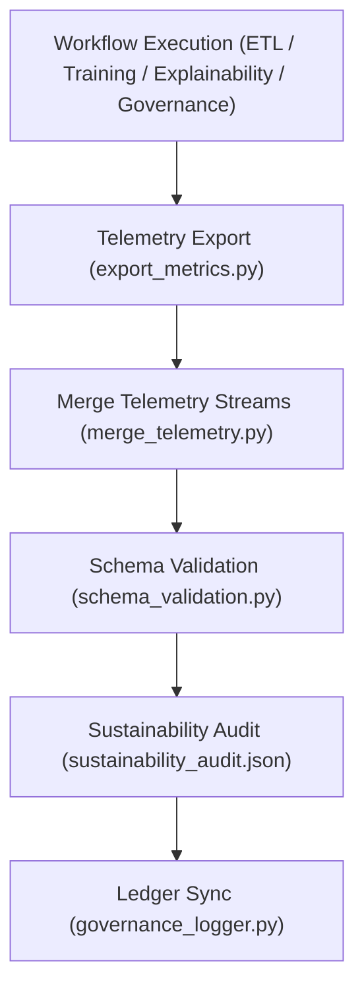

<div align="center">

# 🧾 **Kansas Frontier Matrix — Telemetry Logs for Archaeology Predictive Zones**  
`src/ai/models/archaeology/predictive-zones/pipeline/telemetry/logs/README.md`

**Purpose:**  
Document all **telemetry session logs, merge summaries, and sustainability audits** produced during the Archaeology Predictive Zones AI workflow.  
These logs ensure verifiable **energy tracking**, **FAIR+CARE compliance**, and **ISO 50001 sustainability reporting** across ETL, training, explainability, and governance layers.

[](../../../../../../../../docs/)
[](../../../../../../../../LICENSE)
[](../../../../../../../../docs/standards/faircare.md)
[](#)

</div>

---

## 📘 Overview

The **Telemetry Logs Directory** collects and archives performance, energy, and sustainability metrics for all Archaeology Predictive Zones AI pipeline activities.  
It supports FAIR+CARE-certified environmental governance and provides traceable documentation for ethical AI operations under **MCP-DL v6.3** and **ISO 50001**.

---

## 🗂️ Directory Layout

```plaintext
src/ai/models/archaeology/predictive-zones/pipeline/telemetry/logs/
├── README.md                           # This file — telemetry logs documentation
│
├── telemetry_session_log.json          # Per-run telemetry metrics for AI pipeline stages
├── merge_summary.json                  # Aggregated statistics from multiple telemetry sources
├── validation_report.json              # Telemetry schema and integrity validation outcomes
└── sustainability_audit.json           # ISO 50001 sustainability and FAIR+CARE audit report
```

---

## ⚙️ Telemetry Logging Workflow



### Logging Modules
- `export_metrics.py` — Emits workflow-specific telemetry events.  
- `merge_telemetry.py` — Consolidates all telemetry records into a unified log.  
- `schema_validation.py` — Ensures alignment with FAIR+CARE and telemetry schema.  
- `energy_tracker.py` — Calculates total energy use and emissions under ISO 50001.  
- `governance_logger.py` — Publishes audit results to FAIR+CARE Council ledger.

---

## 🧩 Example Log (`telemetry_session_log.json`)

```json
{
  "session_id": "telemetry_2025_11_08_006",
  "workflows_tracked": ["etl", "training", "explainability", "governance"],
  "etl_runtime_sec": 892,
  "training_time_min": 318.4,
  "energy_wh": 1501.8,
  "carbon_gco2e": 622.5,
  "bias_score": 0.04,
  "faircare_score": 98.7,
  "sustainability_index": 0.93,
  "validation_passed": true,
  "reviewed_by": "@kfm-sustainability",
  "timestamp": "2025-11-08T18:30:00Z"
}
```

---

## ⚖️ FAIR+CARE Integration Matrix

| Principle | Implementation | Validator |
|------------|----------------|------------|
| **Findable** | Each telemetry session indexed by UUID and timestamp. | `telemetry-export.yml` |
| **Accessible** | Public sustainability metrics available post-review. | FAIR+CARE Council |
| **Interoperable** | JSON-LD and ISO 19115 metadata embedded in logs. | `schema_validation.py` |
| **Reusable** | CC-BY 4.0 license; machine-readable format. | MCP-DL Validator |
| **CARE – Responsibility** | Sustainability metrics linked to ethical governance. | `sustainability_audit.json` |
| **CARE – Ethics** | FAIR+CARE auditors ensure equitable AI resource allocation. | Governance Ledger |

---

## 🧮 Key Metrics

| Metric | Description | Example |
|--------|-------------|----------|
| `energy_wh` | Total energy usage across workflows. | 1501.8 |
| `carbon_gco2e` | Equivalent CO₂ emissions. | 622.5 |
| `runtime_sec` | Total combined runtime for workflows. | 5432 |
| `faircare_score` | FAIR+CARE compliance percentage. | 98.7 |
| `sustainability_index` | Composite sustainability efficiency metric. | 0.93 |
| `validation_passed` | Telemetry schema validation status. | true |

**Telemetry records appended to:**  
`releases/v9.9.0/focus-telemetry.json`  
Schema: `schemas/telemetry/src-ai-models-archaeology-predictivezones-pipeline-telemetry-logs-v1.json`

---

## 🔐 Provenance & Security

- All telemetry logs digitally signed (SHA-256) and verified under OIDC.  
- FAIR+CARE Council validates sustainability and ethical compliance quarterly.  
- Governance Ledger Snapshot updated automatically with energy metrics.  

### Example Sustainability Audit
```json
{
  "audit_id": "sustainability_2025_11_08_001",
  "energy_wh": 1501.8,
  "carbon_gco2e": 622.5,
  "care_reviewed": true,
  "auditor": "@kfm-sustainability",
  "ethics_approval": "approved",
  "timestamp": "2025-11-08T18:40:00Z"
}
```

---

## 🧾 Citation

```text
Kansas Frontier Matrix (2025). Telemetry Logs for Archaeology Predictive Zones (v9.9.0).
Provides FAIR+CARE-aligned telemetry and sustainability logs ensuring transparent energy, carbon, and ethics tracking for the Kansas Frontier Matrix AI pipeline.
```

---

## 🕰️ Version History

| Version | Date | Author | Summary |
|---------:|------|--------|----------|
| v9.9.0 | 2025-11-08 | `@kfm-sustainability` | Created telemetry logs documentation with ISO 50001 integration, FAIR+CARE sustainability metrics, and governance synchronization. |

---

<div align="center">

**Kansas Frontier Matrix**  
*Sustainable Intelligence × FAIR+CARE Ethics × Transparent Telemetry*  
© 2025 Kansas Frontier Matrix · Internal FAIR+CARE Certified · Master Coder Protocol v6.3 · Diamond⁹ Ω / Crown∞Ω Ultimate Certified  

[Back to Telemetry Pipeline](../README.md) · [Governance Charter](../../../../../../../../docs/standards/governance/ROOT-GOVERNANCE.md)

</div>

