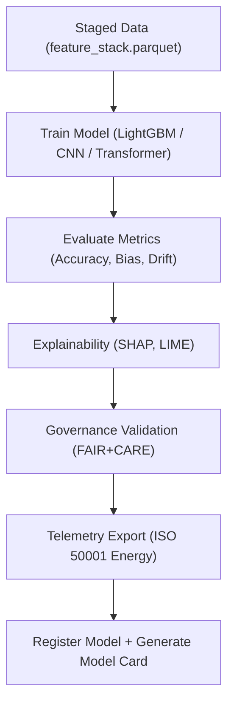

<div align="center">

# 🏗️ **Kansas Frontier Matrix — Archaeology Predictive Zones · Training Pipeline**  
`src/ai/models/archaeology/predictive-zones/pipeline/training/README.md`

**Purpose:**  
Describe the **model training and evaluation pipeline** for the **Archaeology Predictive Zones AI system**, responsible for generating predictive spatial probability maps and analytical layers.  
This pipeline enforces **FAIR+CARE governance**, **MCP-DL reproducibility**, and **ISO 50001 energy accountability**.

[](../../../../../../../docs/)
[](../../../../../../../LICENSE)
[](../../../../../../../docs/standards/faircare.md)
[](#)

</div>

---

## 📘 Overview

The **Training Pipeline** builds, optimizes, and validates models that forecast **archaeological site probabilities** using structured features from environmental and cultural datasets.  
It incorporates **ethical auditing**, **bias detection**, and **explainability layers** to align machine learning operations with **FAIR+CARE and ISO standards**.

---

## 🗂️ Directory Layout

```plaintext
src/ai/models/archaeology/predictive-zones/pipeline/training/
├── README.md                           # This file — training pipeline documentation
│
├── train_predictive_model.py           # Main AI training orchestration
├── evaluate_model.py                   # Evaluation metrics + explainability hooks
├── config.yaml                         # Model hyperparameters and governance metadata
├── model_registry_update.py            # Registers new models in registry.json
├── generate_model_card.py              # Generates model card for governance
└── logs/
    ├── training_log.json               # Model training log
    ├── evaluation_report.json          # Accuracy, bias, drift metrics
    └── energy_report.json              # ISO 50001 sustainability telemetry
```

---

## ⚙️ Training Workflow Overview



### Key Functions
1. **Train Model:** Uses ethical, schema-validated features for supervised learning.  
2. **Evaluate Metrics:** Measures accuracy, bias, drift, and cultural feature performance.  
3. **Explainability:** Runs SHAP/LIME to interpret feature importance.  
4. **Governance Validation:** Ensures compliance with FAIR+CARE Council-approved datasets.  
5. **Telemetry Export:** Logs runtime, energy, and carbon footprint metrics.  
6. **Model Registry Update:** Appends metadata to `src/ai/models/registry.json`.

---

## 🧩 Model Configuration Example (`config.yaml`)

```yaml
model:
  name: predictive_zones_ai_v9.9.0
  type: LightGBM
  objective: binary
  parameters:
    n_estimators: 800
    learning_rate: 0.05
    num_leaves: 128
    max_depth: 12
    subsample: 0.8
    colsample_bytree: 0.7
  random_seed: 42

data:
  input: "../../data/processed/feature_stack.parquet"
  target_column: "site_presence"
  care_tag: "restricted"

evaluation:
  metrics: [AUC, F1, Precision, Recall]
  explainability: true
  drift_detection: true

governance:
  reviewer: "@faircare-council"
  ethics_status: "approved"
  telemetry_ref: "../../../../../../../releases/v9.9.0/focus-telemetry.json"
```

---

## 🧮 Example: Training Log (`logs/training_log.json`)

```json
{
  "training_run_id": "train_2025_11_08_002",
  "model": "LightGBM",
  "records_trained": 148336,
  "epochs": 1,
  "auc": 0.942,
  "f1": 0.912,
  "bias_score": 0.05,
  "drift_flag": false,
  "energy_wh": 1423.5,
  "carbon_gco2e": 610.3,
  "runtime_min": 318.4,
  "governance_ref": "../../../../../../../docs/standards/faircare.md"
}
```

---

## ⚖️ FAIR+CARE Integration Matrix

| Principle | Implementation | Validator |
|------------|----------------|------------|
| **Findable** | Registered models in `registry.json` with UUID and checksum. | `ai-train.yml` |
| **Accessible** | Open metadata, restricted weights for sensitive data. | Governance ledger |
| **Interoperable** | Parquet, JSON, and SBOM integration. | `stac-validate.yml` |
| **Reusable** | Reproducible configs under CC-BY or MIT license. | MCP-DL v6.3 |
| **CARE — Responsibility** | Bias/drift metrics recorded in telemetry. | FAIR+CARE Council |
| **CARE — Ethics** | Uses only `approved` datasets. | `faircare-validate.yml` |

---

## 📊 Telemetry Metrics

Telemetry metrics collected from the training pipeline:

| Metric | Description | Example |
|--------|-------------|---------|
| `train_time_min` | Duration of training job. | 318.4 |
| `records_trained` | Number of records used for training. | 148,336 |
| `energy_wh` | Energy usage during model training. | 1423.5 |
| `bias_score` | Detected bias index. | 0.05 |
| `drift_flag` | Indicates model drift detection. | false |
| `validation_auc` | AUC score of model performance. | 0.942 |
| `carbon_gco2e` | Carbon emissions (ISO 50001). | 610.3 |

All telemetry data are appended to:  
`releases/v9.9.0/focus-telemetry.json`  
Schema: `schemas/telemetry/src-ai-models-archaeology-predictivezones-pipeline-training-v1.json`

---

## 🔐 Governance & Security

- Models trained only on **FAIR+CARE-approved datasets**.  
- SBOM generated post-training for license & dependency integrity.  
- Provenance links embedded into model registry with SHA-256 hashes.  
- Attestation via **SLSA provenance** and signed releases.  
- Governance logs appended to `releases/v9.9.0/governance/ledger_snapshot.json`.

---

## 🧾 Citation

```text
Kansas Frontier Matrix (2025). Archaeology Predictive Zones · Training Pipeline (v9.9.0).
Defines FAIR+CARE and ISO-compliant training pipeline for ethical, explainable, and sustainable AI modeling of archaeological predictive zones in the Kansas Frontier Matrix.
```

---

## 🕰️ Version History

| Version | Date | Author | Summary |
|---------:|------|--------|----------|
| v9.9.0 | 2025-11-08 | `@kfm-ai` | Created training pipeline documentation; added FAIR+CARE, telemetry, and governance schema linkages. |

---

<div align="center">

**Kansas Frontier Matrix**  
*Ethical AI Training × FAIR+CARE Governance × Sustainable Intelligence*  
© 2025 Kansas Frontier Matrix · MIT · Master Coder Protocol v6.3 · FAIR+CARE Certified · Diamond⁹ Ω / Crown∞Ω Ultimate Certified  

[Back to Pipeline Index](../README.md) · [Governance Charter](../../../../../../../docs/standards/governance/ROOT-GOVERNANCE.md)

</div>

