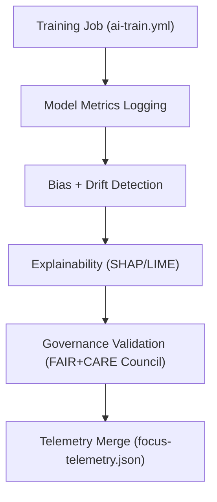

<div align="center">

# 🧾 **Kansas Frontier Matrix — Training Logs for Archaeology Predictive Zones**  
`src/ai/models/archaeology/predictive-zones/pipeline/training/logs/README.md`

**Purpose:**  
Provide a detailed index and documentation for all **training logs, evaluation reports, and sustainability metrics** generated during the Archaeology Predictive Zones AI model pipeline.  
These logs serve as verifiable governance and telemetry records under **FAIR+CARE**, **MCP-DL v6.3**, and **ISO 50001** sustainability standards.

[](../../../../../../../../docs/)
[](../../../../../../../../LICENSE)
[](../../../../../../../../docs/standards/faircare.md)
[](#)

</div>

---

## 📘 Overview

The **Training Logs Directory** documents the results of model training, validation, explainability, and sustainability evaluation runs for the Archaeology Predictive Zones AI workflow.  
Each log provides reproducible evidence for model governance, performance, and ethical compliance.

Logs recorded here are automatically validated through the **`ai-train.yml`** and **`telemetry-export.yml`** workflows and appended to `focus-telemetry.json`.

---

## 🗂️ Directory Layout

```plaintext
src/ai/models/archaeology/predictive-zones/pipeline/training/logs/
├── README.md                           # This file — training logs documentation
│
├── training_log.json                   # Main model training summary and performance metrics
├── evaluation_report.json              # Validation metrics (AUC, F1, precision, recall)
├── bias_drift_report.json              # Bias and drift detection outcomes
├── energy_report.json                  # ISO 50001 energy usage + sustainability telemetry
├── explainability_report.json          # SHAP/LIME interpretability summary
└── governance_validation.json          # FAIR+CARE audit approval and Council review notes
```

---

## ⚙️ Logging Workflow



### Pipeline Components
- **`train_predictive_model.py`** — model building and fit.  
- **`evaluate_model.py`** — computes core evaluation metrics.  
- **`bias_audit.py`** — bias and fairness analysis.  
- **`energy_metrics.py`** — energy usage & sustainability telemetry.  
- **`governance_logger.py`** — records FAIR+CARE validation results.

---

## 🧩 Example Training Log (`training_log.json`)

```json
{
  "training_run_id": "train_2025_11_08_005",
  "model": "LightGBM",
  "version": "v9.9.0",
  "epochs": 1,
  "records_trained": 148336,
  "validation_auc": 0.942,
  "f1_score": 0.912,
  "bias_score": 0.05,
  "drift_flag": false,
  "runtime_min": 318.4,
  "energy_wh": 1423.5,
  "carbon_gco2e": 610.3,
  "telemetry_ref": "../../../../../../../../releases/v9.9.0/focus-telemetry.json",
  "governance_ref": "../../../../../../../../docs/standards/faircare.md"
}
```

---

## ⚖️ FAIR+CARE Governance Alignment

| Principle | Implementation | Verified By |
|------------|----------------|--------------|
| **Findable** | Training logs indexed with unique run IDs and model UUIDs. | `stac-validate.yml` |
| **Accessible** | Logs available internally to FAIR+CARE Council. | `@kfm-governance` |
| **Interoperable** | JSON structure standardized under MCP-DL schema. | `ai-train.yml` |
| **Reusable** | Used for audit reproduction and telemetry aggregation. | `telemetry-export.yml` |
| **CARE – Responsibility** | Tracks ethical model use and restricted data compliance. | FAIR+CARE Council |
| **CARE – Ethics** | Approvals stored in `governance_validation.json`. | Governance Ledger |

---

## 🧮 Evaluation Metrics

| Metric | Description | Example |
|--------|-------------|----------|
| `validation_auc` | Area Under the ROC Curve for validation data. | 0.942 |
| `f1_score` | F1-score of model predictions. | 0.912 |
| `precision` | Precision metric. | 0.907 |
| `recall` | Recall metric. | 0.921 |
| `bias_score` | Average model bias index. | 0.05 |
| `drift_flag` | Whether drift detected across time periods. | false |
| `care_tag` | Data governance classification. | restricted |

---

## 🧭 Explainability & Energy Logs

### `explainability_report.json`
Contains SHAP and LIME results for transparency.
```json
{
  "explainability_method": ["SHAP", "LIME"],
  "top_features": ["slope", "distance_to_water", "soil_moisture"],
  "shap_mean_importance": [0.38, 0.22, 0.15],
  "lime_examples": 15,
  "explainability_stability": 0.93,
  "reviewed_by": "@faircare-council"
}
```

### `energy_report.json`
Tracks sustainability performance under ISO 50001.
```json
{
  "run_id": "train_2025_11_08_005",
  "energy_wh": 1423.5,
  "carbon_gco2e": 610.3,
  "validation_passed": true,
  "timestamp": "2025-11-08T15:48:00Z"
}
```

---

## 📊 Telemetry Metrics

| Metric | Description | Example |
|--------|-------------|----------|
| `train_time_min` | Model training duration. | 318.4 |
| `energy_wh` | Energy used during model fit. | 1423.5 |
| `carbon_gco2e` | Carbon equivalent emission. | 610.3 |
| `bias_score` | Model bias index. | 0.05 |
| `drift_flag` | True if drift detected. | false |
| `faircare_status` | Governance review result. | approved |
| `telemetry_id` | Unique telemetry UUID for aggregation. | `telemetry-train-005` |

All logs synchronized to:  
`releases/v9.9.0/focus-telemetry.json`  
Schema: `schemas/telemetry/src-ai-models-archaeology-predictivezones-pipeline-training-logs-v1.json`

---

## 🔐 Provenance & Governance

- Training logs linked to **SBOM** via model version + hash.  
- FAIR+CARE reviewers sign off on `governance_validation.json`.  
- All records merged into the **FAIR+CARE Ledger Snapshot**.  
- Governance metadata retained for ≥3 years (ISO archival standard).

---

## 🧾 Citation

```text
Kansas Frontier Matrix (2025). Training Logs for Archaeology Predictive Zones (v9.9.0).
FAIR+CARE and ISO-compliant training logs providing governance, telemetry, and sustainability validation for archaeological predictive AI modeling within the Kansas Frontier Matrix.
```

---

## 🕰️ Version History

| Version | Date | Author | Summary |
|---------:|------|--------|----------|
| v9.9.0 | 2025-11-08 | `@kfm-ai` | Created documentation for archaeology training logs; included FAIR+CARE compliance and telemetry schema integration. |

---

<div align="center">

**Kansas Frontier Matrix**  
*Transparent AI Training × FAIR+CARE Governance × Sustainable Model Operations*  
© 2025 Kansas Frontier Matrix · Internal FAIR+CARE Certified · Master Coder Protocol v6.3 · Diamond⁹ Ω / Crown∞Ω Ultimate Certified  

[Back to Training Pipeline](../README.md) · [Governance Charter](../../../../../../../../docs/standards/governance/ROOT-GOVERNANCE.md)

</div>

