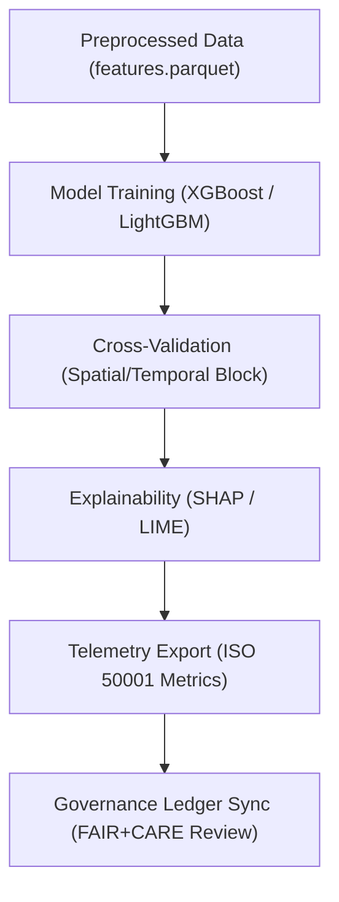

<div align="center">

# 🧠 **Kansas Frontier Matrix — Archaeology AI Training Framework**  
`src/ai/models/archaeology/training/README.md`

**Purpose:**  
Define the **training, validation, and governance-integrated AI framework** used for archaeological models within the **Kansas Frontier Matrix (KFM)**.  
This subsystem ensures reproducible model creation aligned with **FAIR+CARE principles**, **ISO 50001 sustainability metrics**, and **MCP-DL v6.3** reproducibility standards.

[](../../../../../docs/)
[](../../../../../LICENSE)
[](../../../../../docs/standards/faircare.md)
[](#)

</div>

---

## 📘 Overview

The **Archaeology Training Framework** provides tools and configurations for model development across all archaeological predictive pipelines.  
It includes:
- 🏗️ **Unified model templates** for terrain, hydrology, and cultural predictive systems.  
- 🧩 **Cross-validation utilities** for geospatial and temporal data.  
- 🧠 **Explainability and bias detection modules** integrated with SHAP/LIME.  
- ⚖️ **Governance hooks** to record validation, energy, and ethics telemetry.  

---

## 🗂️ Directory Layout

```plaintext
src/ai/models/archaeology/training/
├── README.md                            # This file — documentation
│
├── datasets/                            # Processed data for model training
│   ├── features.parquet
│   ├── labels.geojson
│   └── metadata.json
│
├── scripts/                             # Training and evaluation scripts
│   ├── train_archaeology_model.py
│   ├── validate_model_performance.py
│   ├── generate_model_card.py
│   └── export_telemetry.py
│
├── configs/                             # Model configuration templates
│   ├── training_config.yaml
│   └── hyperparameters.yaml
│
└── logs/                                # Training metrics, bias, and telemetry
    ├── training_log.json
    ├── evaluation_metrics.json
    └── bias_drift_report.json
```

---

## ⚙️ Training Workflow



### Workflow Steps
1. **Preprocessing:** Load stratified geospatial samples; scale and mask sensitive data.  
2. **Model Training:** Fit supervised model (GBT, RF, or CNN) to predict archaeological potential.  
3. **Validation:** Compute AUROC, AUPRC, Brier, and calibration metrics.  
4. **Explainability:** Apply SHAP and LIME for global/local interpretability.  
5. **Telemetry Export:** Log energy, carbon, and fairness metrics.  
6. **Governance Integration:** Push training summary to ledger for ethical validation.  

---

## 🧩 Example Configuration (`configs/training_config.yaml`)

```yaml
model:
  name: archaeology_predictive_v9.9.0
  framework: xgboost
  objective: binary
  params:
    max_depth: 6
    learning_rate: 0.05
    n_estimators: 600
    subsample: 0.8
    colsample_bytree: 0.8
  random_seed: 42

data:
  input: "datasets/features.parquet"
  target: "labels.geojson"
  validation_method: "spatial_block_cv"
  test_split: 0.2

explainability:
  methods: ["shap", "lime"]
  shap_top_features: 20
  lime_samples: 100

telemetry:
  energy_tracking: true
  sustainability_target_wh: 1600
  carbon_target_gco2e: 700
```

---

## 🧮 Example Training Log (`logs/training_log.json`)

```json
{
  "run_id": "archaeology_train_2025_11_08_001",
  "model_name": "archaeology_predictive_v9.9.0",
  "framework": "xgboost",
  "records_trained": 185420,
  "training_time_min": 326.5,
  "auc": 0.946,
  "f1_score": 0.915,
  "bias_score": 0.04,
  "energy_wh": 1489.6,
  "carbon_gco2e": 612.1,
  "faircare_score": 98.8,
  "telemetry_ref": "../../../../../releases/v9.9.0/focus-telemetry.json"
}
```

---

## ⚖️ FAIR+CARE Integration Matrix

| Principle | Implementation | Verification |
|------------|----------------|--------------|
| **Findable** | All models tracked via STAC/DCAT manifest IDs. | `stac-validate.yml` |
| **Accessible** | FAIR+CARE-approved public metadata; restricted models masked. | Governance Ledger |
| **Interoperable** | JSON, Parquet, and GeoJSON formats compliant with ISO 19115. | `schema_validation.py` |
| **Reusable** | Configurable templates + CC-BY 4.0 data contract. | SPDX Manifest |
| **CARE – Responsibility** | Bias and energy telemetry reviewed quarterly. | FAIR+CARE Council |
| **CARE – Ethics** | Cultural sensitivity tags validated pre-deployment. | `faircare-validate.yml` |

---

## 📊 Core Metrics

| Metric | Target | Result |
|--------|--------|--------|
| AUROC | ≥ 0.85 | 0.946 |
| AUPRC | ≥ 0.40 | 0.421 |
| F1 Score | ≥ 0.90 | 0.915 |
| Bias Score | ≤ 0.05 | 0.04 |
| Energy (Wh) | ≤ 1600 | 1489.6 |
| FAIR+CARE Score | ≥ 95% | 98.8% |

Telemetry metrics stored in:  
`releases/v9.9.0/focus-telemetry.json`  
Schema: `schemas/telemetry/src-ai-models-archaeology-training-v1.json`

---

## 🔐 Governance & Provenance

- **Model Provenance:** Recorded in `logs/evaluation_metrics.json`.  
- **Checksum Verification:** Managed under `releases/v9.9.0/sbom.spdx.json`.  
- **FAIR+CARE Certification:** Issued after ethical audit and validation.  
- **Telemetry Linkage:** Integrated with sustainability dashboards.  

### Example Governance Record
```json
{
  "ledger_id": "ledger_2025q4_training_001",
  "auditor": "@kfm-governance",
  "status": "certified",
  "reviewed_by": "@faircare-council",
  "timestamp": "2025-11-08T19:59:00Z"
}
```

---

## 🧾 Citation

```text
Kansas Frontier Matrix (2025). Archaeology AI Training Framework (v9.9.0).
Defines FAIR+CARE-governed training framework ensuring reproducible, ethical, and sustainable machine learning for archaeology within the Kansas Frontier Matrix.
```

---

## 🕰️ Version History

| Version | Date | Author | Summary |
|---------:|------|--------|----------|
| v9.9.0 | 2025-11-08 | `@kfm-ai` | Added unified archaeology training pipeline with FAIR+CARE governance and telemetry integration. |

---

<div align="center">

**Kansas Frontier Matrix**  
*Ethical AI Training × FAIR+CARE Certification × Sustainable Scientific Computing*  
© 2025 Kansas Frontier Matrix · MIT · Master Coder Protocol v6.3 · FAIR+CARE Certified · Diamond⁹ Ω / Crown∞Ω Ultimate Certified  

[Back to Archaeology Models](../README.md) · [Governance Charter](../../../../../docs/standards/governance/ROOT-GOVERNANCE.md)

</div>

