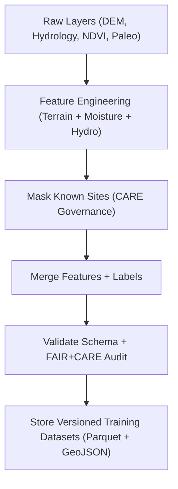

<div align="center">

# 📂 **Kansas Frontier Matrix — Archaeology AI Training Datasets**  
`src/ai/models/archaeology/training/datasets/README.md`

**Purpose:**  
Document the **feature, label, and metadata datasets** used for archaeological AI model training within the Kansas Frontier Matrix (KFM).  
These datasets are curated, version-controlled, and **FAIR+CARE-certified**, ensuring that every model is trained using transparent, ethical, and reproducible geospatial and tabular data under **MCP-DL v6.3**.

[](../../../../../../docs/)
[](../../../../../../LICENSE)
[](../../../../../../docs/standards/faircare.md)
[](#)

</div>

---

## 📘 Overview

The **Archaeology Training Dataset Collection** forms the empirical foundation for all predictive models in the KFM’s archaeological AI suite.  
It includes:
- 🧩 **Feature stacks** generated from DEM, soil, vegetation, and hydrological indices.  
- 🗺️ **Label datasets** representing known and redacted archaeological sites.  
- ⚖️ **Metadata** ensuring compliance with FAIR+CARE and ISO 19115 standards.  

All training data are reproducible through **STAC/DCAT metadata links** and undergo validation by the **FAIR+CARE Council** before use.

---

## 🗂️ Directory Layout

```plaintext
src/ai/models/archaeology/training/datasets/
├── README.md                         # This file — documentation
│
├── features.parquet                  # Feature stack (flattened GeoParquet of training variables)
├── labels.geojson                    # Redacted site polygons / centroids (training labels)
├── metadata.json                     # FAIR+CARE and provenance metadata
├── schema_validation.json            # Field-level schema validation results
└── checksum_registry.json            # SHA-256 checksums for reproducibility
```

---

## ⚙️ Data Pipeline Workflow



### Process Stages
1. **Feature Engineering:** Compute topographic and hydrological derivatives.  
2. **Site Masking:** Apply CARE-tag redactions to sensitive cultural locations.  
3. **Dataset Merge:** Combine environmental features with labeled site presence/absence.  
4. **Schema Validation:** Confirm alignment with data contract and telemetry schema.  
5. **Governance Review:** Record audit approval in ledger snapshot.

---

## 🧩 Example Metadata (`metadata.json`)

```json
{
  "dataset_id": "archaeology_training_dataset_v9.9.0",
  "description": "Training dataset combining DEM, soil moisture, and paleo-hydrology features with known site labels (redacted).",
  "records": 185420,
  "features": 42,
  "label_type": "binary (site presence)",
  "crs": "EPSG:5070",
  "created": "2025-11-08T18:55:00Z",
  "license": "CC-BY-4.0",
  "care_tag": "restricted",
  "validated_by": "@kfm-data",
  "governance_status": "approved",
  "telemetry_ref": "../../../../../../releases/v9.9.0/focus-telemetry.json"
}
```

---

## ⚖️ FAIR+CARE & ISO Compliance Matrix

| Principle | Implementation | Verification |
|------------|----------------|--------------|
| **Findable** | STAC/DCAT metadata and persistent UUID in manifest. | `stac-validate.yml` |
| **Accessible** | Public metadata; restricted geometries. | `faircare-validate.yml` |
| **Interoperable** | GeoParquet, GeoJSON, JSON-LD compliance. | ISO 19115 validator |
| **Reusable** | Open metadata with checksum registry and data contract. | SPDX Manifest |
| **CARE – Responsibility** | Restricted site geometries masked; CARE Council validation. | Governance Ledger |
| **CARE – Ethics** | Cultural data redaction verified by FAIR+CARE Council. | `care_masking_report.json` |

---

## 🧮 Validation & Telemetry Metrics

| Metric | Description | Example |
|--------|-------------|----------|
| `records` | Number of training instances. | 185,420 |
| `features` | Number of explanatory variables. | 42 |
| `energy_wh` | Energy used during feature stack generation. | 26.8 |
| `carbon_gco2e` | CO₂ equivalent for data preparation. | 11.7 |
| `faircare_score` | FAIR+CARE compliance percentage. | 99.1 |
| `validation_status` | Schema audit result. | passed |

Telemetry integrated with:  
`releases/v9.9.0/focus-telemetry.json`  
Schema: `schemas/telemetry/src-ai-models-archaeology-training-datasets-v1.json`

---

## 🔐 Provenance & Governance Integration

Each dataset entry is linked to:
- **Governance Ledger:** `releases/v9.9.0/governance/ledger_snapshot.json`  
- **Checksum Registry:** `checksum_registry.json`  
- **Telemetry Record:** `focus-telemetry.json`  

### Example Provenance Record
```json
{
  "dataset_id": "archaeology_training_dataset_v9.9.0",
  "source_layers": [
    "stac://usgs-dem-10m",
    "stac://landsat-smi-annual-2013-2024",
    "stac://kfm-paleo-channels-v1"
  ],
  "derived_features": ["slope", "ndwi_mean", "dist_paleo_channel"],
  "masked_features": 4,
  "reviewed_by": "@faircare-council",
  "approved": true,
  "timestamp": "2025-11-08T19:00:00Z"
}
```

---

## 🧾 Citation

```text
Kansas Frontier Matrix (2025). Archaeology AI Training Datasets (v9.9.0).
FAIR+CARE and ISO 19115-certified training datasets integrating terrain, hydrology, and cultural redaction data for ethical archaeological AI development in the Kansas Frontier Matrix.
```

---

## 🕰️ Version History

| Version | Date | Author | Summary |
|---------:|------|--------|----------|
| v9.9.0 | 2025-11-08 | `@kfm-data` | Created training dataset documentation; added FAIR+CARE validation and telemetry schema integration. |

---

<div align="center">

**Kansas Frontier Matrix**  
*Ethical Data Stewardship × FAIR+CARE Governance × Sustainable AI Training*  
© 2025 Kansas Frontier Matrix · CC-BY 4.0 · Master Coder Protocol v6.3 · FAIR+CARE Certified · Diamond⁹ Ω / Crown∞Ω Ultimate Certified  

[Back to Training Framework](../README.md) · [Governance Charter](../../../../../../docs/standards/governance/ROOT-GOVERNANCE.md)

</div>

