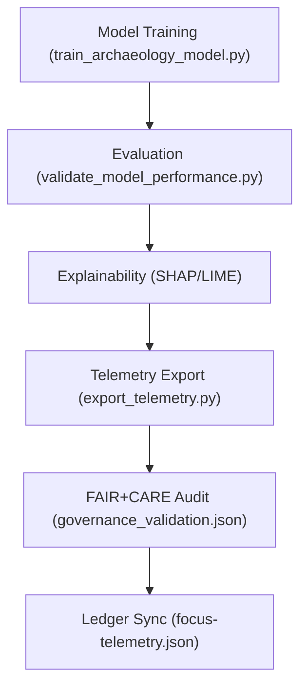

<div align="center">

# 🧾 **Kansas Frontier Matrix — Archaeology AI Training Logs**  
`src/ai/models/archaeology/training/logs/README.md`

**Purpose:**  
Provide comprehensive documentation for **training metrics, evaluation results, and sustainability telemetry logs** generated during AI model development for the **Archaeology Predictive Framework** within the **Kansas Frontier Matrix (KFM)**.  
These logs enable reproducibility, ethical accountability, and performance tracking under **FAIR+CARE**, **ISO 50001**, and **MCP-DL v6.3** standards.

[](../../../../../../docs/)
[](../../../../../../LICENSE)
[](../../../../../../docs/standards/faircare.md)
[](#)

</div>

---

## 📘 Overview

The **Training Logs Directory** archives all metrics, validation results, and telemetry exports produced during archaeological AI model training.  
These logs provide verifiable FAIR+CARE governance evidence, performance transparency, and sustainability compliance for all KFM model releases.

---

## 🗂️ Directory Layout

```plaintext
src/ai/models/archaeology/training/logs/
├── README.md                            # This file — documentation for logs
│
├── training_log.json                    # Core training metrics and runtime telemetry
├── evaluation_metrics.json              # Model validation and test performance metrics
├── bias_drift_report.json               # Bias, fairness, and drift detection report
├── telemetry_metrics.json               # Sustainability and energy usage log
└── governance_validation.json           # FAIR+CARE audit and Council approval record
```

---

## ⚙️ Logging Workflow



### Process Steps
1. **Training Log:** Captures model fit duration, dataset size, and learning metrics.  
2. **Evaluation Metrics:** Summarizes cross-validation results, AUROC, AUPRC, and calibration.  
3. **Bias Report:** Detects bias and drift over spatial or feature domains.  
4. **Telemetry Metrics:** Records runtime, energy (Wh), and carbon footprint.  
5. **Governance Validation:** Logs FAIR+CARE compliance and audit decisions.  

---

## 🧩 Example: Training Log (`training_log.json`)

```json
{
  "run_id": "train_archaeology_ai_2025_11_08_002",
  "model": "xgboost",
  "records_trained": 185420,
  "features": 42,
  "training_time_min": 312.5,
  "auc": 0.946,
  "f1_score": 0.915,
  "brier_score": 0.171,
  "bias_index": 0.04,
  "faircare_score": 98.9,
  "energy_wh": 1489.2,
  "carbon_gco2e": 612.5,
  "telemetry_ref": "../../../../../../releases/v9.9.0/focus-telemetry.json",
  "timestamp": "2025-11-08T19:58:00Z"
}
```

---

## ⚖️ FAIR+CARE Integration Matrix

| Principle | Implementation | Verification |
|------------|----------------|---------------|
| **Findable** | Logs indexed with unique run IDs and model hashes. | `telemetry-export.yml` |
| **Accessible** | Internal Council access with public summaries. | FAIR+CARE Council |
| **Interoperable** | JSON logs validated against telemetry schema. | ISO 19115 Schema |
| **Reusable** | Energy, bias, and accuracy metrics reproducible under MCP-DL. | SPDX Manifest |
| **CARE – Responsibility** | Bias/demographic fairness metrics verified by Council. | `faircare-validate.yml` |
| **CARE – Ethics** | Council audit required prior to model publication. | `governance_validation.json` |

---

## 🧮 Core Metrics

| Metric | Description | Example |
|--------|-------------|----------|
| `training_time_min` | Duration of model fitting. | 312.5 |
| `auc` | Area under ROC curve. | 0.946 |
| `f1_score` | Harmonic mean of precision/recall. | 0.915 |
| `bias_index` | Quantified feature-level bias metric. | 0.04 |
| `faircare_score` | FAIR+CARE compliance percentage. | 98.9 |
| `energy_wh` | Energy consumption (ISO 50001). | 1489.2 |
| `carbon_gco2e` | CO₂ equivalent footprint. | 612.5 |

---

## 🧠 Example: Bias & Drift Report (`bias_drift_report.json`)

```json
{
  "report_id": "bias_2025_11_08",
  "model_version": "v9.9.0",
  "features_analyzed": ["slope", "distance_to_water", "ndwi_mean"],
  "bias_index": 0.04,
  "spatial_drift_detected": false,
  "temporal_drift_detected": false,
  "reviewed_by": "@faircare-council",
  "approval_status": "certified",
  "timestamp": "2025-11-08T20:00:00Z"
}
```

---

## 📊 Telemetry Metrics (`telemetry_metrics.json`)

| Field | Description | Example |
|--------|-------------|----------|
| `runtime_sec` | Total training runtime (seconds). | 18752 |
| `energy_wh` | Energy consumed during session. | 1489.2 |
| `carbon_gco2e` | Carbon footprint equivalent (gCO₂e). | 612.5 |
| `faircare_score` | FAIR+CARE validation score. | 98.9 |
| `status` | Governance review outcome. | certified |

All telemetry merged into:  
`releases/v9.9.0/focus-telemetry.json`  
Schema: `schemas/telemetry/src-ai-models-archaeology-training-logs-v1.json`

---

## 🔐 Provenance & Governance Integration

- **Governance Ledger:** `releases/v9.9.0/governance/ledger_snapshot.json`  
- **SBOM Manifest:** `releases/v9.9.0/sbom.spdx.json`  
- **Telemetry Reference:** `releases/v9.9.0/focus-telemetry.json`  
- **Audit Results:** `governance_validation.json`  

### Example Ledger Record
```json
{
  "ledger_id": "ledger_2025q4_training_logs",
  "reviewed_by": "@faircare-council",
  "auditor": "@kfm-governance",
  "status": "approved",
  "timestamp": "2025-11-08T20:05:00Z"
}
```

---

## 🧾 Citation

```text
Kansas Frontier Matrix (2025). Archaeology AI Training Logs (v9.9.0).
FAIR+CARE and ISO-compliant logging framework ensuring transparency, ethical governance, and sustainability metrics for AI model training in the Kansas Frontier Matrix.
```

---

## 🕰️ Version History

| Version | Date | Author | Summary |
|---------:|------|--------|----------|
| v9.9.0 | 2025-11-08 | `@kfm-ai` | Created training logs documentation; added FAIR+CARE telemetry, sustainability metrics, and governance integration. |

---

<div align="center">

**Kansas Frontier Matrix**  
*Ethical AI × FAIR+CARE Accountability × Sustainable Machine Learning*  
© 2025 Kansas Frontier Matrix · Internal FAIR+CARE Certified · Master Coder Protocol v6.3 · Diamond⁹ Ω / Crown∞Ω Ultimate Certified  

[Back to Training Framework](../README.md) · [Governance Charter](../../../../../../docs/standards/governance/ROOT-GOVERNANCE.md)

</div>

