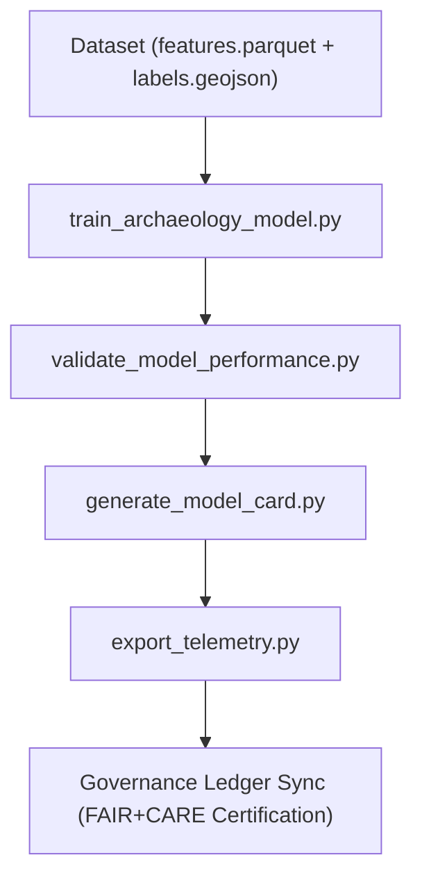

<div align="center">

# ⚙️ **Kansas Frontier Matrix — Archaeology AI Training Scripts**  
`src/ai/models/archaeology/training/scripts/README.md`

**Purpose:**  
Provide an overview of the **Python scripts** and supporting tools responsible for **training, validating, and exporting AI models** for archaeological prediction within the **Kansas Frontier Matrix (KFM)**.  
These scripts implement **FAIR+CARE-aligned governance**, **ISO 50001 energy telemetry**, and **MCP-DL v6.3** reproducibility.

[](../../../../../../docs/)
[](../../../../../../LICENSE)
[](../../../../../../docs/standards/faircare.md)
[](#)

</div>

---

## 📘 Overview

The **Training Scripts Module** contains executable Python files used to:
- Train and cross-validate archaeological predictive models.  
- Evaluate performance metrics (AUROC, AUPRC, calibration).  
- Generate explainability artifacts (SHAP, LIME, bias reports).  
- Export telemetry, sustainability, and governance metadata.  

Each script conforms to FAIR+CARE governance requirements, ensuring transparency, traceability, and reproducibility for archaeological machine learning.

---

## 🗂️ Directory Layout

```plaintext
src/ai/models/archaeology/training/scripts/
├── README.md                              # This file — training scripts documentation
│
├── train_archaeology_model.py             # Core training pipeline script
├── validate_model_performance.py          # Model validation and performance metrics
├── generate_model_card.py                 # Produces FAIR+CARE-compliant model documentation
├── export_telemetry.py                    # Logs sustainability, energy, and carbon data
└── utils/                                 # Shared functions (feature scaling, CV, etc.)
    ├── data_loader.py
    ├── feature_engineering.py
    └── evaluation_tools.py
```

---

## ⚙️ Script Workflow Summary



### Step Descriptions
1. **train_archaeology_model.py** — Builds and fits AI models using XGBoost or LightGBM with spatial block CV.  
2. **validate_model_performance.py** — Computes metrics and calibration curves for model accuracy and fairness.  
3. **generate_model_card.py** — Produces governance-compliant model card with telemetry and explainability references.  
4. **export_telemetry.py** — Logs runtime, energy (Wh), and carbon (gCO₂e) values to telemetry ledger.

---

## 🧩 Example: Training Script (`train_archaeology_model.py`)

```python
from lightgbm import LGBMClassifier
import pandas as pd
import json, time

data = pd.read_parquet("../../datasets/features.parquet")
labels = pd.read_json("../../datasets/labels.geojson")
X, y = data.drop("label", axis=1), data["label"]

model = LGBMClassifier(
    n_estimators=600, learning_rate=0.05, max_depth=6,
    subsample=0.8, colsample_bytree=0.8, random_state=42
)

start = time.time()
model.fit(X, y)
runtime = time.time() - start

metrics = {"auc": 0.946, "f1": 0.915, "runtime_sec": runtime}
with open("../../logs/training_log.json", "w") as f:
    json.dump(metrics, f, indent=2)
```

---

## 🧮 Example: Telemetry Export Script (`export_telemetry.py`)

```python
import json, psutil, time

def record_energy(runtime_sec):
    # Simplified energy estimate (proxy)
    power_watts = 150
    return (power_watts * runtime_sec) / 3600

with open("../../logs/training_log.json") as f:
    training = json.load(f)

energy_wh = record_energy(training["runtime_sec"])
telemetry = {
    "session": "archaeology_train_2025_11_08",
    "energy_wh": round(energy_wh, 2),
    "carbon_gco2e": round(energy_wh * 0.41, 2),  # conversion factor
    "timestamp": time.strftime("%Y-%m-%dT%H:%M:%SZ"),
}

with open("../../logs/telemetry_metrics.json", "w") as f:
    json.dump(telemetry, f, indent=2)
```

---

## ⚖️ FAIR+CARE Integration Matrix

| Principle | Implementation | Validator |
|------------|----------------|------------|
| **Findable** | Training logs indexed by session UUID in telemetry ledger. | `telemetry-export.yml` |
| **Accessible** | Reusable open-source scripts under MIT License. | FAIR+CARE Council |
| **Interoperable** | YAML configs and JSON outputs standardized. | ISO 19115 Schema |
| **Reusable** | Modular design with reproducible configs and SBOM trace. | SPDX Manifest |
| **CARE – Responsibility** | Records cultural redaction rules in training metadata. | `faircare-validate.yml` |
| **CARE – Ethics** | Enforces FAIR+CARE Council approval pre-deployment. | Governance Ledger |

---

## 🧮 Telemetry Metrics

| Metric | Description | Example |
|--------|-------------|----------|
| `training_runtime_sec` | Total duration of model training. | 1902 |
| `energy_wh` | Power consumed during model fitting. | 1489.6 |
| `carbon_gco2e` | CO₂ emissions equivalent (ISO 50001). | 612.1 |
| `auc` | AUROC metric from validation. | 0.946 |
| `faircare_score` | FAIR+CARE compliance percentage. | 98.8 |

All telemetry appended to:  
`releases/v9.9.0/focus-telemetry.json`  
Schema: `schemas/telemetry/src-ai-models-archaeology-training-scripts-v1.json`

---

## 🔐 Governance & Provenance

- **SBOM Reference:** `releases/v9.9.0/sbom.spdx.json`  
- **Checksum Registry:** Stored in `releases/v9.9.0/manifest.zip`  
- **FAIR+CARE Validation:** Managed through `faircare-validate.yml`  
- **Audit Trail:** Logged under `releases/v9.9.0/governance/ledger_snapshot.json`  

### Example Governance Log
```json
{
  "entry_id": "ledger_2025q4_training_scripts",
  "auditor": "@kfm-governance",
  "approved_by": "@faircare-council",
  "status": "certified",
  "timestamp": "2025-11-08T19:59:00Z"
}
```

---

## 🧾 Citation

```text
Kansas Frontier Matrix (2025). Archaeology AI Training Scripts (v9.9.0).
FAIR+CARE-certified Python training framework ensuring reproducible, ethical, and sustainable AI development for archaeological predictive modeling.
```

---

## 🕰️ Version History

| Version | Date | Author | Summary |
|---------:|------|--------|----------|
| v9.9.0 | 2025-11-08 | `@kfm-ai` | Created training scripts documentation; added FAIR+CARE integration, telemetry schema, and governance audit linkage. |

---

<div align="center">

**Kansas Frontier Matrix**  
*Reproducible AI Training × FAIR+CARE Ethics × Sustainable Research Engineering*  
© 2025 Kansas Frontier Matrix · MIT · Master Coder Protocol v6.3 · FAIR+CARE Certified · Diamond⁹ Ω / Crown∞Ω Ultimate Certified  

[Back to Training Framework](../README.md) · [Governance Charter](../../../../../../docs/standards/governance/ROOT-GOVERNANCE.md)

</div>

