<div align="center">

# 🧠 **Kansas Frontier Matrix — Entity Classification Framework**  
`src/ai/models/classification/entity_classification/README.md`

**Purpose:**  
Define the **entity classification models** used within the **Kansas Frontier Matrix (KFM)** to categorize and label **entities** such as **people**, **places**, **events**, and **artifacts**.  
This framework integrates with **FAIR+CARE**, **ISO 50001**, and **MCP-DL v6.3** to ensure **ethical AI governance**, **sustainability**, and **reproducibility** in all model training and evaluation processes.

[](../../../../../../../docs/)
[](../../../../../../../LICENSE)
[](../../../../../../../docs/standards/faircare.md)
[](#)

</div>

---

## 📘 Overview

The **Entity Classification Framework** is designed to classify various entities within the KFM Knowledge Graph, including:
- **People** (e.g., historical figures, authors).
- **Places** (e.g., towns, regions, landmarks).
- **Events** (e.g., battles, treaties, cultural milestones).
- **Artifacts** (e.g., documents, artifacts, monuments).

Key Features:
- 🧠 **Transformer-based models** (BERT, RoBERTa) for high-accuracy entity recognition.  
- ⚖️ **FAIR+CARE governance** for sensitive or culturally significant entity data.  
- ♻️ **ISO 50001 telemetry** for sustainability and energy tracking during training.  
- 🧩 **Cross-graph entity linking** with the KFM Knowledge Graph.  
- 🧠 **Explainability** integration (SHAP, LIME) to ensure model transparency and fairness.

---

## 🗂️ Directory Layout

```plaintext
src/ai/models/classification/entity_classification/
├── README.md                            # This file — documentation for entity classification models
│
├── train_entity_classifier.py           # Main training pipeline for entity classification
├── configs/                             # Configuration files for model training and governance
│   ├── entity_classification_train.yaml
│   ├── hyperparameters.yaml
│   └── telemetry_config.yaml
│
├── logs/                                # Training, evaluation, and governance logs
│   ├── training_log.json
│   ├── evaluation_metrics.json
│   ├── bias_drift_report.json
│   ├── telemetry_metrics.json
│   └── governance_validation.json
│
└── checkpoints/                         # Saved model checkpoints and metadata registry
    ├── checkpoint_001_pretrain.pt
    ├── checkpoint_002_finetune.pt
    └── checkpoints_manifest.json
```

---

## ⚙️ Entity Classification Workflow

```mermaid
flowchart TD
  A["Entity Data (People · Places · Events · Artifacts)"] --> B["Data Preprocessing (Normalization · Tokenization)"]
  B --> C["Model Training (BERT / RoBERTa)"]
  C --> D["Evaluation & Metrics (Accuracy · F1 · Bias)"]
  D --> E["Governance & FAIR+CARE Audit"]
  E --> F["Model Integration (Knowledge Graph · Focus Mode)"]
```



### Workflow Breakdown:
1. **Data Preprocessing:** Tokenization, text normalization, and feature extraction for entity recognition.  
2. **Model Training:** Fine-tune pre-trained BERT or RoBERTa models for entity classification.  
3. **Evaluation:** Compute accuracy, precision, recall, F1-score, and fairness metrics.  
4. **Governance Review:** Ensure ethical compliance and governance certification from FAIR+CARE.  
5. **Deployment:** Use the trained model for entity classification in Focus Mode and Knowledge Graph.

---

## 🧩 Example: Model Configuration (`configs/entity_classification_train.yaml`)

```yaml
model:
  name: "bert-base-uncased"
  architecture: "transformer"
  num_labels: 10
  epochs: 5
  batch_size: 16
  learning_rate: 3e-5
  dropout_rate: 0.1

data:
  source: "../../../../data/processed/entity_classification_corpus.json"
  validation_split: 0.1

telemetry:
  enable_energy_tracking: true
  telemetry_ref: "../../../../../../../releases/v10.0.0/focus-telemetry.json"

ethics:
  reviewer: "@faircare-council"
  care_tag: "restricted"
  governance_ref: "../../../../../../../docs/standards/governance/ROOT-GOVERNANCE.md"
```

---

## ⚙️ Example: Hyperparameters (`hyperparameters.yaml`)

```yaml
hyperparameter_search:
  learning_rate: [2e-5, 3e-5, 5e-5]
  batch_size: [8, 16, 32]
  epochs: [3, 5, 7]
  dropout_rate: [0.05, 0.1, 0.2]
evaluation_metric: "validation_loss"
search_strategy: "grid"
```

---

## ♻️ Example: Telemetry Configuration (`telemetry_config.yaml`)

```yaml
telemetry:
  energy_tracking: true
  reporting_interval_min: 10
  sustainability_threshold_wh: 1500
  carbon_emission_factor_gco2e_per_wh: 0.41
  telemetry_output: "../../../../../../../releases/v10.0.0/focus-telemetry.json"
  telemetry_schema: "../../../../../../../schemas/telemetry/src-ai-models-classification-entity-configs-v1.json"
  metrics:
    - energy_wh
    - carbon_gco2e
    - training_time_min
    - faircare_score
```

---

## ⚖️ Example: Governance Configuration (`governance_config.yaml`)

```yaml
governance:
  reviewer: "@faircare-council"
  auditor: "@kfm-governance"
  ethics_status: "approved"
  audit_frequency: "per-epoch"
  care_tag: "restricted"
  ledger_ref: "../../../../../../../releases/v10.0.0/governance/ledger_snapshot.json"
  sbom_ref: "../../../../../../../releases/v10.0.0/sbom.spdx.json"
  telemetry_ref: "../../../../../../../releases/v10.0.0/focus-telemetry.json"
```

---

## ⚖️ FAIR+CARE Governance Matrix

| Principle | Implementation | Oversight |
|------------|----------------|------------|
| **Findable** | Configurations indexed in SBOM manifest and metadata catalog. | SPDX Manifest |
| **Accessible** | Open-source configuration files; restricted data handled under CARE. | FAIR+CARE Council |
| **Interoperable** | JSON metadata aligns with ISO 19115 and PROV-O. | Schema Validator |
| **Reusable** | Modular configuration templates across entity classification tasks. | MCP-DL Validation |
| **CARE – Responsibility** | Bias and fairness tracked per model evaluation. | `faircare-validate.yml` |
| **CARE – Ethics** | Sensitive content flagged and redacted before training. | Governance Ledger |

---

## 🧮 Telemetry Metrics (ISO 50001)

| Metric | Description | Example |
|--------|-------------|----------|
| `energy_wh` | Energy consumed during model training. | 1380.6 |
| `carbon_gco2e` | CO₂ emissions equivalent. | 562.0 |
| `training_time_min` | Total training time in minutes. | 420 |
| `faircare_score` | FAIR+CARE compliance score. | 99.4 |
| `bias_index` | Fairness index across entity categories. | 0.015 |

Telemetry recorded in:  
`releases/v10.0.0/focus-telemetry.json`  
Schema: `schemas/telemetry/src-ai-models-classification-entity-configs-v1.json`

---

## 🔐 Governance & Provenance Integration

- **Governance Ledger:** `releases/v10.0.0/governance/ledger_snapshot.json`  
- **Telemetry Ledger:** `releases/v10.0.0/focus-telemetry.json`  
- **SBOM Manifest:** `releases/v10.0.0/sbom.spdx.json`  
- **Bias & Fairness Report:** `bias_drift_report.json`

### Example Governance Record
```json
{
  "ledger_entry_id": "ledger_2025q4_entity_classification_configs",
  "auditor": "@kfm-governance",
  "reviewed_by": "@faircare-council",
  "status": "approved",
  "timestamp": "2025-11-08T23:55:00Z"
}
```

---

## 🧾 Citation

```text
Kansas Frontier Matrix (2025). Entity Classification · Configuration Framework (v10.0.0).
FAIR+CARE-certified configuration templates for the reproducible, sustainable, and ethical training of entity classification models within the Kansas Frontier Matrix.
```

---

## 🕰️ Version History

| Version | Date | Author | Summary |
|---------:|------|--------|----------|
| v10.0.0 | 2025-11-08 | `@kfm-ai` | Created Entity Classification configuration documentation; added FAIR+CARE governance and sustainability telemetry. |

---

<div align="center">

**Kansas Frontier Matrix**  
*Entity Recognition × FAIR+CARE Governance × Sustainable AI Systems*  
© 2025 Kansas Frontier Matrix · MIT · Master Coder Protocol v6.3 · FAIR+CARE Certified · Diamond⁹ Ω / Crown∞Ω Ultimate Certified  

[Back to Entity Classification](../README.md) · [Governance Charter](../../../../../docs/standards/governance/ROOT-GOVERNANCE.md)

</div>

