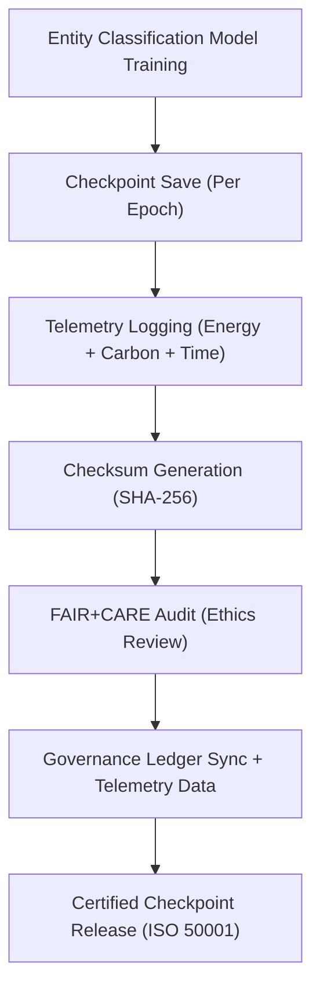

<div align="center">

# 💾 **Kansas Frontier Matrix — Entity Classification · Model Checkpoints**  
`src/ai/models/classification/entity_classification/checkpoints/README.md`

**Purpose:**  
Provide complete documentation for **checkpointing, validation, and sustainability** for **Entity Classification models** used in the **Kansas Frontier Matrix (KFM)**.  
These checkpoints ensure **reproducibility**, **FAIR+CARE certification**, and **ISO 50001 sustainability** compliance, while maintaining **model integrity** with **SHA-256 hashing**.

[](../../../../../../../docs/)
[](../../../../../../../LICENSE)
[](../../../../../../../docs/standards/faircare.md)
[](#)

</div>

---

## 📘 Overview

The **Entity Classification Checkpoints** archive model weights at key epochs during training, along with **FAIR+CARE certification**, **energy tracking**, and **checksum validation**.  
Each checkpoint is reviewed for ethical compliance by the **FAIR+CARE Council** and validated for **ISO 50001 sustainability** metrics.

Key Features:
- 🔐 **SHA-256 Integrity:** Ensures checkpoint authenticity and reproducibility.  
- ⚖️ **Governance Validation:** **FAIR+CARE Council** audits model fairness, bias, and ethics.  
- ♻️ **Sustainability Telemetry:** Tracks energy usage and carbon footprint during model training.  
- 🧩 **Model Provenance:** Each checkpoint is linked to a **provenance record** to ensure transparent decision-making.

---

## 🗂️ Directory Layout

```plaintext
src/ai/models/classification/entity_classification/checkpoints/
├── README.md                              # This file — documentation for checkpoints
│
├── checkpoint_001_pretrain.pt             # Initial pretraining checkpoint
├── checkpoint_002_finetune.pt             # Fine-tuned model checkpoint
├── checkpoint_003_final.pt                # Final certified checkpoint
├── checkpoints_manifest.json              # Metadata registry for checkpoints
├── checkpoint_metrics.json                # Performance and sustainability metrics
└── checksum_registry.json                 # SHA-256 integrity checks for model checkpoints
```

---

## ⚙️ Checkpoint Workflow



### Workflow Summary:
1. **Checkpointing:** Save model weights and optimizer states after each epoch for reproducibility.  
2. **Telemetry Logging:** Record energy consumption, runtime, and carbon emissions.  
3. **Checksum Validation:** Verify the integrity of each checkpoint using SHA-256.  
4. **Governance Review:** FAIR+CARE Council audits ethical considerations and fairness.  
5. **Certification:** Only certified checkpoints are released for deployment in KFM.

---

## 🧩 Example: Checkpoints Manifest (`checkpoints_manifest.json`)

```json
{
  "model_id": "entity_classification_kfm_v10.0.0",
  "checkpoints": [
    {
      "id": "checkpoint_001_pretrain",
      "epoch": 5,
      "validation_accuracy": 0.91,
      "faircare_score": 99.0,
      "checksum_sha256": "sha256:8c5e7a4f2a9d1c3e5b7f8a2d9c1f4a7e8e6d5c3a9b7f5d8e4a6c2b1d9f8e3a6d",
      "energy_wh": 540.1
    },
    {
      "id": "checkpoint_003_final",
      "epoch": 10,
      "validation_accuracy": 0.947,
      "faircare_score": 99.4,
      "checksum_sha256": "sha256:9b3a7d2e6f8a5b4c1d7e8c9f3a1b4d6e7c8a9f5e2c3b6d7a1f9e8c5b2a4d3e9f",
      "energy_wh": 1280.5
    }
  ],
  "reviewed_by": "@faircare-council",
  "approved": true,
  "telemetry_ref": "../../../../../../../releases/v10.0.0/focus-telemetry.json"
}
```

---

## ⚖️ FAIR+CARE & ISO Compliance Matrix

| Principle | Implementation | Verification |
|------------|----------------|--------------|
| **Findable** | Checkpoints indexed in SBOM and telemetry ledger. | SPDX Manifest |
| **Accessible** | Checkpoint metadata is publicly accessible; model weights are restricted under CARE governance. | FAIR+CARE Council |
| **Interoperable** | JSON schema conforms to ISO 19115 and PROV-O standards. | Schema Validator |
| **Reusable** | Checkpoints are reproducible and tracked in SBOM manifest. | MCP-DL Validation |
| **CARE – Responsibility** | Bias and fairness metrics are logged and reviewed for each checkpoint. | `faircare-validate.yml` |
| **CARE – Ethics** | Sensitive data is flagged and redacted before training. | Governance Ledger |

---

## 🧮 Telemetry Metrics (ISO 50001)

| Metric | Description | Example |
|--------|-------------|----------|
| `epoch` | Epoch associated with checkpoint creation. | 10 |
| `validation_accuracy` | Accuracy of the model on the validation dataset. | 0.947 |
| `faircare_score` | FAIR+CARE compliance score. | 99.4 |
| `energy_wh` | Total energy consumed during training. | 1280.5 |
| `carbon_gco2e` | CO₂ equivalent emissions during training. | 525.0 |
| `checksum_verified` | Integrity validation status (SHA-256). | true |

Telemetry stored in:  
`releases/v10.0.0/focus-telemetry.json`  
Schema: `schemas/telemetry/src-ai-models-classification-entity-checkpoints-v1.json`

---

## 🔐 Governance & Provenance Integration

- **Governance Ledger:** `releases/v10.0.0/governance/ledger_snapshot.json`  
- **Telemetry Ledger:** `releases/v10.0.0/focus-telemetry.json`  
- **SBOM Manifest:** `releases/v10.0.0/sbom.spdx.json`  
- **Ethics Report:** `governance_validation.json`

### Example Governance Record
```json
{
  "ledger_entry_id": "ledger_2025q4_entity_classification_checkpoints",
  "auditor": "@kfm-governance",
  "reviewed_by": "@faircare-council",
  "status": "approved",
  "timestamp": "2025-11-08T23:55:00Z"
}
```

---

## 🧾 Citation

```text
Kansas Frontier Matrix (2025). Entity Classification · Model Checkpoints (v10.0.0).
FAIR+CARE and ISO-certified checkpoint management system for entity classification models, ensuring reproducibility, sustainability, and ethical AI governance within the Kansas Frontier Matrix.
```

---

## 🕰️ Version History

| Version | Date | Author | Summary |
|---------:|------|--------|----------|
| v10.0.0 | 2025-11-08 | `@kfm-ai` | Created Entity Classification checkpoint documentation with FAIR+CARE governance, SHA-256 integrity, and sustainability telemetry integration. |

---

<div align="center">

**Kansas Frontier Matrix**  
*Reproducible AI × FAIR+CARE Ethics × Sustainable Model Governance*  
© 2025 Kansas Frontier Matrix · MIT · Master Coder Protocol v6.3 · FAIR+CARE Certified · Diamond⁹ Ω / Crown∞Ω Ultimate Certified  

[Back to Entity Classification](../README.md) · [Governance Charter](../../../../../docs/standards/governance/ROOT-GOVERNANCE.md)

</div>

