<div align="center">

# 🧾 **Kansas Frontier Matrix — Entity Classification · Training Logs**  
`src/ai/models/classification/entity_classification/logs/README.md`

**Purpose:**  
Document the **training, validation, and governance logs** generated for the **Entity Classification models** within the **Kansas Frontier Matrix (KFM)**.  
These logs ensure **FAIR+CARE compliance**, **ISO 50001 sustainability tracking**, and **bias monitoring** during model development and deployment.

[](../../../../../../../docs/)
[](../../../../../../../LICENSE)
[](../../../../../../../docs/standards/faircare.md)
[](#)

</div>

---

## 📘 Overview

The **Entity Classification Training Logs** provide a detailed record of the performance, fairness, and sustainability metrics for all **entity recognition models**.  
These logs serve as an audit trail, ensuring **transparency** and **accountability** in the training and evaluation processes of KFM’s classification models.

Key Features:
- 📈 **Training performance** including loss curves, accuracy, and F1 scores.  
- ⚖️ **Bias and fairness metrics** to monitor cultural and demographic imbalances.  
- ♻️ **Sustainability telemetry** including energy usage, carbon footprint, and efficiency metrics.  
- 🧾 **FAIR+CARE governance logs** for ethics certification and cultural sensitivity review.

---

## 🗂️ Directory Layout

```plaintext
src/ai/models/classification/entity_classification/logs/
├── README.md                             # This file — documentation for training logs
│
├── training_log.json                     # Model training performance metrics
├── evaluation_metrics.json               # Validation accuracy and evaluation results
├── bias_drift_report.json                # Bias audit and fairness evaluation report
├── telemetry_metrics.json                # ISO 50001 sustainability metrics (energy, carbon)
└── governance_validation.json            # FAIR+CARE ethics certification record
```

---

## ⚙️ Logging Workflow

```mermaid
flowchart TD
  A["Entity Classification Model Training"] --> B["Validation (Accuracy · F1 · Bias)"]
  B --> C["Bias & Fairness Monitoring (FAIR+CARE)"]
  C --> D["Telemetry Logging (Energy · Carbon · Time)"]
  D --> E["Governance & FAIR+CARE Validation"]
  E --> F["Ledger Sync & Model Certification"]
```



### Workflow Breakdown:
1. **Training Metrics:** Logs model performance, training time, and epoch data.  
2. **Evaluation Metrics:** Includes precision, recall, F1 score, and accuracy metrics on the validation set.  
3. **Bias Monitoring:** Evaluates fairness using cultural and demographic data analysis.  
4. **Telemetry Logging:** Monitors energy consumption, carbon emissions, and training efficiency.  
5. **Governance Certification:** FAIR+CARE review and approval before model release.

---

## 🧩 Example: Training Log (`training_log.json`)

```json
{
  "run_id": "entity_classification_train_2025_11_08",
  "model": "bert-base-uncased",
  "epochs": 5,
  "training_time_min": 420,
  "validation_loss": 0.042,
  "accuracy": 0.947,
  "bias_index": 0.015,
  "faircare_score": 99.4,
  "energy_wh": 1380.6,
  "carbon_gco2e": 562.0,
  "reviewed_by": "@faircare-council",
  "telemetry_ref": "../../../../../../../releases/v10.0.0/focus-telemetry.json"
}
```

---

## ⚖️ FAIR+CARE Governance Matrix

| Principle | Implementation | Oversight |
|------------|----------------|------------|
| **Findable** | Log entries indexed in SBOM manifest and telemetry ledger. | SPDX Manifest |
| **Accessible** | Public summaries; sensitive entity data under CARE tags. | FAIR+CARE Council |
| **Interoperable** | JSON schema compatible with ISO 19115 and PROV-O. | Schema Validator |
| **Reusable** | Reproducible metrics for different entity classification tasks. | MCP-DL Validation |
| **CARE – Responsibility** | Bias and fairness metrics reviewed quarterly. | `faircare-validate.yml` |
| **CARE – Ethics** | Sensitive cultural and demographic data redacted. | Governance Ledger |

---

## 🧮 Example: Bias & Drift Report (`bias_drift_report.json`)

```json
{
  "report_id": "bias_audit_entity_classification_2025_11_08",
  "bias_index": 0.015,
  "drift_detected": false,
  "entities_tested": ["person", "place", "event", "artifact"],
  "reviewed_by": "@faircare-council",
  "status": "certified",
  "timestamp": "2025-11-08T23:55:00Z"
}
```

---

## 🧮 Telemetry Metrics (ISO 50001)

| Metric | Description | Example |
|--------|-------------|----------|
| `training_time_min` | Duration of model training. | 420 |
| `energy_wh` | Energy consumed during model training. | 1380.6 |
| `carbon_gco2e` | CO₂ equivalent emissions. | 562.0 |
| `accuracy` | Accuracy on validation dataset. | 0.947 |
| `bias_index` | Fairness deviation across training data. | 0.015 |
| `faircare_score` | FAIR+CARE compliance score. | 99.4 |

Telemetry recorded in:  
`releases/v10.0.0/focus-telemetry.json`  
Schema: `schemas/telemetry/src-ai-models-classification-entity-logs-v1.json`

---

## 🔐 Governance & Provenance Integration

- **Governance Ledger:** `releases/v10.0.0/governance/ledger_snapshot.json`  
- **Telemetry Ledger:** `releases/v10.0.0/focus-telemetry.json`  
- **SBOM Manifest:** `releases/v10.0.0/sbom.spdx.json`  
- **Bias & Fairness Report:** `bias_drift_report.json`

### Example Governance Record
```json
{
  "ledger_entry_id": "ledger_2025q4_entity_classification_logs",
  "auditor": "@kfm-governance",
  "reviewed_by": "@faircare-council",
  "status": "approved",
  "timestamp": "2025-11-08T23:55:00Z"
}
```

---

## 🧾 Citation

```text
Kansas Frontier Matrix (2025). Entity Classification · Training Logs (v10.0.0).
FAIR+CARE-certified documentation ensuring transparency, sustainability, and ethical governance in entity classification models within the Kansas Frontier Matrix.
```

---

## 🕰️ Version History

| Version | Date | Author | Summary |
|---------:|------|--------|----------|
| v10.0.0 | 2025-11-08 | `@kfm-ai` | Created Entity Classification training logs documentation; integrated FAIR+CARE governance, sustainability telemetry, and bias audit logs. |

---

<div align="center">

**Kansas Frontier Matrix**  
*Ethical AI × FAIR+CARE Certification × Sustainable Entity Classification*  
© 2025 Kansas Frontier Matrix · Internal FAIR+CARE Certified · Master Coder Protocol v6.3 · Diamond⁹ Ω / Crown∞Ω Ultimate Certified  

[Back to Entity Classification Framework](../README.md) · [Governance Charter](../../../../../docs/standards/governance/ROOT-GOVERNANCE.md)

</div>

