<div align="center">

# 🧮 **Kansas Frontier Matrix — Classification Model Evaluation Framework**  
`src/ai/models/classification/evaluation/README.md`

**Purpose:**  
Define the **evaluation metrics, performance tracking**, and **FAIR+CARE audit framework** for all **classification models** in the **Kansas Frontier Matrix (KFM)**.  
This system ensures that every model, whether for text, spatial, or entity classification, undergoes **thorough validation**, **bias audits**, and **sustainability tracking** under **ISO 50001** energy standards and **MCP-DL v6.3** reproducibility protocols.

[](../../../../../../../docs/)
[](../../../../../../../LICENSE)
[](../../../../../../../docs/standards/faircare.md)
[](#)

</div>

---

## 📘 Overview

The **Classification Model Evaluation Framework** is designed to provide standardized validation and audit mechanisms for classification models used in KFM.  
It supports:
- **Cross-model evaluation** (e.g., text, spatial, entity) across common metrics (accuracy, precision, recall, F1-score).  
- **Bias and fairness assessments** to detect cultural or demographic imbalances.  
- **Sustainability auditing** using **ISO 50001** metrics (energy, carbon footprint).  
- **Governance validation** through **FAIR+CARE audits** for ethical compliance and transparency.

---

## 🗂️ Directory Layout

```plaintext
src/ai/models/classification/evaluation/
├── README.md                              # This file — documentation for evaluation framework
│
├── evaluation_report.json                 # Combined evaluation metrics for all classification models
├── bias_drift_analysis.json               # Bias, fairness, and drift detection analysis
├── sustainability_report.json             # Energy and carbon footprint report
├── telemetry_metrics.json                 # ISO 50001 sustainability tracking
└── governance_validation.json             # FAIR+CARE ethics validation and audit certification
```

---

## ⚙️ Evaluation Workflow

```mermaid
flowchart TD
  A["Trained Classification Models (Text · Spatial · Entity)"] --> B["Cross-Model Evaluation (Accuracy · Precision · Recall)"]
  B --> C["Bias & Fairness Monitoring (FAIR+CARE)"]
  C --> D["Sustainability Telemetry Logging (ISO 50001)"]
  D --> E["Governance Review (FAIR+CARE Council)"]
  E --> F["Certification & Model Approval"]
```



### Workflow Breakdown:
1. **Cross-Model Evaluation:** Calculates accuracy, F1 score, and other key metrics for text, spatial, and entity classifiers.  
2. **Bias & Fairness Monitoring:** Identifies bias in model predictions and audits fairness across demographics or geospatial features.  
3. **Sustainability Metrics:** Tracks energy consumption, carbon emissions, and efficiency metrics for ISO 50001 compliance.  
4. **Governance Review:** FAIR+CARE Council audits the results for ethical compliance and cultural sensitivity.  
5. **Certification:** Only models that pass all audits are certified for deployment.

---

## 🧩 Example: Evaluation Report (`evaluation_report.json`)

```json
{
  "evaluation_id": "classification_model_eval_2025_11_08",
  "models": ["text_classification_v10.0.0", "spatial_classification_v10.0.0", "entity_classification_v10.0.0"],
  "tasks": ["text_classification", "spatial_classification", "entity_classification"],
  "metrics": {
    "text_accuracy": 0.946,
    "spatial_accuracy": 0.932,
    "entity_accuracy": 0.947,
    "text_bias_index": 0.015,
    "spatial_bias_index": 0.012,
    "entity_bias_index": 0.016,
    "overall_faircare_score": 99.5
  },
  "runtime_min": 540,
  "energy_wh": 2150.6,
  "carbon_gco2e": 880.7,
  "reviewed_by": "@faircare-council",
  "status": "certified"
}
```

---

## ⚖️ FAIR+CARE Governance Matrix

| Principle | Implementation | Oversight |
|------------|----------------|------------|
| **Findable** | Evaluation results indexed in SBOM and telemetry ledger. | SPDX Manifest |
| **Accessible** | Evaluation logs are public, restricted data under CARE tags. | FAIR+CARE Council |
| **Interoperable** | Output metadata conforms to ISO 19115 and DCAT standards. | Schema Validator |
| **Reusable** | Reproducible evaluation metrics for all classification models. | MCP-DL Validation |
| **CARE – Responsibility** | Bias and fairness audits logged per evaluation. | `bias_drift_analysis.json` |
| **CARE – Ethics** | Sensitive data masked and audited for fairness. | `governance_validation.json` |

---

## 🧮 Telemetry Metrics (ISO 50001)

| Metric | Description | Example |
|--------|-------------|----------|
| `runtime_min` | Total evaluation runtime. | 540 |
| `energy_wh` | Energy consumption during model evaluation. | 2150.6 |
| `carbon_gco2e` | CO₂ equivalent emissions. | 880.7 |
| `overall_accuracy` | Combined accuracy for all classification tasks. | 0.946 |
| `faircare_score` | FAIR+CARE audit score. | 99.5 |
| `bias_index` | Mean bias index across models. | 0.015 |

Telemetry recorded in:  
`releases/v10.0.0/focus-telemetry.json`  
Schema: `schemas/telemetry/src-ai-models-classification-evaluation-v1.json`

---

## 🔐 Governance & Provenance Integration

- **Governance Ledger:** `releases/v10.0.0/governance/ledger_snapshot.json`  
- **Telemetry Ledger:** `releases/v10.0.0/focus-telemetry.json`  
- **SBOM Manifest:** `releases/v10.0.0/sbom.spdx.json`  
- **Bias & Fairness Report:** `bias_drift_analysis.json`

### Example Governance Record
```json
{
  "ledger_entry_id": "ledger_2025q4_classification_evaluation",
  "auditor": "@kfm-governance",
  "reviewed_by": "@faircare-council",
  "status": "approved",
  "timestamp": "2025-11-08T23:55:00Z"
}
```

---

## 🧾 Citation

```text
Kansas Frontier Matrix (2025). Classification Model Evaluation Framework (v10.0.0).
FAIR+CARE-certified framework ensuring ethical performance, sustainability, and fairness in classification models across text, spatial, and entity domains within the Kansas Frontier Matrix.
```

---

## 🕰️ Version History

| Version | Date | Author | Summary |
|---------:|------|--------|----------|
| v10.0.0 | 2025-11-08 | `@kfm-ai` | Created Classification Evaluation documentation; integrated FAIR+CARE, sustainability telemetry, and bias auditing features. |

---

<div align="center">

**Kansas Frontier Matrix**  
*Transparent Evaluation × FAIR+CARE Ethics × Sustainable AI*  
© 2025 Kansas Frontier Matrix · MIT · Master Coder Protocol v6.3 · FAIR+CARE Certified · Diamond⁹ Ω / Crown∞Ω Ultimate Certified  

[Back to Classification Models](../README.md) · [Governance Charter](../../../../../docs/standards/governance/ROOT-GOVERNANCE.md)

</div>

