<div align="center">

# 🌍 **Kansas Frontier Matrix — Spatial Classification Framework**  
`src/ai/models/classification/spatial_classification/README.md`

**Purpose:**  
Define the **spatial classification models** and their **training, evaluation, and governance workflows** used within the **Kansas Frontier Matrix (KFM)**.  
These models provide AI-driven classification of geospatial data, such as **landcover classification**, **terrain analysis**, and **hydrology prediction** using **FAIR+CARE**, **ISO 50001** sustainability standards, and **MCP-DL v6.3** reproducibility protocols.

[](../../../../../../../docs/)
[](../../../../../../../LICENSE)
[](../../../../../../../docs/standards/faircare.md)
[](#)

</div>

---

## 📘 Overview

The **Spatial Classification Framework** classifies geospatial features based on raster and vector data, enabling tasks like landcover change detection, floodplain classification, and terrain suitability analysis.  
All spatial models are aligned with **FAIR+CARE governance**, ensuring ethical treatment of cultural and Indigenous land data, with sustainability audits per **ISO 50001**.

Key Features:
- 🧠 **CNN and Vision Transformer-based models** for image and raster classification.  
- 🌍 **Geospatial feature integration** from DEM, NDVI, and satellite imagery.  
- ⚖️ **Governance compliance** for restricted or sacred geographical areas.  
- ♻️ **Energy tracking and carbon footprint calculation** for sustainability.  
- 🧠 **Explainability** integration with SHAP, LIME, and attention visualizations.

---

## 🗂️ Directory Layout

```plaintext
src/ai/models/classification/spatial_classification/
├── README.md                            # This file — documentation for spatial classification models
│
├── train_spatial_classifier.py           # Main training pipeline for spatial classification
├── configs/                             # Configuration files for model setup and governance
│   ├── spatial_classification_train.yaml
│   ├── hyperparameters.yaml
│   └── telemetry_config.yaml
│
├── logs/                                # Training, evaluation, and sustainability logs
│   ├── training_log.json
│   ├── evaluation_metrics.json
│   ├── bias_drift_report.json
│   ├── telemetry_metrics.json
│   └── governance_validation.json
│
└── checkpoints/                         # Saved model checkpoints and metadata registry
    ├── checkpoint_001_pretrain.pt
    ├── checkpoint_002_finetune.pt
    └── checkpoints_manifest.json
```

---

## ⚙️ Spatial Classification Workflow

```mermaid
flowchart TD
  A["Spatial Data (DEM · NDVI · Hydro · Soil)"] --> B["Data Preprocessing (Normalization · Augmentation)"]
  B --> C["Model Training (CNN / ViT)"]
  C --> D["Evaluation & Metrics (Accuracy · Spatial Fairness)"]
  D --> E["Governance & FAIR+CARE Audit"]
  E --> F["Model Integration (Focus Mode · Knowledge Graph)"]
```



### Workflow Stages:
1. **Data Preprocessing:** Raster normalization, augmentation, and masking for sensitive regions.  
2. **Model Training:** Fine-tuning CNNs or Vision Transformers on geospatial data.  
3. **Evaluation:** Validation using accuracy, F1 score, and spatial consistency metrics.  
4. **Governance Review:** FAIR+CARE Council audit and approval.  
5. **Deployment:** Integration with Focus Mode AI and Knowledge Graph for inference.

---

## 🧩 Example: Model Configuration (`configs/spatial_classification_train.yaml`)

```yaml
model:
  name: "resnet18"
  architecture: "cnn"
  embedding_dim: 512
  epochs: 10
  batch_size: 32
  learning_rate: 1e-4
  optimizer: "adam"

data:
  sources:
    dem: "../../../../data/processed/dem_30m.tif"
    ndvi: "../../../../data/processed/ndvi_composite.tif"
    hydro: "../../../../data/processed/hydro_network.tif"
    soil: "../../../../data/processed/soil_moisture_index.tif"
  output_embeddings: "../../../../data/processed/embeddings/spatial_embeddings.npy"

telemetry:
  energy_tracking: true
  telemetry_ref: "../../../../../../../releases/v10.0.0/focus-telemetry.json"

ethics:
  reviewer: "@faircare-council"
  care_tag: "restricted"
  governance_ref: "../../../../../../../docs/standards/governance/ROOT-GOVERNANCE.md"
```

---

## ⚙️ Example: Hyperparameters (`hyperparameters.yaml`)

```yaml
hyperparameter_search:
  learning_rate: [1e-5, 1e-4, 5e-4]
  batch_size: [16, 32, 64]
  epochs: [5, 10, 15]
  embedding_dim: [256, 512, 768]
  optimizer: ["adam", "sgd"]
  dropout_rate: [0.05, 0.1, 0.2]
evaluation_metric: "validation_accuracy"
search_strategy: "grid"
```

---

## ♻️ Example: Telemetry Configuration (`telemetry_config.yaml`)

```yaml
telemetry:
  energy_tracking: true
  reporting_interval_min: 10
  sustainability_threshold_wh: 1500
  carbon_emission_factor_gco2e_per_wh: 0.41
  telemetry_output: "../../../../../../../releases/v10.0.0/focus-telemetry.json"
  telemetry_schema: "../../../../../../../schemas/telemetry/src-ai-models-classification-spatial-configs-v1.json"
  metrics:
    - energy_wh
    - carbon_gco2e
    - training_time_min
    - faircare_score
```

---

## ⚖️ Example: Governance Configuration (`governance_config.yaml`)

```yaml
governance:
  reviewer: "@faircare-council"
  auditor: "@kfm-governance"
  ethics_status: "approved"
  audit_frequency: "per-epoch"
  care_tag: "restricted"
  ledger_ref: "../../../../../../../releases/v10.0.0/governance/ledger_snapshot.json"
  sbom_ref: "../../../../../../../releases/v10.0.0/sbom.spdx.json"
  telemetry_ref: "../../../../../../../releases/v10.0.0/focus-telemetry.json"
```

---

## ⚖️ FAIR+CARE Governance Matrix

| Principle | Implementation | Verification |
|------------|----------------|--------------|
| **Findable** | Configurations indexed in SBOM manifest and FAIR+CARE ledger. | SPDX Manifest |
| **Accessible** | Open-source configurations under MIT license; restricted data under CARE tags. | FAIR+CARE Council |
| **Interoperable** | Aligned with CIDOC CRM and PROV-O for provenance. | Schema Validator |
| **Reusable** | Reproducible model configurations for spatial classification tasks. | MCP-DL Validation |
| **CARE – Responsibility** | Bias and fairness metrics logged and reviewed per model run. | `faircare-validate.yml` |
| **CARE – Ethics** | Sensitive spatial data flagged and validated before processing. | Governance Ledger |

---

## 🧮 Telemetry Metrics (ISO 50001)

| Metric | Description | Example |
|--------|-------------|----------|
| `energy_wh` | Total energy used during model training. | 1280.5 |
| `carbon_gco2e` | CO₂ equivalent emissions during model training. | 525.0 |
| `training_time_min` | Total runtime for training. | 340 |
| `faircare_score` | FAIR+CARE ethical compliance score. | 99.4 |
| `bias_index` | Bias index across spatial regions (e.g., floodplains, uplands). | 0.012 |

Telemetry recorded in:  
`releases/v10.0.0/focus-telemetry.json`  
Schema: `schemas/telemetry/src-ai-models-classification-spatial-configs-v1.json`

---

## 🔐 Governance & Provenance Integration

- **Governance Ledger:** `releases/v10.0.0/governance/ledger_snapshot.json`  
- **Telemetry Reference:** `focus-telemetry.json`  
- **SBOM Manifest:** `releases/v10.0.0/sbom.spdx.json`  
- **Bias & Fairness Report:** `bias_drift_report.json`

### Example Governance Record
```json
{
  "ledger_entry_id": "ledger_2025q4_spatial_classification_configs",
  "auditor": "@kfm-governance",
  "reviewed_by": "@faircare-council",
  "status": "approved",
  "timestamp": "2025-11-08T23:55:00Z"
}
```

---

## 🧾 Citation

```text
Kansas Frontier Matrix (2025). Spatial Classification · Configuration Framework (v10.0.0).
Defines FAIR+CARE-certified configuration templates for reproducible, ethical, and sustainable spatial classification models within the Kansas Frontier Matrix.
```

---

## 🕰️ Version History

| Version | Date | Author | Summary |
|---------:|------|--------|----------|
| v10.0.0 | 2025-11-08 | `@kfm-ai` | Created Spatial Classification configuration documentation; integrated FAIR+CARE governance and sustainability telemetry. |

---

<div align="center">

**Kansas Frontier Matrix**  
*Spatial Intelligence × FAIR+CARE Governance × Sustainable AI Systems*  
© 2025 Kansas Frontier Matrix · MIT · Master Coder Protocol v6.3 · FAIR+CARE Certified · Diamond⁹ Ω / Crown∞Ω Ultimate Certified  

[Back to Spatial Classification](../README.md) · [Governance Charter](../../../../../docs/standards/governance/ROOT-GOVERNANCE.md)

</div>

