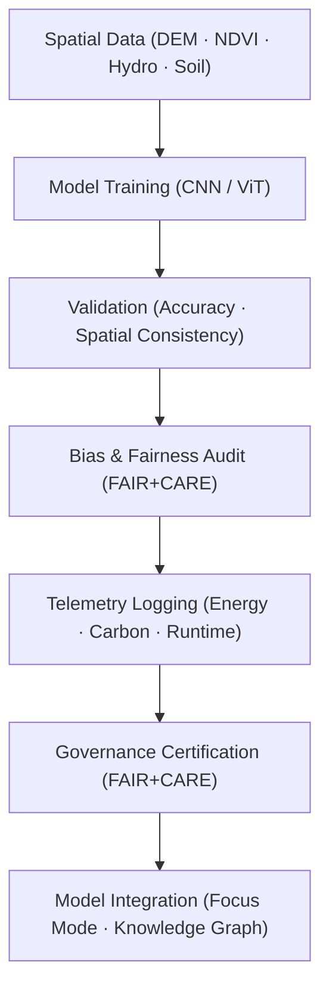

<div align="center">

# 🧾 **Kansas Frontier Matrix — Spatial Classification · Training Logs**  
`src/ai/models/classification/spatial_classification/logs/README.md`

**Purpose:**  
Document all **training, validation, and sustainability logs** generated by **Spatial Classification models** within the **Kansas Frontier Matrix (KFM)**.  
These logs ensure transparency, fairness, sustainability, and **FAIR+CARE** certification, including performance, bias metrics, and carbon footprint tracking.

[](../../../../../../../docs/)
[](../../../../../../../LICENSE)
[](../../../../../../../docs/standards/faircare.md)
[](#)

</div>

---

## 📘 Overview

The **Spatial Classification Training Logs** archive performance and operational metrics for models used to classify geospatial data (e.g., landcover, hydrology, terrain).  
These logs support **FAIR+CARE governance**, **ISO 50001 sustainability tracking**, and **bias/fairness audits**, ensuring responsible AI decision-making in the Kansas Frontier Matrix.

Key Features:
- 🔍 **Training performance logs** including loss curves, accuracy, and F1 score.  
- ⚖️ **Bias and fairness analysis** to ensure equal representation of spatial features.  
- ♻️ **Sustainability tracking** to monitor energy consumption and carbon footprint (ISO 50001).  
- 🧾 **FAIR+CARE governance logs** for audit and certification.

---

## 🗂️ Directory Layout

```plaintext
src/ai/models/classification/spatial_classification/logs/
├── README.md                             # This file — documentation for training logs
│
├── training_log.json                     # Core model training metrics and performance log
├── evaluation_metrics.json               # Validation results and evaluation metrics
├── bias_drift_report.json                # Bias and fairness audit results
├── telemetry_metrics.json                # ISO 50001 sustainability telemetry data
└── governance_validation.json            # FAIR+CARE Council certification and audit log
```

---

## ⚙️ Logging Workflow



### Workflow Breakdown:
1. **Training Metrics:** Logs model performance, loss, and accuracy across epochs.  
2. **Evaluation Metrics:** Summarizes validation results, such as F1 score and spatial alignment.  
3. **Bias & Fairness Audit:** Identifies drift in model predictions and ensures fairness across geospatial regions.  
4. **Telemetry Logging:** Tracks energy, runtime, and carbon emissions during model training.  
5. **Governance Certification:** FAIR+CARE Council certifies the model’s ethical and sustainability compliance.

---

## 🧩 Example: Training Log (`training_log.json`)

```json
{
  "run_id": "spatial_classification_train_2025_11_08",
  "model": "resnet18",
  "epochs": 10,
  "training_time_min": 340,
  "validation_accuracy": 0.932,
  "bias_index": 0.012,
  "faircare_score": 99.4,
  "energy_wh": 1280.5,
  "carbon_gco2e": 525.0,
  "reviewed_by": "@faircare-council",
  "telemetry_ref": "../../../../../../../releases/v10.0.0/focus-telemetry.json"
}
```

---

## ⚖️ FAIR+CARE Governance Matrix

| Principle | Implementation | Oversight |
|------------|----------------|------------|
| **Findable** | Log entries indexed by UUID in SBOM and telemetry ledger. | SPDX Manifest |
| **Accessible** | Public summaries; sensitive geospatial data under CARE tags. | FAIR+CARE Council |
| **Interoperable** | JSON schema compatible with ISO 19115 + GeoSPARQL. | Schema Validator |
| **Reusable** | Reproducible across geospatial classification tasks. | MCP-DL Validation |
| **CARE – Responsibility** | Bias, fairness, and energy metrics logged per training run. | `faircare-validate.yml` |
| **CARE – Ethics** | Sensitive spatial regions masked and validated. | Governance Ledger |

---

## 🧮 Example: Bias & Drift Report (`bias_drift_report.json`)

```json
{
  "report_id": "bias_audit_spatial_classification_2025_11_08",
  "bias_index": 0.012,
  "drift_detected": false,
  "region_distribution": {
    "floodplains": 0.30,
    "uplands": 0.40,
    "wetlands": 0.30
  },
  "reviewed_by": "@faircare-council",
  "status": "certified",
  "timestamp": "2025-11-08T23:45:00Z"
}
```

---

## 🧮 Telemetry Metrics (ISO 50001)

| Metric | Description | Example |
|--------|-------------|----------|
| `training_time_min` | Total duration of model training. | 340 |
| `energy_wh` | Power consumption during training. | 1280.5 |
| `carbon_gco2e` | CO₂ equivalent emissions. | 525.0 |
| `faircare_score` | FAIR+CARE compliance score. | 99.4 |
| `bias_index` | Spatial fairness deviation. | 0.012 |

Telemetry stored in:  
`releases/v10.0.0/focus-telemetry.json`  
Schema: `schemas/telemetry/src-ai-models-classification-spatial-logs-v1.json`

---

## 🔐 Governance & Provenance Integration

- **Governance Ledger:** `releases/v10.0.0/governance/ledger_snapshot.json`  
- **Telemetry Ledger:** `releases/v10.0.0/focus-telemetry.json`  
- **SBOM Manifest:** `releases/v10.0.0/sbom.spdx.json`  
- **Bias & Fairness Audit:** `bias_drift_report.json`

### Example Governance Record
```json
{
  "ledger_entry_id": "ledger_2025q4_spatial_classification_logs",
  "auditor": "@kfm-governance",
  "reviewed_by": "@faircare-council",
  "status": "approved",
  "timestamp": "2025-11-08T23:50:00Z"
}
```

---

## 🧾 Citation

```text
Kansas Frontier Matrix (2025). Spatial Classification · Training Logs (v10.0.0).
FAIR+CARE-certified documentation ensuring ethical transparency, sustainability, and reproducibility in spatial classification models within the Kansas Frontier Matrix.
```

---

## 🕰️ Version History

| Version | Date | Author | Summary |
|---------:|------|--------|----------|
| v10.0.0 | 2025-11-08 | `@kfm-ai` | Created Spatial Classification training logs documentation; integrated FAIR+CARE audit, sustainability telemetry, and bias monitoring. |

---

<div align="center">

**Kansas Frontier Matrix**  
*Spatial Intelligence × FAIR+CARE Ethics × Sustainable AI Systems*  
© 2025 Kansas Frontier Matrix · Internal FAIR+CARE Certified · Master Coder Protocol v6.3 · Diamond⁹ Ω / Crown∞Ω Ultimate Certified  

[Back to Spatial Classification](../README.md) · [Governance Charter](../../../../../docs/standards/governance/ROOT-GOVERNANCE.md)

</div>

