<div align="center">

# 📜 **Kansas Frontier Matrix — Text Classification Framework**  
`src/ai/models/classification/text_classification/README.md`

**Purpose:**  
Describe the **architecture, training workflows, and governance controls** for **text classification models** used within the **Kansas Frontier Matrix (KFM)**.  
These models assign labels to diverse textual data (e.g., treaties, OCR outputs, cultural narratives), and are governed by **FAIR+CARE**, **ISO 50001 sustainability protocols**, and **MCP-DL v6.3 reproducibility standards**.

[](../../../../../../../docs/)
[](../../../../../../../LICENSE)
[](../../../../../../../docs/standards/faircare.md)
[](#)

</div>

---

## 📘 Overview

The **Text Classification Framework** enables the training of models that assign meaningful labels to historical documents, cultural texts, and archival records within the Kansas Frontier Matrix.  
This suite integrates with other KFM systems, including **Focus Mode** for narrative generation and the **Knowledge Graph** for entity-based inference.

Key Features:
- 🧠 **Transformer-based models** (BERT, RoBERTa, etc.) for high-quality NLP classification.  
- 🧩 **Multilingual support** for diverse text corpora.  
- ⚖️ **Ethical compliance** and **FAIR+CARE certification** for all data sources.  
- ♻️ **ISO 50001 compliance** for energy tracking and sustainability.  
- 🧠 **Explainability integration** (SHAP, LIME) for model interpretability.

---

## 🗂️ Directory Layout

```plaintext
src/ai/models/classification/text_classification/
├── README.md                            # This file — documentation for text classification models
│
├── train_text_classifier.py             # Main pipeline for training text classifiers
├── configs/                             # Configuration files for model training and governance
│   ├── text_classification_train.yaml
│   └── telemetry_config.yaml
│
├── logs/                                # Training, evaluation, and governance logs
│   ├── training_log.json
│   ├── evaluation_metrics.json
│   ├── bias_drift_report.json
│   ├── telemetry_metrics.json
│   └── governance_validation.json
│
└── checkpoints/                         # Saved model checkpoints and registry
    ├── checkpoint_001_pretrain.pt
    ├── checkpoint_002_finetune.pt
    └── checkpoints_manifest.json
```

---

## ⚙️ Text Classification Workflow

```mermaid
flowchart TD
  A["Text Data (OCR · Treaties · Archival Texts)"] --> B["Preprocessing (Tokenization · Normalization)"]
  B --> C["Model Training (BERT · LSTM · CNN)"]
  C --> D["Evaluation & Metrics (Accuracy · F1 · Bias)"]
  D --> E["Governance & FAIR+CARE Audit"]
  E --> F["Deployment to Focus Mode & Knowledge Graph"]
```



### Workflow Breakdown:
1. **Data Preprocessing:** Tokenization, lowercasing, and normalization of input text.  
2. **Model Training:** Fine-tuning transformer models like BERT or RoBERTa for text classification.  
3. **Evaluation:** Compute accuracy, F1-score, and bias index to ensure model fairness.  
4. **Governance Review:** Ensure ethical compliance and FAIR+CARE certification before deployment.  
5. **Deployment:** Use the trained classifier for labeling tasks in Focus Mode and Knowledge Graph systems.

---

## 🧩 Example: Model Configuration (`configs/text_classification_train.yaml`)

```yaml
model:
  name: "bert-base-uncased"
  architecture: "transformer"
  num_labels: 5
  epochs: 5
  batch_size: 16
  learning_rate: 3e-5
  dropout_rate: 0.1

data:
  source: "../../../../data/processed/text_corpus/"
  validation_split: 0.1

telemetry:
  enable_energy_tracking: true
  telemetry_ref: "../../../../../../../releases/v10.0.0/focus-telemetry.json"

ethics:
  reviewer: "@faircare-council"
  care_tag: "restricted"
  governance_ref: "../../../../../../../docs/standards/governance/ROOT-GOVERNANCE.md"
```

---

## ⚖️ FAIR+CARE Governance Matrix

| Principle | Implementation | Oversight |
|------------|----------------|------------|
| **Findable** | Logs and checkpoints indexed in SBOM manifest and telemetry ledger. | SPDX Manifest |
| **Accessible** | Public metadata, CARE-restricted corpus. | FAIR+CARE Council |
| **Interoperable** | Model output and metrics adhere to ISO 19115 and DCAT standards. | Schema Validator |
| **Reusable** | Open-source training code, configuration, and checkpoints. | MCP-DL Validation |
| **CARE – Responsibility** | Bias and fairness audits logged and reviewed. | `faircare-validate.yml` |
| **CARE – Ethics** | Redacted and sensitive content filtered pre-processing. | Governance Ledger |

---

## 🧮 Telemetry Metrics (ISO 50001)

| Metric | Description | Example |
|--------|-------------|----------|
| `training_time_min` | Total model training time. | 420 |
| `energy_wh` | Energy used during training. | 1380.6 |
| `carbon_gco2e` | CO₂ equivalent emissions. | 562.0 |
| `accuracy` | Accuracy on the validation dataset. | 0.947 |
| `bias_index` | Fairness deviation across training data. | 0.015 |
| `faircare_score` | FAIR+CARE compliance score. | 99.4 |

Telemetry stored in:  
`releases/v10.0.0/focus-telemetry.json`  
Schema: `schemas/telemetry/src-ai-models-classification-text-v1.json`

---

## 🔐 Governance & Provenance Integration

- **Governance Ledger:** `releases/v10.0.0/governance/ledger_snapshot.json`  
- **Telemetry Ledger:** `releases/v10.0.0/focus-telemetry.json`  
- **SBOM Manifest:** `releases/v10.0.0/sbom.spdx.json`  
- **Bias & Fairness Report:** `bias_drift_report.json`

### Example Governance Record
```json
{
  "ledger_entry_id": "ledger_2025q4_text_classification_models",
  "auditor": "@kfm-governance",
  "reviewed_by": "@faircare-council",
  "status": "approved",
  "timestamp": "2025-11-08T23:55:00Z"
}
```

---

## 🧾 Citation

```text
Kansas Frontier Matrix (2025). Text Classification Framework (v10.0.0).
FAIR+CARE-certified documentation defining ethical, transparent, and sustainable text classification models for multi-modal data processing within the Kansas Frontier Matrix.
```

---

## 🕰️ Version History

| Version | Date | Author | Summary |
|---------:|------|--------|----------|
| v10.0.0 | 2025-11-08 | `@kfm-ai` | Created Text Classification documentation with FAIR+CARE governance, sustainability telemetry, and reproducibility standards. |

---

<div align="center">

**Kansas Frontier Matrix**  
*Ethical NLP × FAIR+CARE Certification × Sustainable AI Systems*  
© 2025 Kansas Frontier Matrix · MIT · Master Coder Protocol v6.3 · FAIR+CARE Certified · Diamond⁹ Ω / Crown∞Ω Ultimate Certified  

[Back to Classification Suite](../README.md) · [Governance Charter](../../../../../docs/standards/governance/ROOT-GOVERNANCE.md)

</div>
---
title: "🧭 Kansas Frontier Matrix — Classification Model Suite (Diamond⁹ Ω / Crown∞Ω Ultimate Certified)"
path: "src/ai/models/classification/README.md"
version: "v10.0.0"
last_updated: "2025-11-08"
review_cycle: "Continuous / Autonomous"
commit_sha: "<latest-commit-hash>"
sbom_ref: "../../../../../releases/v10.0.0/sbom.spdx.json"
manifest_ref: "../../../../../releases/v10.0.0/manifest.zip"
telemetry_ref: "../../../../../releases/v10.0.0/focus-telemetry.json"
telemetry_schema: "../../../../../schemas/telemetry/src-ai-models-classification-v1.json"
governance_ref: "../../../../../docs/standards/governance/ROOT-GOVERNANCE.md"
license: "MIT"
mcp_version: "MCP-DL v6.3"
---

<div align="center">

# 🧭 **Kansas Frontier Matrix — Classification Model Suite**  
`src/ai/models/classification/README.md`

**Purpose:**  
Define the **classification AI model family** used in the **Kansas Frontier Matrix (KFM)** for tagging, labeling, and contextual categorization of documents, spatial features, and entities.  
Each model in this suite is built under **FAIR+CARE ethical principles**, ensuring transparent decision boundaries, explainable predictions, and reproducible performance under **MCP-DL v6.3** and **ISO 19115** governance.

[](../../../../../docs/)
[](../../../../../LICENSE)
[](../../../../../docs/standards/faircare.md)
[](#)

</div>

---

## 📘 Overview

The **Classification Model Suite** provides transformer- and CNN-based classifiers for labeling multi-domain data, including:
- 📜 **Text classification:** tagging documents, treaties, and OCR-transcribed content.  
- 🗺️ **Spatial classification:** identifying terrain, hydrology, and landcover features.  
- 🧬 **Entity classification:** assigning types within KFM’s Knowledge Graph (e.g., *Person*, *Event*, *Artifact*).  
- 🧠 **Explainability integration:** interpretable results using SHAP and attention visualization.  

All classification outputs are **FAIR+CARE-aligned**, **ISO 50001-audited**, and certified through the **KFM Governance Council**.

---

## 🗂️ Directory Layout

```plaintext
src/ai/models/classification/
├── README.md                            # This file — documentation for the classification suite
│
├── text_classification/                 # NLP-based classification (BERT / LSTM)
│   ├── train_text_classifier.py
│   ├── configs/
│   ├── logs/
│   └── checkpoints/
│
├── spatial_classification/              # Raster / imagery-based classification (CNN / ViT)
│   ├── train_spatial_classifier.py
│   ├── configs/
│   ├── logs/
│   └── checkpoints/
│
├── entity_classification/               # Knowledge Graph node classification (GraphSAGE / GAT)
│   ├── train_entity_classifier.py
│   ├── configs/
│   ├── logs/
│   └── checkpoints/
│
└── evaluation/                          # FAIR+CARE audits, validation, and telemetry
    ├── evaluation_report.json
    ├── bias_drift_analysis.json
    └── telemetry_metrics.json
```

---

## ⚙️ Classification Framework

```mermaid
flowchart TD
  A["Training Data (Text · Graph · Spatial)"] --> B["Feature Extraction (Embeddings + Metadata)"]
  B --> C["Classification Model (Transformer / CNN / GNN)"]
  C --> D["Validation & Explainability (FAIR+CARE Audit)"]
  D --> E["Governance Ledger Sync + Telemetry Tracking"]
  E --> F["Focus Mode Deployment (Ethical AI Classification Layer)"]
```



### Workflow Stages
1. **Feature Extraction:** Use embeddings from `src/ai/models/embeddings/` for multi-modal features.  
2. **Model Training:** Fine-tune domain-specific classifiers with FAIR+CARE oversight.  
3. **Validation:** Evaluate accuracy, bias, and explainability metrics.  
4. **Governance:** FAIR+CARE audit approval prior to model release.  
5. **Integration:** Certified models deployed in Focus Mode interfaces.

---

## 🧩 Example: Model Configuration (`text_classification/configs/train_text_classifier.yaml`)

```yaml
model:
  name: "bert-base-uncased"
  architecture: "transformer"
  num_labels: 6
  epochs: 5
  batch_size: 16
  learning_rate: 3e-5
  dropout_rate: 0.1

data:
  source: "../../../../data/processed/text_classification_corpus.json"
  validation_split: 0.1

telemetry:
  enable_energy_tracking: true
  telemetry_ref: "../../../../../../releases/v10.0.0/focus-telemetry.json"

ethics:
  reviewer: "@faircare-council"
  care_tag: "restricted"
  governance_ref: "../../../../../../docs/standards/governance/ROOT-GOVERNANCE.md"
```

---

## ⚖️ FAIR+CARE Governance Matrix

| Principle | Implementation | Oversight |
|------------|----------------|------------|
| **Findable** | All models indexed in SBOM manifest and DCAT catalogs. | SPDX Manifest |
| **Accessible** | Configs and metadata are open; datasets under CARE tags. | FAIR+CARE Council |
| **Interoperable** | CIDOC CRM + PROV-O aligned metadata for entity types. | Schema Validator |
| **Reusable** | Reproducible model configurations across classification tasks. | MCP-DL Validation |
| **CARE – Responsibility** | Bias, fairness, and sustainability monitored per training run. | `faircare-validate.yml` |
| **CARE – Ethics** | Ethical classifiers redacted for restricted data categories. | Governance Ledger |

---

## 🧮 Example: Telemetry Metrics (ISO 50001)

| Metric | Description | Example |
|--------|-------------|----------|
| `training_time_min` | Model training duration. | 420 |
| `energy_wh` | Energy used during classifier training. | 1380.6 |
| `carbon_gco2e` | CO₂ emissions equivalent. | 562.0 |
| `accuracy` | Classification model accuracy. | 0.947 |
| `bias_index` | Fairness deviation metric. | 0.015 |
| `faircare_score` | Ethical governance compliance score. | 99.4 |

Telemetry appended to:  
`releases/v10.0.0/focus-telemetry.json`  
Schema: `schemas/telemetry/src-ai-models-classification-v1.json`

---

## 🔐 Governance & Provenance Integration

- **Governance Ledger:** `releases/v10.0.0/governance/ledger_snapshot.json`  
- **Telemetry Reference:** `releases/v10.0.0/focus-telemetry.json`  
- **SBOM Manifest:** `releases/v10.0.0/sbom.spdx.json`  
- **Council Audit:** `evaluation/bias_drift_analysis.json`

### Example Governance Record
```json
{
  "ledger_entry_id": "ledger_2025q4_classification_models",
  "auditor": "@kfm-governance",
  "reviewed_by": "@faircare-council",
  "status": "approved",
  "timestamp": "2025-11-08T23:45:00Z"
}
```

---

## 🧾 Citation

```text
Kansas Frontier Matrix (2025). Classification Model Suite (v10.0.0).
FAIR+CARE-certified documentation defining ethical, transparent, and sustainable classification models for multi-modal data across the Kansas Frontier Matrix.
```

---

## 🕰️ Version History

| Version | Date | Author | Summary |
|---------:|------|--------|----------|
| v10.0.0 | 2025-11-08 | `@kfm-ai` | Created Classification Model Suite documentation; integrated FAIR+CARE governance, sustainability telemetry, and explainability hooks. |

---

<div align="center">

**Kansas Frontier Matrix**  
*Transparent AI × FAIR+CARE Ethics × Sustainable Multi-Modal Classification*  
© 2025 Kansas Frontier Matrix · MIT · Master Coder Protocol v6.3 · FAIR+CARE Certified · Diamond⁹ Ω / Crown∞Ω Ultimate Certified  

[Back to AI Models Index](../README.md) · [Governance Charter](../../../../../docs/standards/governance/ROOT-GOVERNANCE.md)

</div>

