<div align="center">

# 🧭 **Kansas Frontier Matrix — Classification Model Suite**  
`src/ai/models/classification/README.md`

**Purpose:**  
Define the **classification AI model family** used in the **Kansas Frontier Matrix (KFM)** for tagging, labeling, and contextual categorization of documents, spatial features, and entities.  
Each model in this suite is built under **FAIR+CARE ethical principles**, ensuring transparent decision boundaries, explainable predictions, and reproducible performance under **MCP-DL v6.3** and **ISO 19115** governance.

[](../../../../../docs/)
[](../../../../../LICENSE)
[](../../../../../docs/standards/faircare.md)
[](#)

</div>

---

## 📘 Overview

The **Classification Model Suite** provides transformer- and CNN-based classifiers for labeling multi-domain data, including:
- 📜 **Text classification:** tagging documents, treaties, and OCR-transcribed content.  
- 🗺️ **Spatial classification:** identifying terrain, hydrology, and landcover features.  
- 🧬 **Entity classification:** assigning types within KFM’s Knowledge Graph (e.g., *Person*, *Event*, *Artifact*).  
- 🧠 **Explainability integration:** interpretable results using SHAP and attention visualization.  

All classification outputs are **FAIR+CARE-aligned**, **ISO 50001-audited**, and certified through the **KFM Governance Council**.

---

## 🗂️ Directory Layout

```plaintext
src/ai/models/classification/
├── README.md                            # This file — documentation for the classification suite
│
├── text_classification/                 # NLP-based classification (BERT / LSTM)
│   ├── train_text_classifier.py
│   ├── configs/
│   ├── logs/
│   └── checkpoints/
│
├── spatial_classification/              # Raster / imagery-based classification (CNN / ViT)
│   ├── train_spatial_classifier.py
│   ├── configs/
│   ├── logs/
│   └── checkpoints/
│
├── entity_classification/               # Knowledge Graph node classification (GraphSAGE / GAT)
│   ├── train_entity_classifier.py
│   ├── configs/
│   ├── logs/
│   └── checkpoints/
│
└── evaluation/                          # FAIR+CARE audits, validation, and telemetry
    ├── evaluation_report.json
    ├── bias_drift_analysis.json
    └── telemetry_metrics.json
```

---

## ⚙️ Classification Framework

```mermaid
flowchart TD
  A["Training Data (Text · Graph · Spatial)"] --> B["Feature Extraction (Embeddings + Metadata)"]
  B --> C["Classification Model (Transformer / CNN / GNN)"]
  C --> D["Validation & Explainability (FAIR+CARE Audit)"]
  D --> E["Governance Ledger Sync + Telemetry Tracking"]
  E --> F["Focus Mode Deployment (Ethical AI Classification Layer)"]
```



### Workflow Stages
1. **Feature Extraction:** Use embeddings from `src/ai/models/embeddings/` for multi-modal features.  
2. **Model Training:** Fine-tune domain-specific classifiers with FAIR+CARE oversight.  
3. **Validation:** Evaluate accuracy, bias, and explainability metrics.  
4. **Governance:** FAIR+CARE audit approval prior to model release.  
5. **Integration:** Certified models deployed in Focus Mode interfaces.

---

## 🧩 Example: Model Configuration (`text_classification/configs/train_text_classifier.yaml`)

```yaml
model:
  name: "bert-base-uncased"
  architecture: "transformer"
  num_labels: 6
  epochs: 5
  batch_size: 16
  learning_rate: 3e-5
  dropout_rate: 0.1

data:
  source: "../../../../data/processed/text_classification_corpus.json"
  validation_split: 0.1

telemetry:
  enable_energy_tracking: true
  telemetry_ref: "../../../../../../releases/v10.0.0/focus-telemetry.json"

ethics:
  reviewer: "@faircare-council"
  care_tag: "restricted"
  governance_ref: "../../../../../../docs/standards/governance/ROOT-GOVERNANCE.md"
```

---

## ⚖️ FAIR+CARE Governance Matrix

| Principle | Implementation | Oversight |
|------------|----------------|------------|
| **Findable** | All models indexed in SBOM manifest and DCAT catalogs. | SPDX Manifest |
| **Accessible** | Configs and metadata are open; datasets under CARE tags. | FAIR+CARE Council |
| **Interoperable** | CIDOC CRM + PROV-O aligned metadata for entity types. | Schema Validator |
| **Reusable** | Reproducible model configurations across classification tasks. | MCP-DL Validation |
| **CARE – Responsibility** | Bias, fairness, and sustainability monitored per training run. | `faircare-validate.yml` |
| **CARE – Ethics** | Ethical classifiers redacted for restricted data categories. | Governance Ledger |

---

## 🧮 Example: Telemetry Metrics (ISO 50001)

| Metric | Description | Example |
|--------|-------------|----------|
| `training_time_min` | Model training duration. | 420 |
| `energy_wh` | Energy used during classifier training. | 1380.6 |
| `carbon_gco2e` | CO₂ emissions equivalent. | 562.0 |
| `accuracy` | Classification model accuracy. | 0.947 |
| `bias_index` | Fairness deviation metric. | 0.015 |
| `faircare_score` | Ethical governance compliance score. | 99.4 |

Telemetry appended to:  
`releases/v10.0.0/focus-telemetry.json`  
Schema: `schemas/telemetry/src-ai-models-classification-v1.json`

---

## 🔐 Governance & Provenance Integration

- **Governance Ledger:** `releases/v10.0.0/governance/ledger_snapshot.json`  
- **Telemetry Reference:** `releases/v10.0.0/focus-telemetry.json`  
- **SBOM Manifest:** `releases/v10.0.0/sbom.spdx.json`  
- **Council Audit:** `evaluation/bias_drift_analysis.json`

### Example Governance Record
```json
{
  "ledger_entry_id": "ledger_2025q4_classification_models",
  "auditor": "@kfm-governance",
  "reviewed_by": "@faircare-council",
  "status": "approved",
  "timestamp": "2025-11-08T23:45:00Z"
}
```

---

## 🧾 Citation

```text
Kansas Frontier Matrix (2025). Classification Model Suite (v10.0.0).
FAIR+CARE-certified documentation defining ethical, transparent, and sustainable classification models for multi-modal data across the Kansas Frontier Matrix.
```

---

## 🕰️ Version History

| Version | Date | Author | Summary |
|---------:|------|--------|----------|
| v10.0.0 | 2025-11-08 | `@kfm-ai` | Created Classification Model Suite documentation; integrated FAIR+CARE governance, sustainability telemetry, and explainability hooks. |

---

<div align="center">

**Kansas Frontier Matrix**  
*Transparent AI × FAIR+CARE Ethics × Sustainable Multi-Modal Classification*  
© 2025 Kansas Frontier Matrix · MIT · Master Coder Protocol v6.3 · FAIR+CARE Certified · Diamond⁹ Ω / Crown∞Ω Ultimate Certified  

[Back to AI Models Index](../README.md) · [Governance Charter](../../../../../docs/standards/governance/ROOT-GOVERNANCE.md)

</div>

