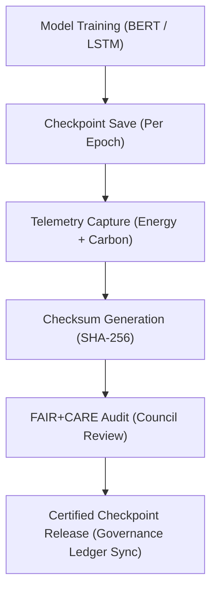

<div align="center">

# 💾 **Kansas Frontier Matrix — Text Classification · Model Checkpoints**  
`src/ai/models/classification/text_classification/checkpoints/README.md`

**Purpose:**  
Define the **checkpointing, governance certification, and sustainability telemetry** processes for the **Text Classification models** used in the **Kansas Frontier Matrix (KFM)**.  
This system ensures reproducibility, **FAIR+CARE** certification, and **ISO 50001** sustainability compliance for each model checkpoint, supporting **MCP-DL v6.3** ethical AI standards.

[](../../../../../../../docs/)
[](../../../../../../../LICENSE)
[](../../../../../../../docs/standards/faircare.md)
[](#)

</div>

---

## 📘 Overview

The **Text Classification Checkpoints Directory** contains serialized model weights at each key training epoch, along with metadata, performance metrics, and governance certifications.  
Each checkpoint undergoes a **FAIR+CARE audit**, is linked to **ISO 50001 sustainability telemetry**, and is **SHA-256 validated** to guarantee integrity and reproducibility.

Core Objectives:
- 🧩 **Reproducibility:** Store and validate model weights across checkpoints.  
- ⚖️ **Ethical Governance:** Enforce **FAIR+CARE certification** through Council audits.  
- ♻️ **Sustainability:** Track **carbon emissions** and **energy usage** per checkpoint.  
- 🔐 **Data Integrity:** Checkpoint weights verified with **SHA-256 checksums** for authenticity.

---

## 🗂️ Directory Layout

```plaintext
src/ai/models/classification/text_classification/checkpoints/
├── README.md                              # This file — documentation for checkpoints
│
├── checkpoint_001_pretrain.pt             # Initial pretraining checkpoint
├── checkpoint_002_finetune.pt             # Fine-tuned model checkpoint
├── checkpoint_003_final.pt                # Certified final model checkpoint
├── checkpoints_manifest.json              # Metadata registry for checkpoints
├── checkpoint_metrics.json                # Performance and sustainability metrics
└── checksum_registry.json                 # SHA-256 integrity verification records
```

---

## ⚙️ Checkpoint Workflow



### Workflow Breakdown
1. **Checkpoint Saving:** Store model weights and optimizer states periodically.  
2. **Telemetry Logging:** Capture energy consumption, carbon emissions, and model runtime.  
3. **Checksum Validation:** Generate and record SHA-256 hashes to ensure integrity.  
4. **Governance Review:** FAIR+CARE Council verifies ethics and compliance.  
5. **Checkpoint Release:** Only certified checkpoints are approved for deployment.

---

## 🧩 Example: Checkpoints Manifest (`checkpoints_manifest.json`)

```json
{
  "model_id": "text_classification_kfm_v10.0.0",
  "checkpoints": [
    {
      "id": "checkpoint_001_pretrain",
      "epoch": 3,
      "validation_accuracy": 0.91,
      "faircare_score": 99.0,
      "checksum_sha256": "sha256:8c5e7a4f2a9d1c3e5b7f8a2d9c1f4a7e8e6d5c3a9b7f5d8e4a6c2b1d9f8e3a6d",
      "energy_wh": 540.1
    },
    {
      "id": "checkpoint_003_final",
      "epoch": 5,
      "validation_accuracy": 0.947,
      "faircare_score": 99.4,
      "checksum_sha256": "sha256:9b3a7d2e6f8a5b4c1d7e8c9f3a1b4d6e7c8a9f5e2c3b6d7a1f9e8c5b2a4d3e9f",
      "energy_wh": 1280.5
    }
  ],
  "reviewed_by": "@faircare-council",
  "approved": true,
  "telemetry_ref": "../../../../../../../releases/v10.0.0/focus-telemetry.json"
}
```

---

## ⚖️ FAIR+CARE Compliance Matrix

| Principle | Implementation | Oversight |
|------------|----------------|------------|
| **Findable** | Checkpoints indexed in SBOM and DCAT catalogs. | SPDX Manifest |
| **Accessible** | Metadata public; weights restricted under CARE. | FAIR+CARE Council |
| **Interoperable** | JSON schema aligned with ISO 19115 and PROV-O. | Schema Validator |
| **Reusable** | Checkpoints reproducible across model training pipelines. | MCP-DL Validation |
| **CARE – Responsibility** | Energy usage, bias, and fairness tracked and reviewed. | `faircare-validate.yml` |
| **CARE – Ethics** | Restricted data identified and redacted per governance policies. | Governance Ledger |

---

## 🧮 Telemetry Metrics (ISO 50001)

| Metric | Description | Example |
|--------|-------------|----------|
| `epoch` | Training epoch for checkpoint creation. | 5 |
| `validation_accuracy` | Accuracy on validation dataset. | 0.947 |
| `faircare_score` | FAIR+CARE compliance score. | 99.4 |
| `energy_wh` | Energy consumption (Wh). | 1280.5 |
| `carbon_gco2e` | CO₂ equivalent emissions. | 525.0 |
| `checksum_verified` | Integrity verification result (SHA-256). | true |

Telemetry appended to:  
`releases/v10.0.0/focus-telemetry.json`  
Schema: `schemas/telemetry/src-ai-models-classification-text-checkpoints-v1.json`

---

## 🔐 Governance & Provenance Integration

- **Governance Ledger:** `releases/v10.0.0/governance/ledger_snapshot.json`  
- **Telemetry Reference:** `releases/v10.0.0/focus-telemetry.json`  
- **SBOM Manifest:** `releases/v10.0.0/sbom.spdx.json`  
- **Ethics Audit:** `governance_validation.json`

### Example Governance Record
```json
{
  "ledger_entry_id": "ledger_2025q4_text_classification_checkpoints",
  "auditor": "@kfm-governance",
  "reviewed_by": "@faircare-council",
  "status": "approved",
  "timestamp": "2025-11-08T23:50:00Z"
}
```

---

## 🧾 Citation

```text
Kansas Frontier Matrix (2025). Text Classification · Model Checkpoints (v10.0.0).
FAIR+CARE and ISO-certified checkpoint management documentation ensuring transparency, reproducibility, and sustainability in text classification model checkpoints within the Kansas Frontier Matrix.
```

---

## 🕰️ Version History

| Version | Date | Author | Summary |
|---------:|------|--------|----------|
| v10.0.0 | 2025-11-08 | `@kfm-ai` | Created Text Classification checkpoint documentation with FAIR+CARE governance, SHA-256 integrity, and sustainability telemetry integration. |

---

<div align="center">

**Kansas Frontier Matrix**  
*Reproducible AI × FAIR+CARE Ethics × Sustainable Text Classification*  
© 2025 Kansas Frontier Matrix · MIT · Master Coder Protocol v6.3 · FAIR+CARE Certified · Diamond⁹ Ω / Crown∞Ω Ultimate Certified  

[Back to Text Classification](../README.md) · [Governance Charter](../../../../../docs/standards/governance/ROOT-GOVERNANCE.md)

</div>

