<div align="center">

# 🧾 **Kansas Frontier Matrix — Text Classification · Training Logs**  
`src/ai/models/classification/text_classification/logs/README.md`

**Purpose:**  
Document and archive all **training, validation, and governance logs** for the **Text Classification models** used within the **Kansas Frontier Matrix (KFM)**.  
These logs ensure reproducibility, sustainability, and **FAIR+CARE** certification for every classification task, including accuracy evaluation, bias detection, and carbon emissions monitoring.

[](../../../../../../../docs/)
[](../../../../../../../LICENSE)
[](../../../../../../../docs/standards/faircare.md)
[](#)

</div>

---

## 📘 Overview

The **Text Classification Training Logs** provide detailed records of the performance and operational metrics for models trained on textual data, including:
- 📈 **Accuracy and performance metrics** for classification tasks (e.g., sentiment analysis, document tagging).  
- ⚖️ **Bias, drift, and fairness metrics** to ensure ethical decision-making.  
- ♻️ **Energy consumption, carbon emissions**, and **ISO 50001 sustainability** telemetry.  
- 🔐 **FAIR+CARE governance validation** for ethical oversight and compliance.

Logs are fully integrated into the **KFM Telemetry and Governance Ledger**, ensuring traceability and certification.

---

## 🗂️ Directory Layout

```plaintext
src/ai/models/classification/text_classification/logs/
├── README.md                             # This file — documentation for training logs
│
├── training_log.json                     # Core model training performance log
├── evaluation_metrics.json               # Validation and model performance metrics
├── bias_drift_report.json                # Bias and fairness audit report
├── telemetry_metrics.json                # ISO 50001 energy and carbon telemetry
└── governance_validation.json            # FAIR+CARE audit and certification record
```

---

## ⚙️ Logging Workflow

```mermaid
flowchart TD
  A["Text Classification Model Training"] --> B["Validation & Accuracy Metrics"]
  B --> C["Bias & Fairness Audit (FAIR+CARE)"]
  C --> D["Telemetry Capture (Energy · Carbon · Time)"]
  D --> E["Governance & FAIR+CARE Validation"]
  E --> F["Ledger Sync & Model Certification"]
```



### Log Breakdown:
1. **Training Metrics:** Logs model loss, accuracy, and epoch details.  
2. **Validation Metrics:** Summarizes model evaluation on test datasets, including F1 score, precision, recall.  
3. **Bias & Fairness Audit:** Tracks fairness and drift using ethical and cultural measures.  
4. **Telemetry:** Monitors power usage, carbon emissions, and model runtime.  
5. **Governance Certification:** FAIR+CARE Council review and approval before release.

---

## 🧩 Example: Training Log (`training_log.json`)

```json
{
  "run_id": "text_classification_train_2025_11_08",
  "model": "bert-base-uncased",
  "epochs": 5,
  "training_time_min": 420,
  "validation_loss": 0.042,
  "accuracy": 0.947,
  "bias_index": 0.015,
  "faircare_score": 99.4,
  "energy_wh": 1380.6,
  "carbon_gco2e": 562.0,
  "reviewed_by": "@faircare-council",
  "telemetry_ref": "../../../../../../../releases/v10.0.0/focus-telemetry.json"
}
```

---

## ⚖️ FAIR+CARE Governance Matrix

| Principle | Implementation | Oversight |
|------------|----------------|------------|
| **Findable** | Log entries indexed and linked in SBOM manifest. | SPDX Manifest |
| **Accessible** | Logs and summaries are publicly accessible; sensitive content restricted under CARE tags. | FAIR+CARE Council |
| **Interoperable** | JSON schema compatible with ISO 19115 metadata standards. | Schema Validator |
| **Reusable** | All logs and data are publicly available under MIT license. | MCP-DL Validation |
| **CARE – Responsibility** | Bias and fairness audits reviewed quarterly. | `faircare-validate.yml` |
| **CARE – Ethics** | Sensitive data redacted pre-training. | Governance Ledger |

---

## 🧮 Example: Bias & Drift Report (`bias_drift_report.json`)

```json
{
  "report_id": "bias_audit_text_classification_2025_11_08",
  "bias_index": 0.015,
  "drift_detected": false,
  "text_categories": {
    "history": 0.12,
    "agriculture": 0.15,
    "social": 0.08
  },
  "reviewed_by": "@faircare-council",
  "status": "certified",
  "timestamp": "2025-11-08T23:40:00Z"
}
```

---

## 🧮 Telemetry Metrics (ISO 50001)

| Metric | Description | Example |
|--------|-------------|----------|
| `training_time_min` | Model training duration. | 420 |
| `energy_wh` | Energy usage during model training. | 1380.6 |
| `carbon_gco2e` | Carbon equivalent emissions (gCO₂e). | 562.0 |
| `accuracy` | Accuracy on validation dataset. | 0.947 |
| `bias_index` | Bias score indicating fairness deviation. | 0.015 |
| `faircare_score` | FAIR+CARE ethical compliance score. | 99.4 |

Telemetry data recorded in:  
`releases/v10.0.0/focus-telemetry.json`  
Schema: `schemas/telemetry/src-ai-models-classification-text-logs-v1.json`

---

## 🔐 Governance & Provenance Integration

- **Governance Ledger:** `releases/v10.0.0/governance/ledger_snapshot.json`  
- **Telemetry Ledger:** `releases/v10.0.0/focus-telemetry.json`  
- **SBOM Manifest:** `releases/v10.0.0/sbom.spdx.json`  
- **Ethics Audit:** `governance_validation.json`

### Example Governance Record
```json
{
  "ledger_entry_id": "ledger_2025q4_text_classification_logs",
  "auditor": "@kfm-governance",
  "reviewed_by": "@faircare-council",
  "status": "approved",
  "timestamp": "2025-11-08T23:45:00Z"
}
```

---

## 🧾 Citation

```text
Kansas Frontier Matrix (2025). Text Classification · Training Logs (v10.0.0).
FAIR+CARE-certified training log documentation ensuring ethical transparency, sustainability, and reproducibility in text classification model development within the Kansas Frontier Matrix.
```

---

## 🕰️ Version History

| Version | Date | Author | Summary |
|---------:|------|--------|----------|
| v10.0.0 | 2025-11-08 | `@kfm-ai` | Created Text Classification training logs documentation; integrated FAIR+CARE governance, sustainability telemetry, and bias auditing metrics. |

---

<div align="center">

**Kansas Frontier Matrix**  
*Ethical AI × FAIR+CARE Certification × Sustainable NLP Systems*  
© 2025 Kansas Frontier Matrix · Internal FAIR+CARE Certified · Master Coder Protocol v6.3 · Diamond⁹ Ω / Crown∞Ω Ultimate Certified  

[Back to Text Classification Framework](../README.md) · [Governance Charter](../../../../../docs/standards/governance/ROOT-GOVERNANCE.md)

</div>

