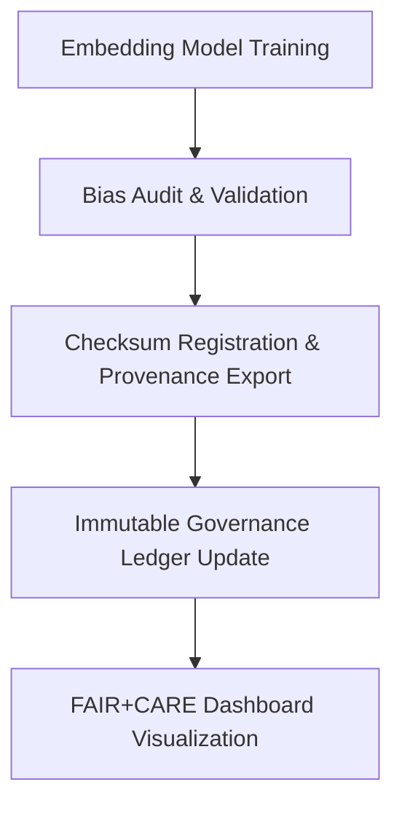

<div align="center">

# 🧭 Kansas Frontier Matrix — **Embeddings Model Suite**
`src/ai/models/embeddings/README.md`

**Purpose:** Defines and documents the architecture, metadata, and governance integration for the **Embeddings Model Suite** within the Kansas Frontier Matrix.  
These models generate vector representations that power entity linking, Focus Mode context retrieval, and semantic similarity across the Knowledge Graph under FAIR+CARE-aligned ethical and provenance standards.

[](../../../../.github/workflows/ai-validate.yml)  
[](../../../../docs/standards/faircare-validation.md)  
[](../../../../docs/architecture/repo-focus.md)

</div>

---

## 📚 Overview

The **Embeddings Module** provides the semantic backbone for contextual understanding in the Kansas Frontier Matrix.  
Embedding models transform text, metadata, and spatial-temporal records into numerical vectors that enable cross-modal search, contextual clustering, and AI-driven entity association within Focus Mode.

**Core Objectives:**
- 🧠 Encode text, place names, and events into FAIR+CARE-traceable vectors  
- 🔍 Support Focus Mode entity linking and semantic similarity analysis  
- ⚖️ Maintain ethical transparency and governance integration for all embeddings  
- 📊 Enable reproducibility and version control of embedding models  
- 🧾 Log checksum and provenance for auditability under Immutable Governance Chain  

---

## 🗂️ Directory Layout

```plaintext
src/ai/models/embeddings/
├── README.md                     # This file — documentation and governance reference
│
├── model.pkl                     # Serialized embedding model file (vector space representation)
├── config.json                   # Model configuration and training parameters
├── metadata.json                 # FAIR+CARE model metadata, provenance, and license details
├── training_corpus.json          # Corpus used for embedding fine-tuning (geospatial + text)
├── tokenizer.json                # Tokenizer and vocabulary file for embedding pipeline
│
├── evaluation/                   # Model evaluation and validation assets
│   ├── metrics.json              # Embedding performance metrics (cosine similarity, bias)
│   ├── drift_report.json         # Stability and drift analysis across releases
│   └── validation_log.txt        # Log of evaluation and testing sessions
│
└── governance/                   # Governance and ethical compliance reports
    ├── checksum_record.json      # SHA-256 checksum verification records
    ├── bias_audit.json           # CARE-aligned bias and representational fairness audit
    └── lineage_ref.json          # Provenance linkage to Immutable Governance Ledger
```

---

## ⚙️ Model Specifications

| Parameter | Description |
|------------|--------------|
| **Architecture** | Sentence Transformer (bi-encoder variant) |
| **Vector Dimension** | 384 |
| **Tokenizer** | Byte Pair Encoding (custom Kansas historical vocab) |
| **Training Corpus** | Curated Kansas-focused text & geospatial records |
| **Framework** | PyTorch + SentenceTransformers |
| **Loss Function** | Cosine Similarity + Triplet Loss |
| **Evaluation Metrics** | Mean Cosine Similarity, Bias Score, Drift Stability |
| **Explainability Tools** | PCA projection and attention-weight visualization |
| **Governance Hooks** | FAIR+CARE validation, checksum registry, provenance linkage |

---

## ⚙️ Example Workflows

### 🔧 Generate Embeddings
```python
from sentence_transformers import SentenceTransformer

model = SentenceTransformer("src/ai/models/embeddings")
text = ["Treaty of Fort Laramie", "Kansas River flooding event 1903"]
embeddings = model.encode(text)
print(embeddings)
```

### 📊 Evaluate Model Similarity
```bash
python src/ai/training/evaluate_model.py \
  --model src/ai/models/embeddings \
  --output src/ai/models/embeddings/evaluation/metrics.json
```

### ⚖️ Audit Bias & Governance Compliance
```bash
python src/governance/validators/faircare_validate.py \
  --input src/ai/models/embeddings/metadata.json \
  --output reports/fair/embedding-bias-validation.json
```

### 🔗 Register Provenance & Checksums
```bash
python src/governance/lineage/checksum_register.py \
  --input src/ai/models/embeddings/ \
  --output reports/audit/embedding-provenance.json
```

---

## 🧩 FAIR+CARE Governance Integration

| Process | Purpose | Output |
|----------|----------|---------|
| **Model Validation** | Evaluate embeddings for ethical bias and quality | `evaluation/metrics.json` |
| **Bias & CARE Audit** | Assess inclusivity, fairness, and transparency | `governance/bias_audit.json` |
| **Checksum Verification** | Integrity validation of model files | `governance/checksum_record.json` |
| **Provenance Linkage** | Record lineage and governance references | `governance/lineage_ref.json` |

Governance telemetry outputs:
```
reports/audit/governance-ledger.json
releases/v9.4.0/focus-telemetry.json
```

---

## 🧠 FAIR+CARE Metadata (metadata.json)

```json
{
  "id": "embeddings_model_v1",
  "version": "1.1.0",
  "license": "MIT",
  "trained_on": "training_corpus.json",
  "alignment": ["FAIR+CARE", "ISO 23894", "IEEE 7007"],
  "checksum_sha256": "8bce92a4b0a74610e7f91ad87fae9457f25cfab1e4f1c4c7df8a13159ea0b12a",
  "explainability_ref": "reports/ai/embeddings-visualization.json",
  "bias_audit_ref": "reports/fair/embedding-bias-validation.json",
  "created_at": "2025-11-02T00:00:00Z",
  "validated_by": "faircare-validate.yml",
  "status": "active"
}
```

---

## 🧩 Provenance & Telemetry Workflow



**Workflow Summary:**
1. Embedding model trained and validated on transparent corpus.  
2. Bias and ethical audits ensure fairness and responsibility.  
3. Provenance exported as JSON-LD for audit interoperability.  
4. Ledger updated to guarantee immutable traceability.  

---

## 🛡️ Security & Integrity

- **Integrity:** Model weights and tokenizer files signed via SHA-256 checksums.  
- **Transparency:** FAIR+CARE metadata and bias reports open-access.  
- **Reproducibility:** Dataset hashes stored in `dataset_manifest.json`.  
- **Governance:** All artifacts linked to `reports/audit/governance-ledger.json`.  

Telemetry Schema:  
`schemas/telemetry/ai-pipelines-v1.json`

Telemetry Outputs:
```
reports/ai/embedding-events.json
releases/v9.4.0/focus-telemetry.json
```

---

## 🧩 Standards & Compliance

| Standard | Domain | Implementation |
|-----------|----------|----------------|
| **MCP-DL v6.4.3** | Documentation-driven lifecycle management | This README + metadata.json |
| **FAIR+CARE** | Ethical AI data governance | Bias and provenance integration |
| **ISO 23894** | Risk management and lifecycle transparency | Ethics and drift reporting |
| **IEEE 7007** | Ontological transparency and interpretability | Embedding visualization exports |
| **DCAT / JSON-LD** | Provenance and interoperability | `governance/lineage_ref.json` export |

---

## 🧾 Version History

| Version | Date | Author | Summary |
|----------|------|---------|----------|
| v1.1.0 | 2025-11-02 | @kfm-ai | Added directory layout, governance metadata, and bias audit reports. |
| v1.0.2 | 2025-10-29 | @kfm-ethics | Enhanced FAIR+CARE compliance and checksum registry automation. |
| v1.0.1 | 2025-10-27 | @bartytime4life | Integrated telemetry schema for embedding pipeline lineage tracking. |
| v1.0.0 | 2025-10-25 | @kfm-focus | Established base embedding architecture under MCP-DL v6.4.3. |

---

<div align="center">

**Kansas Frontier Matrix — Ethical Vector Intelligence for Contextual Understanding**  
*“Every embedding transparent. Every relationship traceable. Every dataset ethical.”* 🔗  
📍 `src/ai/models/embeddings/README.md` — FAIR+CARE-aligned documentation for the Embeddings Model Suite of the Kansas Frontier Matrix.

</div>
