<div align="center">

# 🧬 **Kansas Frontier Matrix — Embeddings Model Suite**  
`src/ai/models/embeddings/README.md`

**Purpose:**  
Define the **embeddings architecture, training workflows, and governance mechanisms** used for semantic alignment across KFM’s Knowledge Graph, geospatial layers, and Focus Mode AI systems.  
These embeddings unify text, spatial, and temporal domains through **FAIR+CARE-aligned representation learning** and **ISO 19115 metadata standards** under **MCP-DL v6.3 reproducibility**.

[](../../../../../docs/)
[](../../../../../LICENSE)
[](../../../../../docs/standards/faircare.md)
[](#)

</div>

---

## 📘 Overview

The **Embeddings Suite** provides cross-domain vector representations for:
- 🗺️ **Geospatial data** (GeoSPARQL + DEM + Landcover).  
- 📜 **Textual data** (OCR, treaties, cultural narratives).  
- 🧩 **Knowledge Graph entities** (Neo4j cultural heritage graph).  
- 🕰️ **Temporal reasoning** (event alignment using OWL-Time).  

Each embedding is FAIR+CARE-certified and linked to telemetry for **bias control**, **energy tracking**, and **ethical provenance validation**.

---

## 🗂️ Directory Layout

```plaintext
src/ai/models/embeddings/
├── README.md                             # This file — documentation for embeddings models
│
├── text_embeddings/                      # Transformer-based semantic embeddings (text)
│   ├── train_text_embeddings.py
│   ├── configs/
│   ├── logs/
│   └── checkpoints/
│
├── graph_embeddings/                     # Knowledge Graph entity embeddings (Neo4j / RDF)
│   ├── train_graph_embeddings.py
│   ├── configs/
│   ├── logs/
│   └── checkpoints/
│
├── spatial_embeddings/                   # Geospatial + raster feature embeddings (DEM / NDVI)
│   ├── train_spatial_embeddings.py
│   ├── configs/
│   ├── logs/
│   └── checkpoints/
│
└── evaluation/                           # Cross-domain evaluation & governance validation
    ├── evaluation_report.json
    ├── bias_drift_analysis.json
    └── telemetry_metrics.json
```

---

## ⚙️ Embedding Framework Overview

```mermaid
flowchart TD
  A["Input Modalities (Text · Graph · Spatial · Temporal)"] --> B["Preprocessing Pipelines (Normalization · Tokenization · Sampling)"]
  B --> C["Embedding Models (BERT · Node2Vec · CNN Encoder)"]
  C --> D["Cross-Domain Alignment (Cosine / Triplet Loss)"]
  D --> E["FAIR+CARE Audit + Telemetry Export"]
  E --> F["Knowledge Graph Integration + Focus Mode Consumption"]
```



### Embedding Types
| Type | Model | Input | Output Format |
|------|--------|--------|----------------|
| **Text Embeddings** | BERT / SentenceTransformers | OCR + Archives | `.npy` |
| **Graph Embeddings** | Node2Vec / GraphSAGE | Neo4j Entities | `.npy` |
| **Spatial Embeddings** | CNN Encoder / ResNet-Geo | Raster Grids | `.npy` |
| **Temporal Embeddings** | Transformer Time Encoder | Event Timelines | `.npy` |

---

## 🧩 Example: Text Embedding Config (`text_embeddings/configs/train.yaml`)

```yaml
model:
  name: "bert-base-multilingual-cased"
  architecture: "transformer"
  output_dim: 768
  batch_size: 32
  epochs: 5
  learning_rate: 3e-5

data:
  source: "../../../../data/processed/cultural_corpus/"
  tokenizer: "bert-base-multilingual-cased"
  validation_split: 0.1

telemetry:
  enable_energy_tracking: true
  telemetry_ref: "../../../../../../releases/v10.0.0/focus-telemetry.json"

ethics:
  reviewer: "@faircare-council"
  care_tag: "restricted"
  governance_ref: "../../../../../../docs/standards/governance/ROOT-GOVERNANCE.md"
```

---

## ⚖️ FAIR+CARE Governance Matrix

| Principle | Implementation | Oversight |
|------------|----------------|------------|
| **Findable** | Embeddings metadata indexed in DCAT/STAC + SBOM manifest. | SPDX Manifest |
| **Accessible** | Open metadata; restricted vectors under CARE tags. | FAIR+CARE Council |
| **Interoperable** | RDF + CIDOC CRM + GeoSPARQL alignment. | Schema Validation |
| **Reusable** | Licensed MIT; reproducible with config YAML + logs. | MCP-DL Validation |
| **CARE – Responsibility** | Bias tracking across cultural entity embeddings. | `bias_drift_analysis.json` |
| **CARE – Ethics** | Sensitive textual data masked and validated by Council. | `evaluation_report.json` |

---

## 🧮 Telemetry Metrics (ISO 50001)

| Metric | Description | Example |
|--------|-------------|----------|
| `training_time_min` | Training duration. | 430 |
| `energy_wh` | Energy consumption per embedding model. | 1050.3 |
| `carbon_gco2e` | Equivalent CO₂ footprint. | 430.6 |
| `bias_index` | Mean fairness deviation. | 0.017 |
| `faircare_score` | Ethical compliance rating. | 99.4 |

Telemetry exported to:  
`releases/v10.0.0/focus-telemetry.json`  
Schema: `schemas/telemetry/src-ai-models-embeddings-v1.json`

---

## 🔐 Provenance & Governance Integration

- **Governance Ledger:** `releases/v10.0.0/governance/ledger_snapshot.json`  
- **Telemetry Reference:** `focus-telemetry.json`  
- **SBOM Manifest:** `releases/v10.0.0/sbom.spdx.json`  
- **Bias Report:** `evaluation/bias_drift_analysis.json`

### Example Governance Record
```json
{
  "ledger_entry_id": "ledger_2025q4_embeddings_suite",
  "auditor": "@kfm-governance",
  "reviewed_by": "@faircare-council",
  "status": "approved",
  "timestamp": "2025-11-08T22:25:00Z"
}
```

---

## 🧾 Citation

```text
Kansas Frontier Matrix (2025). Embeddings Model Suite (v10.0.0).
FAIR+CARE-certified cross-domain embedding framework aligning cultural, spatial, and textual representations for ethical, transparent, and sustainable AI modeling within the Kansas Frontier Matrix.
```

---

## 🕰️ Version History

| Version | Date | Author | Summary |
|---------:|------|--------|----------|
| v10.0.0 | 2025-11-08 | `@kfm-ai` | Created embeddings suite documentation; defined governance, telemetry schema, and FAIR+CARE compliance alignment. |

---

<div align="center">

**Kansas Frontier Matrix**  
*Unified Representations × FAIR+CARE Ethics × Sustainable AI Infrastructure*  
© 2025 Kansas Frontier Matrix · MIT · Master Coder Protocol v6.3 · FAIR+CARE Certified · Diamond⁹ Ω / Crown∞Ω Ultimate Certified  

[Back to AI Models Index](../README.md) · [Governance Charter](../../../../../docs/standards/governance/ROOT-GOVERNANCE.md)

</div>

