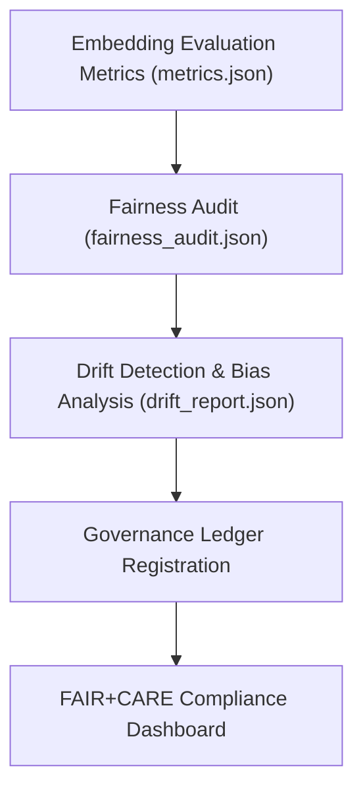

<div align="center">

# 📈 Kansas Frontier Matrix — **Embeddings Model Evaluation & Metrics**
`src/ai/models/embeddings/evaluation/README.md`

**Purpose:** Documents the validation and performance evaluation of the **Embeddings Model Suite** in the Kansas Frontier Matrix.  
Defines evaluation methodologies, metrics, and governance integration ensuring FAIR+CARE ethical compliance, reproducibility, and provenance tracking.

[](../../../../../.github/workflows/ai-evaluate.yml)  
[](../../../../../docs/standards/faircare-validation.md)  
[](../../../../../docs/architecture/repo-focus.md)

</div>

---

## 📚 Overview

This module manages performance evaluation and validation of KFM’s **Embeddings Models**, ensuring that the generated semantic representations meet quality, ethics, and governance standards.  
Each test captures quantitative metrics (similarity, drift, accuracy) and qualitative fairness assessments, contributing to transparent, reproducible model evaluation under FAIR+CARE principles.

**Core Objectives:**
- 🧩 Validate model embeddings for accuracy, bias, and ethical representativeness  
- 🧠 Measure semantic similarity and contextual alignment performance  
- ⚖️ Integrate fairness audits with governance and telemetry pipelines  
- 🔍 Ensure transparent and reproducible evaluation methodologies  
- 🧾 Synchronize evaluation results with the Immutable Governance Ledger  

---

## 🗂️ Directory Layout

```plaintext
src/ai/models/embeddings/evaluation/
├── README.md                   # This file — documentation for evaluation and metrics
│
├── metrics.json                # Quantitative metrics (similarity, accuracy, bias)
├── drift_report.json           # Model drift analysis comparing current vs prior release
├── validation_log.txt          # Log file recording test runs, datasets, and results
└── fairness_audit.json         # CARE-aligned fairness and representation assessment
```

**File Descriptions:**

- **`metrics.json`** — Records model evaluation metrics including cosine similarity, coverage, and bias scores.  
- **`drift_report.json`** — Tracks embedding stability across releases and dataset changes.  
- **`validation_log.txt`** — Logs runtime information from evaluation sessions.  
- **`fairness_audit.json`** — Summarizes CARE principle assessments and ethical fairness results.

---

## ⚙️ Evaluation & Metrics Workflow

### 🧮 Evaluate Embedding Model
```bash
python src/ai/training/evaluate_model.py \
  --model src/ai/models/embeddings \
  --dataset data/processed/embedding_eval_corpus.json \
  --output src/ai/models/embeddings/evaluation/metrics.json
```

### ⚠️ Perform Drift Detection
```bash
python src/ai/training/drift_detection.py \
  --baseline releases/v9.3.3/models.json \
  --current releases/v9.4.0/models.json \
  --output src/ai/models/embeddings/evaluation/drift_report.json
```

### ⚖️ Run Fairness Audit
```bash
python src/governance/validators/faircare_validate.py \
  --input src/ai/models/embeddings/evaluation/metrics.json \
  --output src/ai/models/embeddings/evaluation/fairness_audit.json
```

---

## 🧩 Key Evaluation Metrics

| Metric | Description | Governance Role |
|---------|--------------|-----------------|
| **Cosine Similarity** | Measures embedding vector alignment accuracy | Evaluates model coherence |
| **Bias Score** | Quantifies representational or contextual bias | CARE ethics audit indicator |
| **Drift Delta** | Tracks semantic consistency between releases | Governance lineage trace |
| **Coverage** | Assesses vocabulary & feature inclusion | FAIR Findability metric |
| **Ethics Score** | Weighted aggregate of fairness, accuracy, and CARE | Governance compliance index |

Example from `metrics.json`:
```json
{
  "model_id": "embeddings_model_v1",
  "cosine_similarity": 0.962,
  "bias_score": 0.021,
  "coverage": 0.98,
  "ethics_score": 0.96,
  "validated_by": "faircare-validate.yml",
  "timestamp": "2025-11-02T00:00:00Z"
}
```

---

## 🔗 Evaluation Workflow Diagram



**Workflow Summary:**
1. Embedding model evaluated for semantic and ethical performance.  
2. Fairness audit validates CARE-aligned outcomes.  
3. Drift analysis ensures temporal and contextual model consistency.  
4. Results synchronized with Immutable Governance Ledger.  

---

## 🧠 FAIR+CARE Integration

| Evaluation Component | Description | FAIR+CARE Dimension | Output |
|----------------------|--------------|----------------------|---------|
| **Metrics Report** | Quantitative performance validation | Reusability / Transparency | `metrics.json` |
| **Drift Report** | Temporal model stability validation | Responsibility / Ethics | `drift_report.json` |
| **Fairness Audit** | CARE principle validation | Collective Benefit / Authority | `fairness_audit.json` |
| **Validation Log** | Provenance and reproducibility tracking | Accountability / Transparency | `validation_log.txt` |

All results appended to:
```
reports/audit/governance-ledger.json
releases/v9.4.0/focus-telemetry.json
```

---

## 🧩 Standards & Governance Mapping

| Standard | Purpose | Implementation |
|-----------|----------|----------------|
| **MCP-DL v6.4.3** | Documentation-driven evaluation | This README + metrics.json |
| **FAIR+CARE** | Ethical transparency & traceability | All evaluation outputs |
| **ISO 23894** | AI lifecycle risk management | Drift and ethics stability tests |
| **IEEE 7007** | Explainability and model interpretability | Embedding space transparency |
| **DCAT / JSON-LD** | Provenance and interoperability | FAIR+CARE data contract compliance |

---

## 🛡️ Security, Provenance & Reproducibility

- **Integrity:** All reports SHA-256 signed and logged in governance manifest.  
- **Reproducibility:** Evaluations executed with fixed random seeds and dataset hashes.  
- **Telemetry:** Evaluation telemetry linked to `focus-telemetry.json`.  
- **Governance:** Ethics and performance logs permanently registered in governance ledger.

Telemetry Schema:  
`schemas/telemetry/ai-pipelines-v1.json`

Telemetry Outputs:
```
reports/ai/embedding-evaluation-events.json
releases/v9.4.0/focus-telemetry.json
```

---

## 🧾 Version History

| Version | Date | Author | Summary |
|----------|------|---------|----------|
| v1.1.0 | 2025-11-02 | @kfm-ai | Added full directory layout, FAIR+CARE audit schema, and governance telemetry linkage. |
| v1.0.2 | 2025-10-30 | @kfm-ethics | Enhanced bias and drift auditing framework. |
| v1.0.1 | 2025-10-28 | @bartytime4life | Integrated governance manifest and lineage synchronization. |
| v1.0.0 | 2025-10-25 | @kfm-data | Established baseline evaluation structure for embedding models under MCP-DL v6.4.3. |

---

<div align="center">

**Kansas Frontier Matrix — Ethical Evaluation for Transparent AI**  
*“Every metric verified. Every audit traceable. Every result accountable.”* 🔗  
📍 `src/ai/models/embeddings/evaluation/README.md` — FAIR+CARE-certified documentation for the evaluation and validation framework of Kansas Frontier Matrix Embedding Models.

</div>
