<div align="center">

# 🧮 **Kansas Frontier Matrix — Embeddings Evaluation & Governance Audit**  
`src/ai/models/embeddings/evaluation/README.md`

**Purpose:**  
Establish the **evaluation, audit, and FAIR+CARE governance validation system** for the embeddings models (Text, Graph, and Spatial) within the **Kansas Frontier Matrix (KFM)**.  
This framework ensures reproducible benchmarking, ethical compliance, and sustainability metrics under **ISO 50001**, **ISO 19115**, and **MCP-DL v6.3**.

[](../../../../../../docs/)
[](../../../../../../LICENSE)
[](../../../../../../docs/standards/faircare.md)
[](#)

</div>

---

## 📘 Overview

The **Embeddings Evaluation Framework** validates semantic, spatial, and relational embeddings across KFM domains.  
It measures model **accuracy**, **fairness**, **sustainability**, and **ethical compliance**, forming the foundation for audit readiness and explainability in Focus Mode AI systems.

Core Objectives:
- 📊 Quantify performance across text, graph, and spatial embedding models.  
- ⚖️ Ensure FAIR+CARE-certified fairness and bias auditing.  
- ♻️ Integrate sustainability telemetry from ISO 50001 standards.  
- 🔍 Validate model explainability and governance reproducibility.  

---

## 🗂️ Directory Layout

```plaintext
src/ai/models/embeddings/evaluation/
├── README.md                             # This file — documentation for embedding evaluation
│
├── evaluation_report.json                 # Combined evaluation metrics for all embeddings
├── bias_drift_analysis.json               # Bias, drift, and fairness validation results
├── sustainability_report.json             # Energy, runtime, and carbon footprint report
├── telemetry_metrics.json                 # ISO 50001 telemetry data
└── governance_validation.json             # FAIR+CARE Council audit summary
```

---

## ⚙️ Evaluation Workflow

```mermaid
flowchart TD
  A["Trained Embeddings (Text · Graph · Spatial)"] --> B["Cross-Domain Evaluation (Similarity / Link / Spatial Coherence)"]
  B --> C["Bias & Fairness Analysis (FAIR+CARE Audit)"]
  C --> D["Sustainability Telemetry Collection (ISO 50001)"]
  D --> E["Governance Validation & Certification"]
  E --> F["Integration into Focus Mode Knowledge Graph"]
```



### Evaluation Stages
1. **Cross-Domain Evaluation:** Tests embedding alignment across modalities (text ↔ graph ↔ spatial).  
2. **Bias & Fairness Analysis:** Identifies representational imbalance or cultural bias.  
3. **Sustainability Metrics:** Logs runtime, power usage, and carbon footprint.  
4. **Governance Validation:** FAIR+CARE Council verifies compliance.  
5. **Certification:** Results recorded in telemetry and governance ledgers.

---

## 🧩 Example Evaluation Report (`evaluation_report.json`)

```json
{
  "evaluation_id": "embeddings_evaluation_2025_11_08",
  "models": ["text_embeddings_v10.0.0", "graph_embeddings_v10.0.0", "spatial_embeddings_v10.0.0"],
  "tasks": ["semantic_similarity", "link_prediction", "spatial_alignment"],
  "metrics": {
    "cosine_similarity_mean": 0.942,
    "link_prediction_auc": 0.958,
    "spatial_coherence_score": 0.933,
    "bias_index": 0.016,
    "faircare_score": 99.5
  },
  "runtime_min": 540,
  "energy_wh": 2150.6,
  "carbon_gco2e": 880.7,
  "reviewed_by": "@faircare-council",
  "status": "certified"
}
```

---

## ⚖️ FAIR+CARE Governance Matrix

| Principle | Implementation | Oversight |
|------------|----------------|------------|
| **Findable** | Evaluation results indexed in SBOM manifest and telemetry. | SPDX Manifest |
| **Accessible** | Public summary; restricted bias reports under CARE governance. | FAIR+CARE Council |
| **Interoperable** | Results follow CIDOC CRM + PROV-O schema for lineage. | Schema Validator |
| **Reusable** | Reproducible benchmarks across embedding models. | MCP-DL Validation |
| **CARE – Responsibility** | Council monitors bias and ethical reporting quarterly. | `bias_drift_analysis.json` |
| **CARE – Ethics** | Sensitive correlations masked and validated under CARE. | Governance Ledger |

---

## 🧮 Example: Bias Drift Analysis (`bias_drift_analysis.json`)

```json
{
  "analysis_id": "bias_audit_embeddings_2025_11_08",
  "bias_index": 0.016,
  "drift_detected": false,
  "languages_tested": ["en", "es", "fr"],
  "spatial_zones_tested": ["uplands", "floodplains", "prairies"],
  "report_status": "certified",
  "reviewed_by": "@faircare-council",
  "timestamp": "2025-11-08T23:35:00Z"
}
```

---

## 🧮 Telemetry Metrics (ISO 50001)

| Metric | Description | Example |
|--------|-------------|----------|
| `runtime_min` | Total evaluation time. | 540 |
| `energy_wh` | Energy used for evaluation. | 2150.6 |
| `carbon_gco2e` | CO₂ emissions during evaluation. | 880.7 |
| `faircare_score` | FAIR+CARE compliance percentage. | 99.5 |
| `bias_index` | Mean bias index across modalities. | 0.016 |

Telemetry appended to:  
`releases/v10.0.0/focus-telemetry.json`  
Schema: `schemas/telemetry/src-ai-models-embeddings-evaluation-v1.json`

---

## 🔐 Governance & Provenance Integration

- **Governance Ledger:** `releases/v10.0.0/governance/ledger_snapshot.json`  
- **Telemetry Reference:** `releases/v10.0.0/focus-telemetry.json`  
- **SBOM Manifest:** `releases/v10.0.0/sbom.spdx.json`  
- **FAIR+CARE Certification:** `governance_validation.json`

### Example Governance Record
```json
{
  "ledger_entry_id": "ledger_2025q4_embeddings_evaluation",
  "auditor": "@kfm-governance",
  "reviewed_by": "@faircare-council",
  "status": "approved",
  "timestamp": "2025-11-08T23:40:00Z"
}
```

---

## 🧾 Citation

```text
Kansas Frontier Matrix (2025). Embeddings Evaluation & Governance Audit (v10.0.0).
FAIR+CARE and ISO-certified evaluation framework ensuring bias control, sustainability, and explainability for multi-modal embedding models within the Kansas Frontier Matrix.
```

---

## 🕰️ Version History

| Version | Date | Author | Summary |
|---------:|------|--------|----------|
| v10.0.0 | 2025-11-08 | `@kfm-ai` | Created embeddings evaluation documentation; integrated FAIR+CARE audit schema, telemetry metrics, and governance compliance structure. |

---

<div align="center">

**Kansas Frontier Matrix**  
*Unified Evaluation × FAIR+CARE Ethics × Sustainable Multi-Modal AI*  
© 2025 Kansas Frontier Matrix · MIT · Master Coder Protocol v6.3 · FAIR+CARE Certified · Diamond⁹ Ω / Crown∞Ω Ultimate Certified  

[Back to Embeddings Suite](../README.md) · [Governance Charter](../../../../../../docs/standards/governance/ROOT-GOVERNANCE.md)

</div>

