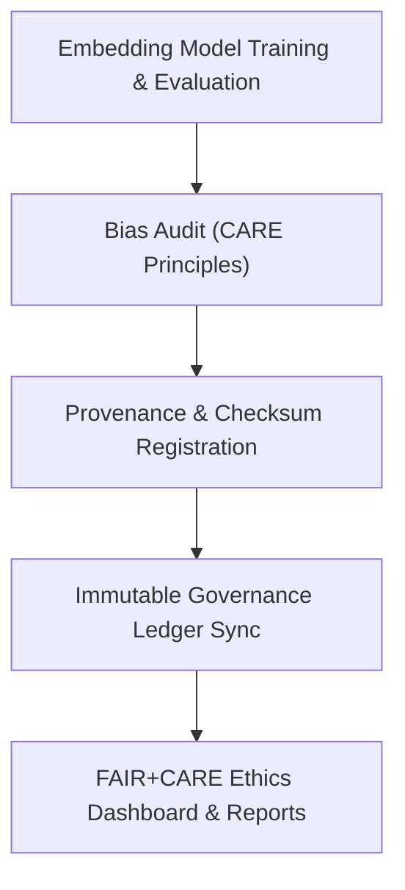

<div align="center">

# ⚖️ Kansas Frontier Matrix — **Embeddings Model Governance & Ethics Module**
`src/ai/models/embeddings/governance/README.md`

**Purpose:** Defines the ethical, governance, and provenance framework for all **Embedding Models** in the Kansas Frontier Matrix.  
This module ensures that semantic representations comply with FAIR+CARE principles, undergo bias and ethics validation, and remain fully traceable through the Immutable Governance Ledger.

[](../../../../../.github/workflows/governance-validate.yml)  
[](../../../../../docs/standards/faircare-validation.md)  
[](../../../../../docs/architecture/repo-focus.md)

</div>

---

## 📚 Overview

The **Governance & Ethics Module** ensures that the **Embeddings Models** maintain ethical and transparent AI behavior throughout their lifecycle.  
It includes bias audits, checksum validation, and provenance records for open governance, ensuring reproducibility and accountability under FAIR+CARE and ISO standards.

**Core Objectives:**
- ⚖️ Evaluate and document model fairness, inclusivity, and stewardship  
- 🧠 Verify licensing, data provenance, and ethical transparency  
- 🔍 Register all embedding model metadata in the Immutable Governance Ledger  
- 🧾 Maintain checksum integrity for every embedding model artifact  
- 🔗 Link evaluation metrics to ethical governance dashboards  

---

## 🗂️ Directory Layout

```plaintext
src/ai/models/embeddings/governance/
├── README.md                   # This file — documentation for governance and ethics integration
│
├── bias_audit.json             # CARE-aligned fairness, diversity, and bias evaluation
├── checksum_record.json        # File-level SHA-256 checksum registry
├── lineage_ref.json            # Provenance linkage to the Immutable Governance Ledger
├── license.txt                 # SPDX-aligned open license and usage declaration
└── ethics_review.json          # CARE Principles review for ethical model use and representation
```

**File Descriptions:**

- **`bias_audit.json`** — Quantifies representation bias and CARE compliance, ensuring ethical AI behavior across domains and datasets.  
- **`checksum_record.json`** — Contains SHA-256 validation signatures for all model files (`model.pkl`, `config.json`, `tokenizer.json`).  
- **`lineage_ref.json`** — Connects model training, validation, and evaluation provenance to the Immutable Governance Ledger.  
- **`license.txt`** — SPDX license record (MIT, CC-BY 4.0) confirming reuse and attribution compliance.  
- **`ethics_review.json`** — Assesses AI ethics in alignment with FAIR+CARE’s CARE principles and ISO 23894 risk management standards.

---

## ⚙️ Example Workflows

### ⚖️ Run Bias & Fairness Audit
```bash
python src/governance/validators/faircare_validate.py \
  --input src/ai/models/embeddings/governance/bias_audit.json \
  --output reports/fair/embeddings-bias-validation.json
```

### 🔗 Register Provenance Linkages
```bash
python src/governance/lineage/provenance_linker.py \
  --input src/ai/models/embeddings/governance/lineage_ref.json \
  --output reports/audit/embeddings-lineage.json
```

### 🧾 Update Immutable Governance Ledger
```bash
python src/governance/lineage/ledger_sync.py \
  --input reports/audit/embeddings-lineage.json \
  --output reports/audit/governance-ledger.json
```

### 📜 Ethics Review Export
```bash
python src/governance/audit/report_builder.py \
  --input src/ai/models/embeddings/governance/ethics_review.json \
  --output reports/audit/embeddings-ethics-summary.json
```

---

## 🧩 Governance Workflow Diagram



**Workflow Summary:**
1. Model undergoes evaluation and FAIR+CARE bias audit.  
2. Provenance and checksum records logged for integrity.  
3. Governance ledger updated with validated metadata.  
4. Ethics summary exported for transparent review.  

---

## 🧠 FAIR+CARE Integration

| Governance Artifact | Description | FAIR+CARE Dimension | Output |
|----------------------|--------------|----------------------|---------|
| `bias_audit.json` | Model fairness and inclusivity evaluation | Responsibility, Ethics | `reports/fair/embeddings-bias-validation.json` |
| `ethics_review.json` | CARE principles assessment (authority, benefit, responsibility) | Collective Benefit, Authority | `reports/audit/embeddings-ethics-summary.json` |
| `lineage_ref.json` | Provenance and model lineage tracking | Transparency, Reproducibility | `reports/audit/embeddings-lineage.json` |
| `checksum_record.json` | File integrity and artifact verification | Accountability, Integrity | `reports/audit/embeddings-checksum.json` |

Governance outputs synchronized with:
```
reports/audit/governance-ledger.json
releases/v9.4.0/focus-telemetry.json
```

---

## 🧩 Ethics & Bias Scoring Example

```json
{
  "model_id": "embeddings_model_v1",
  "version": "1.1.0",
  "bias_score": 0.018,
  "fairness_index": 0.981,
  "ethics_alignment": {
    "collective_benefit": 0.96,
    "authority_to_control": 0.94,
    "responsibility": 0.92,
    "ethics": 0.97
  },
  "checksum_sha256": "aa8c52ff31a9de2f15c963b81a6e19a476d70a5b46af4f7d20b45b95306bdfd9",
  "validated_by": "faircare-validate.yml",
  "timestamp": "2025-11-02T00:00:00Z",
  "status": "active"
}
```

---

## 🧩 Standards & Alignment

| Standard | Purpose | Implementation |
|-----------|----------|----------------|
| **MCP-DL v6.4.3** | Documentation-first ethics validation | This README + governance files |
| **FAIR+CARE** | Ethical governance and stewardship compliance | Bias and CARE audits |
| **ISO 23894** | Risk management in AI governance | Ethics and drift analysis |
| **IEEE 7007** | Transparency and explainability assurance | Provenance and ethics review |
| **DCAT / CIDOC CRM** | Interoperable provenance export | JSON-LD lineage schema integration |

---

## 🛡️ Security, Provenance & Reproducibility

- **Integrity:** SHA-256 signatures verify all governance artifacts.  
- **Transparency:** Provenance data publicly accessible under FAIR+CARE framework.  
- **Reproducibility:** Audit and ethics reviews version-controlled via MCP-DL.  
- **Observability:** Governance telemetry logs included in all releases.  

Telemetry Schema:  
`schemas/telemetry/ai-pipelines-v1.json`

Telemetry Outputs:
```
reports/audit/embeddings-governance-events.json
releases/v9.4.0/focus-telemetry.json
```

---

## 🧾 Version History

| Version | Date | Author | Summary |
|----------|------|---------|----------|
| v1.1.0 | 2025-11-02 | @kfm-governance | Added full ethics and bias governance structure for Embeddings models. |
| v1.0.2 | 2025-10-30 | @kfm-ethics | Enhanced FAIR+CARE evaluation and checksum tracking. |
| v1.0.1 | 2025-10-28 | @bartytime4life | Integrated DCAT lineage schema and telemetry linkage. |
| v1.0.0 | 2025-10-25 | @kfm-ai | Established baseline governance documentation under MCP-DL v6.4.3. |

---

<div align="center">

**Kansas Frontier Matrix — Ethical Governance for Vector Intelligence**  
*“Every vector governed. Every audit verified. Every model ethical.”* 🔗  
📍 `src/ai/models/embeddings/governance/README.md` — FAIR+CARE-certified documentation for governance and ethics tracking of KFM Embeddings Models.

</div>
