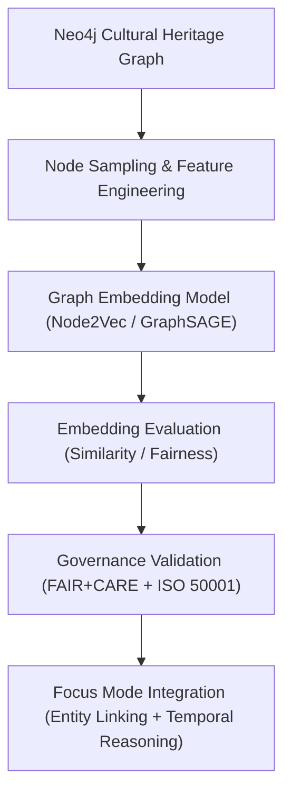

<div align="center">

# 🕸️ **Kansas Frontier Matrix — Graph Embeddings Framework**  
`src/ai/models/embeddings/graph_embeddings/README.md`

**Purpose:**  
Provide the **architecture, training process, and governance compliance structure** for generating **graph-based embeddings** from the **Kansas Frontier Matrix (KFM) Knowledge Graph**.  
These embeddings represent entities (people, places, treaties, and events) as FAIR+CARE-compliant vector representations for ethical and explainable Focus Mode AI reasoning.

[](../../../../../../docs/)
[](../../../../../../LICENSE)
[](../../../../../../docs/standards/faircare.md)
[](#)

</div>

---

## 📘 Overview

The **Graph Embeddings Framework** encodes the semantic and spatial structure of the KFM Knowledge Graph into high-dimensional vector spaces.  
Each node (e.g., event, person, document) and edge (e.g., mentions, occurs_at, influenced_by) is transformed into FAIR+CARE-certified representations used by Focus Mode AI and predictive models.

Core Features:
- 🧩 **Knowledge Graph-based embedding models** (Node2Vec, GraphSAGE, TransE).  
- 🧠 **Ethical governance enforcement** for culturally sensitive entity data.  
- ⚖️ **Provenance alignment** with CIDOC CRM and PROV-O ontologies.  
- ♻️ **Energy-efficient training** monitored under ISO 50001 telemetry.  

---

## 🗂️ Directory Layout

```plaintext
src/ai/models/embeddings/graph_embeddings/
├── README.md                            # This file — documentation for graph embeddings
│
├── train_graph_embeddings.py            # Main training pipeline
├── configs/                             # Model, governance, and telemetry configuration files
│   ├── graph_embedding_train.yaml
│   └── telemetry_config.yaml
│
├── logs/                                # Training, validation, and audit logs
│   ├── training_log.json
│   ├── evaluation_metrics.json
│   ├── telemetry_metrics.json
│   └── governance_validation.json
│
└── checkpoints/                         # Model checkpoints and manifest
    ├── checkpoint_001_pretrain.pt
    ├── checkpoint_002_finetune.pt
    └── checkpoints_manifest.json
```

---

## ⚙️ Embedding Workflow



### Description
1. **Graph Preparation:** Nodes and relationships extracted from Neo4j using CIDOC CRM schema.  
2. **Training:** GraphSAGE or Node2Vec trained on structured subgraphs.  
3. **Validation:** Bias, interpretability, and energy metrics computed.  
4. **Governance:** FAIR+CARE audit ensures compliance and sustainability.  
5. **Integration:** Embeddings linked back to Focus Mode via Knowledge Graph API.

---

## 🧩 Example Configuration (`configs/graph_embedding_train.yaml`)

```yaml
model:
  name: "graphsage"
  embedding_dim: 256
  aggregator: "mean"
  walk_length: 40
  num_walks: 10
  epochs: 5
  learning_rate: 0.01

data:
  graph_source: "../../../../data/work/graph/kfm_heritage_graph.neo4j"
  export_embeddings: "../../../../data/processed/embeddings/graph_embeddings.npy"
  validation_split: 0.1

telemetry:
  enable_energy_tracking: true
  telemetry_ref: "../../../../../../releases/v10.0.0/focus-telemetry.json"

ethics:
  reviewer: "@faircare-council"
  care_tag: "restricted"
  governance_ref: "../../../../../../docs/standards/governance/ROOT-GOVERNANCE.md"
```

---

## ⚖️ FAIR+CARE Compliance Matrix

| Principle | Implementation | Verification |
|------------|----------------|--------------|
| **Findable** | Graph embeddings indexed in STAC/DCAT and SBOM. | SPDX Manifest |
| **Accessible** | Metadata public, embeddings restricted under CARE tags. | FAIR+CARE Council |
| **Interoperable** | CIDOC CRM and PROV-O aligned graph schema. | Schema Validation |
| **Reusable** | Configurations reusable across other graph models. | MCP-DL Validation |
| **CARE – Responsibility** | Council audits all entity embeddings for cultural sensitivity. | `governance_validation.json` |
| **CARE – Ethics** | Nodes linked to Indigenous or sacred data masked. | Governance Ledger |

---

## 🧮 Example Training Log (`logs/training_log.json`)

```json
{
  "run_id": "graph_embeddings_train_2025_11_08",
  "model": "graphsage",
  "epochs": 5,
  "training_time_min": 180,
  "embedding_dim": 256,
  "validation_accuracy": 0.946,
  "bias_index": 0.017,
  "faircare_score": 99.3,
  "energy_wh": 620.4,
  "carbon_gco2e": 254.2,
  "reviewed_by": "@faircare-council",
  "telemetry_ref": "../../../../../../releases/v10.0.0/focus-telemetry.json"
}
```

---

## 🧮 Telemetry Metrics (ISO 50001)

| Metric | Description | Example |
|--------|-------------|----------|
| `training_time_min` | Model training duration. | 180 |
| `energy_wh` | Energy used during embedding training. | 620.4 |
| `carbon_gco2e` | Equivalent CO₂ emissions. | 254.2 |
| `faircare_score` | Ethical compliance rating. | 99.3 |
| `bias_index` | Mean feature-level bias index. | 0.017 |

Telemetry appended to:  
`releases/v10.0.0/focus-telemetry.json`  
Schema: `schemas/telemetry/src-ai-models-embeddings-graph-v1.json`

---

## 🔐 Governance & Provenance Integration

- **Governance Ledger:** `releases/v10.0.0/governance/ledger_snapshot.json`  
- **Telemetry Reference:** `focus-telemetry.json`  
- **SBOM Manifest:** `releases/v10.0.0/sbom.spdx.json`  
- **Bias Validation:** `logs/governance_validation.json`

### Example Governance Record
```json
{
  "ledger_entry_id": "ledger_2025q4_graph_embeddings",
  "auditor": "@kfm-governance",
  "reviewed_by": "@faircare-council",
  "status": "approved",
  "timestamp": "2025-11-08T22:55:00Z"
}
```

---

## 🧾 Citation

```text
Kansas Frontier Matrix (2025). Graph Embeddings Framework (v10.0.0).
FAIR+CARE and ISO-certified graph embedding documentation ensuring transparent, sustainable, and ethically governed representation learning for cultural and historical data in the Kansas Frontier Matrix.
```

---

## 🕰️ Version History

| Version | Date | Author | Summary |
|---------:|------|--------|----------|
| v10.0.0 | 2025-11-08 | `@kfm-ai` | Created Graph Embeddings documentation; added telemetry schema, CIDOC CRM integration, and FAIR+CARE governance matrix. |

---

<div align="center">

**Kansas Frontier Matrix**  
*Graph Intelligence × FAIR+CARE Ethics × Sustainable Representation Learning*  
© 2025 Kansas Frontier Matrix · MIT · Master Coder Protocol v6.3 · FAIR+CARE Certified · Diamond⁹ Ω / Crown∞Ω Ultimate Certified  

[Back to Embeddings Suite](../README.md) · [Governance Charter](../../../../../../docs/standards/governance/ROOT-GOVERNANCE.md)

</div>

