<div align="center">

# 💾 **Kansas Frontier Matrix — Graph Embeddings · Model Checkpoints**  
`src/ai/models/embeddings/graph_embeddings/checkpoints/README.md`

**Purpose:**  
Define the **checkpointing, integrity validation, and governance audit** standards for the **Graph Embeddings Framework** in the **Kansas Frontier Matrix (KFM)**.  
These checkpoints ensure reproducible, FAIR+CARE-compliant, and ISO 50001-sustainable model persistence under **MCP-DL v6.3** ethical AI governance protocols.

[](../../../../../../../docs/)
[](../../../../../../../LICENSE)
[](../../../../../../../docs/standards/faircare.md)
[](#)

</div>

---

## 📘 Overview

The **Graph Embeddings Checkpoint Directory** maintains serialized model states, validation metrics, and sustainability telemetry records.  
Every checkpoint is reviewed by the **FAIR+CARE Council**, logged in the **Governance Ledger**, and verified through **SHA-256 integrity checks**.

Key Objectives:
- 🧩 Guarantee reproducibility for graph embedding experiments.  
- ⚖️ Maintain FAIR+CARE and ISO-aligned ethics certification.  
- ♻️ Track carbon and energy use for sustainability compliance.  
- 🔐 Secure and checksum-verified checkpoint archiving.

---

## 🗂️ Directory Layout

```plaintext
src/ai/models/embeddings/graph_embeddings/checkpoints/
├── README.md                              # This file — documentation for checkpoints
│
├── checkpoint_001_pretrain.pt             # Initial training checkpoint
├── checkpoint_002_finetune.pt             # Fine-tuned checkpoint
├── checkpoint_003_final.pt                # Certified release checkpoint
├── checkpoints_manifest.json              # Master list of checkpoint metadata
├── checkpoint_metrics.json                # Training and governance metrics
└── checksum_registry.json                 # SHA-256 integrity verification records
```

---

## ⚙️ Checkpoint Workflow

```mermaid
flowchart TD
  A["Graph Embedding Training (Node2Vec / GraphSAGE)"] --> B["Checkpoint Save (Per Epoch)"]
  B --> C["Telemetry Capture (Energy · FairCARE · Carbon)"]
  C --> D["Checksum Registry (SHA-256)"]
  D --> E["Governance Validation (Council Review)"]
  E --> F["Certified Checkpoint Published"]
```



### Workflow Description
1. **Model Snapshot:** Embedding weights saved after each epoch.  
2. **Telemetry Logging:** Logs FAIR+CARE metrics and sustainability data.  
3. **Checksum Validation:** Verifies checkpoint authenticity and reproducibility.  
4. **Governance Review:** Council validation for ethics and audit compliance.  
5. **Publication:** Certified checkpoint released for Focus Mode integration.

---

## 🧩 Example: Checkpoints Manifest (`checkpoints_manifest.json`)

```json
{
  "model_id": "graph_embeddings_kfm_v10.0.0",
  "checkpoints": [
    {
      "id": "checkpoint_001_pretrain",
      "epoch": 3,
      "validation_accuracy": 0.931,
      "faircare_score": 99.1,
      "checksum_sha256": "sha256:9eaf24d77b3b6a6a8cd3b94a9e7f6c2e1a9d3e5f7b6d2a1f4e3c1a7b8d6f9e0c",
      "energy_wh": 540.1
    },
    {
      "id": "checkpoint_003_final",
      "epoch": 5,
      "validation_accuracy": 0.946,
      "faircare_score": 99.3,
      "checksum_sha256": "sha256:8b5a7c9d3e4f6a1d2c8b9f7e5d3c2a1e4b8f9d5e7c6a1b2f8a3c4b5d7f8e9a0b",
      "energy_wh": 620.4
    }
  ],
  "reviewed_by": "@faircare-council",
  "approved": true,
  "telemetry_ref": "../../../../../../../releases/v10.0.0/focus-telemetry.json"
}
```

---

## ⚖️ FAIR+CARE Compliance Matrix

| Principle | Implementation | Verification |
|------------|----------------|---------------|
| **Findable** | Checkpoints indexed in SBOM + telemetry ledger. | SPDX Manifest |
| **Accessible** | Metadata public; embeddings secured under CARE tag. | Governance Ledger |
| **Interoperable** | JSON schema conforms to ISO 19115 + PROV-O. | Schema Validator |
| **Reusable** | Checkpoints archived with training configs and telemetry. | MCP-DL Validation |
| **CARE – Responsibility** | Logs ethics, bias, and sustainability data per checkpoint. | `faircare-validate.yml` |
| **CARE – Ethics** | Certified under FAIR+CARE before integration into Focus Mode. | `governance_validation.json` |

---

## 🧮 Telemetry Metrics

| Metric | Description | Example |
|--------|-------------|----------|
| `training_epoch` | Epoch number of checkpoint. | 5 |
| `validation_accuracy` | Accuracy on validation dataset. | 0.946 |
| `faircare_score` | FAIR+CARE compliance rating. | 99.3 |
| `energy_wh` | Energy used for checkpoint training. | 620.4 |
| `carbon_gco2e` | CO₂ equivalent emissions. | 254.2 |
| `checksum_verified` | Checksum validation status. | true |

Telemetry recorded in:  
`releases/v10.0.0/focus-telemetry.json`  
Schema: `schemas/telemetry/src-ai-models-embeddings-graph-checkpoints-v1.json`

---

## 🔐 Governance & Provenance Integration

- **Governance Ledger:** `releases/v10.0.0/governance/ledger_snapshot.json`  
- **Telemetry Reference:** `focus-telemetry.json`  
- **SBOM Manifest:** `releases/v10.0.0/sbom.spdx.json`  
- **Checksum Registry:** `checksum_registry.json`

### Example Governance Record
```json
{
  "ledger_entry_id": "ledger_2025q4_graph_embeddings_checkpoints",
  "auditor": "@kfm-governance",
  "reviewed_by": "@faircare-council",
  "status": "approved",
  "timestamp": "2025-11-08T23:10:00Z"
}
```

---

## 🧾 Citation

```text
Kansas Frontier Matrix (2025). Graph Embeddings · Model Checkpoints (v10.0.0).
FAIR+CARE and ISO-certified documentation ensuring reproducibility, auditability, and sustainable checkpoint management for graph-based embedding models in the Kansas Frontier Matrix.
```

---

## 🕰️ Version History

| Version | Date | Author | Summary |
|---------:|------|--------|----------|
| v10.0.0 | 2025-11-08 | `@kfm-ai` | Created Graph Embeddings checkpoint documentation; added FAIR+CARE validation, telemetry schema, and checksum registry integration. |

---

<div align="center">

**Kansas Frontier Matrix**  
*Reproducible Graph AI × FAIR+CARE Ethics × Sustainable Data Governance*  
© 2025 Kansas Frontier Matrix · MIT · Master Coder Protocol v6.3 · FAIR+CARE Certified · Diamond⁹ Ω / Crown∞Ω Ultimate Certified  

[Back to Graph Embeddings](../README.md) · [Governance Charter](../../../../../../../docs/standards/governance/ROOT-GOVERNANCE.md)

</div>

