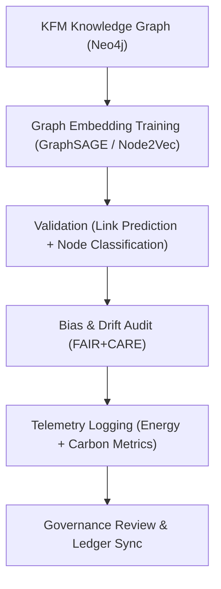

<div align="center">

# 🧾 **Kansas Frontier Matrix — Graph Embeddings · Training Logs**  
`src/ai/models/embeddings/graph_embeddings/logs/README.md`

**Purpose:**  
Provide documentation for all **training, validation, and governance logs** generated during the **Graph Embeddings** model lifecycle within the **Kansas Frontier Matrix (KFM)**.  
These logs ensure traceability, transparency, and ethical accountability through **FAIR+CARE**, **ISO 50001**, and **MCP-DL v6.3** standards.

[](../../../../../../../docs/)
[](../../../../../../../LICENSE)
[](../../../../../../../docs/standards/faircare.md)
[](#)

</div>

---

## 📘 Overview

The **Graph Embeddings Logs Directory** archives performance metrics, telemetry data, and FAIR+CARE audit reports for all training runs.  
Each record contributes to KFM’s governance and sustainability reporting, forming a complete audit trail for explainable and ethical AI embedding production.

Core Features:
- 🔎 Track **bias, drift, and performance metrics** for each embedding model.  
- ⚙️ Log **ISO 50001-compliant energy usage** and carbon footprint.  
- ⚖️ Ensure **FAIR+CARE certification** of all graph training processes.  
- ♻️ Support reproducibility and SBOM integrity validation.  

---

## 🗂️ Directory Layout

```plaintext
src/ai/models/embeddings/graph_embeddings/logs/
├── README.md                              # This file — documentation for logs
│
├── training_log.json                      # Model training performance metrics
├── evaluation_metrics.json                # Validation and accuracy metrics
├── bias_drift_report.json                 # Fairness and cultural bias audit
├── telemetry_metrics.json                 # Sustainability telemetry report
└── governance_validation.json             # FAIR+CARE Council audit certification record
```

---

## ⚙️ Logging Workflow



### Workflow Stages
1. **Model Training:** Embedding generation from cultural graph entities.  
2. **Evaluation:** Measures structural similarity, AUC, and F1-score.  
3. **Bias Audit:** Quantifies fairness drift across node categories (e.g., culture, gender).  
4. **Telemetry:** Logs power, runtime, and carbon data for ISO 50001 audit.  
5. **Governance:** FAIR+CARE Council certifies results and updates the ledger.

---

## 🧩 Example: Training Log (`training_log.json`)

```json
{
  "run_id": "graph_embeddings_train_2025_11_08",
  "model": "graphsage",
  "epochs": 5,
  "training_time_min": 180,
  "embedding_dim": 256,
  "validation_accuracy": 0.946,
  "bias_index": 0.017,
  "faircare_score": 99.3,
  "energy_wh": 620.4,
  "carbon_gco2e": 254.2,
  "reviewed_by": "@faircare-council",
  "telemetry_ref": "../../../../../../../releases/v10.0.0/focus-telemetry.json"
}
```

---

## ⚖️ FAIR+CARE Governance Matrix

| Principle | Implementation | Oversight |
|------------|----------------|------------|
| **Findable** | Log entries UUID-indexed and SBOM-linked. | SPDX Manifest |
| **Accessible** | Public summaries; restricted data under CARE governance. | FAIR+CARE Council |
| **Interoperable** | JSON schema conforms to ISO 19115 + PROV-O. | Schema Validator |
| **Reusable** | FAIR+CARE metadata reproducible across embedding runs. | MCP-DL Validation |
| **CARE – Responsibility** | Council audits ensure bias and energy transparency. | `faircare-validate.yml` |
| **CARE – Ethics** | CARE mask applied to restricted nodes pre-training. | Governance Ledger |

---

## 🧮 Example: Bias & Drift Report (`bias_drift_report.json`)

```json
{
  "report_id": "bias_audit_graph_embeddings_2025_11_08",
  "node_categories": {
    "people": 0.33,
    "places": 0.41,
    "events": 0.26
  },
  "bias_index": 0.017,
  "drift_detected": false,
  "reviewed_by": "@faircare-council",
  "status": "certified",
  "timestamp": "2025-11-08T23:00:00Z"
}
```

---

## 🧮 Telemetry Metrics (ISO 50001)

| Metric | Description | Example |
|--------|-------------|----------|
| `training_time_min` | Duration of graph embedding training. | 180 |
| `energy_wh` | Power consumption (Wh). | 620.4 |
| `carbon_gco2e` | Carbon equivalent emissions (gCO₂e). | 254.2 |
| `faircare_score` | FAIR+CARE compliance percentage. | 99.3 |
| `bias_index` | Average fairness deviation index. | 0.017 |

Telemetry data recorded in:  
`releases/v10.0.0/focus-telemetry.json`  
Schema: `schemas/telemetry/src-ai-models-embeddings-graph-logs-v1.json`

---

## 🔐 Governance & Provenance Integration

- **Governance Ledger:** `releases/v10.0.0/governance/ledger_snapshot.json`  
- **Telemetry Ledger:** `releases/v10.0.0/focus-telemetry.json`  
- **SBOM Manifest:** `releases/v10.0.0/sbom.spdx.json`  
- **Ethics Audit:** `governance_validation.json`

### Example Governance Record
```json
{
  "ledger_entry_id": "ledger_2025q4_graph_embeddings_logs",
  "auditor": "@kfm-governance",
  "reviewed_by": "@faircare-council",
  "status": "approved",
  "timestamp": "2025-11-08T23:05:00Z"
}
```

---

## 🧾 Citation

```text
Kansas Frontier Matrix (2025). Graph Embeddings · Training Logs (v10.0.0).
FAIR+CARE-aligned documentation ensuring ethical transparency, bias control, and sustainability telemetry for graph embedding models within the Kansas Frontier Matrix.
```

---

## 🕰️ Version History

| Version | Date | Author | Summary |
|---------:|------|--------|----------|
| v10.0.0 | 2025-11-08 | `@kfm-ai` | Created Graph Embeddings logs documentation; integrated FAIR+CARE telemetry schema and ISO sustainability tracking. |

---

<div align="center">

**Kansas Frontier Matrix**  
*Graph Representation × FAIR+CARE Ethics × Sustainable AI Systems*  
© 2025 Kansas Frontier Matrix · Internal FAIR+CARE Certified · Master Coder Protocol v6.3 · Diamond⁹ Ω / Crown∞Ω Ultimate Certified  

[Back to Graph Embeddings](../README.md) · [Governance Charter](../../../../../../../docs/standards/governance/ROOT-GOVERNANCE.md)

</div>

