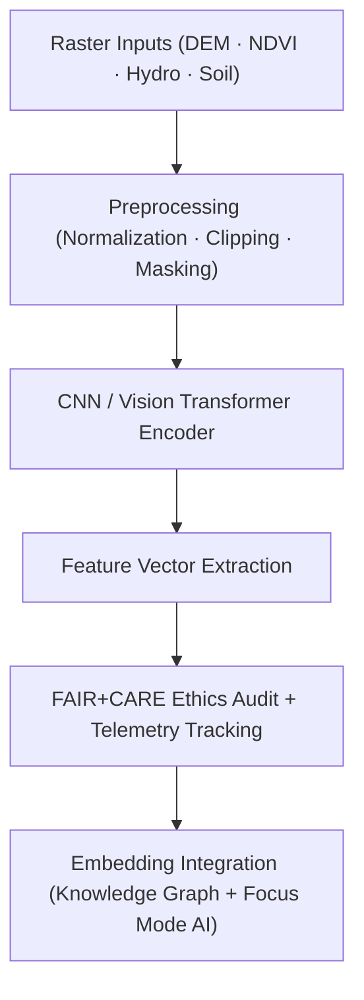

<div align="center">

# 🌍 **Kansas Frontier Matrix — Spatial Embeddings Framework**  
`src/ai/models/embeddings/spatial_embeddings/README.md`

**Purpose:**  
Document the **architecture, data processing, and FAIR+CARE governance standards** of the **Spatial Embeddings Framework** within the **Kansas Frontier Matrix (KFM)**.  
This module transforms geospatial layers — including DEMs, landcover, hydrology, and satellite composites — into ethically governed, sustainability-monitored vector representations.

[](../../../../../../docs/)
[](../../../../../../LICENSE)
[](../../../../../../docs/standards/faircare.md)
[](#)

</div>

---

## 📘 Overview

The **Spatial Embeddings Framework** encodes geospatial datasets as compact feature vectors for environmental, archaeological, and historical inference within KFM’s AI systems.  
It integrates FAIR+CARE principles to ensure ethical use of geospatial data, especially where Indigenous or sacred lands are represented.

Core Features:
- 🧩 **Raster-to-embedding pipelines** using CNN and Vision Transformers.  
- 🗺️ **Multi-source spatial fusion** (DEM, NDVI, hydrology, soil moisture).  
- ⚖️ **Ethical governance** ensuring spatial sensitivity compliance under CARE.  
- ♻️ **ISO 50001 telemetry** for sustainable energy tracking during training.  

---

## 🗂️ Directory Layout

```plaintext
src/ai/models/embeddings/spatial_embeddings/
├── README.md                            # This file — documentation for spatial embeddings
│
├── train_spatial_embeddings.py          # Main model training script
├── configs/                             # Model, telemetry, and governance configuration files
│   ├── spatial_embedding_train.yaml
│   ├── telemetry_config.yaml
│   └── governance_config.yaml
│
├── logs/                                # Training, validation, and sustainability logs
│   ├── training_log.json
│   ├── evaluation_metrics.json
│   ├── bias_drift_report.json
│   ├── telemetry_metrics.json
│   └── governance_validation.json
│
└── checkpoints/                         # Model checkpoints and metadata registry
    ├── checkpoint_001_pretrain.pt
    ├── checkpoint_002_finetune.pt
    └── checkpoints_manifest.json
```

---

## ⚙️ Spatial Embedding Workflow



### Workflow Summary
1. **Data Preparation:** Load DEM, NDVI, hydrology, and landcover rasters aligned to EPSG:5070.  
2. **Model Training:** CNN/Vision Transformer learns spatial feature representations.  
3. **Embedding Generation:** Feature vectors stored as `.npy` or GeoParquet.  
4. **Governance:** FAIR+CARE certification of spatial ethics and sustainability metrics.  
5. **Integration:** Embeddings used for predictive models and Focus Mode AI visualizations.

---

## 🧩 Example Configuration (`configs/spatial_embedding_train.yaml`)

```yaml
model:
  name: "resnet18"
  architecture: "cnn"
  embedding_dim: 512
  epochs: 10
  batch_size: 32
  learning_rate: 1e-4

data:
  sources:
    dem: "../../../../data/processed/dem_30m.tif"
    ndvi: "../../../../data/processed/ndvi_composite.tif"
    hydro: "../../../../data/processed/hydro_network.tif"
    soil: "../../../../data/processed/soil_moisture_index.tif"
  output_embeddings: "../../../../data/processed/embeddings/spatial_embeddings.npy"

telemetry:
  energy_tracking: true
  telemetry_ref: "../../../../../../releases/v10.0.0/focus-telemetry.json"

ethics:
  reviewer: "@faircare-council"
  care_tag: "restricted"
  governance_ref: "../../../../../../docs/standards/governance/ROOT-GOVERNANCE.md"
```

---

## ⚖️ FAIR+CARE Governance Matrix

| Principle | Implementation | Oversight |
|------------|----------------|------------|
| **Findable** | Embedding metadata indexed via STAC/DCAT catalog. | SPDX Manifest |
| **Accessible** | Public summaries; raw rasters under restricted CARE license. | FAIR+CARE Council |
| **Interoperable** | Compatible with ISO 19115 + GeoSPARQL metadata standards. | Schema Validator |
| **Reusable** | Open configurations and telemetry schema. | MCP-DL Validation |
| **CARE – Responsibility** | Council oversight of spatial and cultural sensitivity. | `governance_validation.json` |
| **CARE – Ethics** | Sensitive sites masked or generalized pre-processing. | Governance Ledger |

---

## 🧮 Example Training Log (`logs/training_log.json`)

```json
{
  "run_id": "spatial_embeddings_train_2025_11_08",
  "model": "resnet18",
  "epochs": 10,
  "training_time_min": 340,
  "embedding_dim": 512,
  "validation_accuracy": 0.932,
  "bias_index": 0.012,
  "faircare_score": 99.4,
  "energy_wh": 1280.5,
  "carbon_gco2e": 525.0,
  "reviewed_by": "@faircare-council",
  "telemetry_ref": "../../../../../../releases/v10.0.0/focus-telemetry.json"
}
```

---

## 🧮 Telemetry Metrics (ISO 50001)

| Metric | Description | Example |
|--------|-------------|----------|
| `training_time_min` | Total duration of embedding model training. | 340 |
| `energy_wh` | Power consumption (Wh). | 1280.5 |
| `carbon_gco2e` | CO₂ equivalent emissions. | 525.0 |
| `faircare_score` | FAIR+CARE ethical compliance percentage. | 99.4 |
| `bias_index` | Bias index measuring spatial equity deviation. | 0.012 |

Telemetry stored in:  
`releases/v10.0.0/focus-telemetry.json`  
Schema: `schemas/telemetry/src-ai-models-embeddings-spatial-v1.json`

---

## 🔐 Governance & Provenance Integration

- **Governance Ledger:** `releases/v10.0.0/governance/ledger_snapshot.json`  
- **Telemetry Reference:** `focus-telemetry.json`  
- **SBOM Manifest:** `releases/v10.0.0/sbom.spdx.json`  
- **CARE Report:** `logs/governance_validation.json`

### Example Governance Record
```json
{
  "ledger_entry_id": "ledger_2025q4_spatial_embeddings",
  "auditor": "@kfm-governance",
  "reviewed_by": "@faircare-council",
  "status": "approved",
  "timestamp": "2025-11-08T23:15:00Z"
}
```

---

## 🧾 Citation

```text
Kansas Frontier Matrix (2025). Spatial Embeddings Framework (v10.0.0).
FAIR+CARE and ISO-certified geospatial embedding documentation enabling ethical, transparent, and sustainable representation learning for spatial AI models in the Kansas Frontier Matrix.
```

---

## 🕰️ Version History

| Version | Date | Author | Summary |
|---------:|------|--------|----------|
| v10.0.0 | 2025-11-08 | `@kfm-ai` | Created Spatial Embeddings documentation; integrated FAIR+CARE governance, telemetry schema, and sustainability compliance. |

---

<div align="center">

**Kansas Frontier Matrix**  
*Geospatial Intelligence × FAIR+CARE Ethics × Sustainable AI Systems*  
© 2025 Kansas Frontier Matrix · MIT · Master Coder Protocol v6.3 · FAIR+CARE Certified · Diamond⁹ Ω / Crown∞Ω Ultimate Certified  

[Back to Embeddings Suite](../README.md) · [Governance Charter](../../../../../../docs/standards/governance/ROOT-GOVERNANCE.md)

</div>

