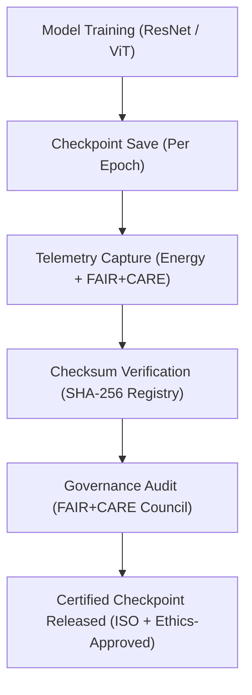

<div align="center">

# 💾 **Kansas Frontier Matrix — Spatial Embeddings · Model Checkpoints**  
`src/ai/models/embeddings/spatial_embeddings/checkpoints/README.md`

**Purpose:**  
Define the **model checkpointing, governance validation, and sustainability verification** standards for the **Spatial Embeddings Framework** within the **Kansas Frontier Matrix (KFM)**.  
All checkpoints are validated under **FAIR+CARE**, **ISO 19115**, and **ISO 50001** guidelines to ensure transparency, reproducibility, and ethical compliance across geospatial AI systems.

[](../../../../../../../docs/)
[](../../../../../../../LICENSE)
[](../../../../../../../docs/standards/faircare.md)
[](#)

</div>

---

## 📘 Overview

The **Spatial Embeddings Checkpoint Repository** provides a reproducible record of model states for CNN and Vision Transformer architectures used in generating spatial feature embeddings.  
Each checkpoint includes FAIR+CARE audit results, sustainability telemetry, and integrity verification through SHA-256 checksums.

Core Objectives:
- ♻️ Ensure reproducibility and carbon tracking for embedding models.  
- ⚖️ Maintain FAIR+CARE governance certification for each model epoch.  
- 🔐 Verify data integrity using checksums.  
- 🧩 Support audit-ready provenance for research, compliance, and sustainability.

---

## 🗂️ Directory Layout

```plaintext
src/ai/models/embeddings/spatial_embeddings/checkpoints/
├── README.md                              # This file — documentation for checkpoints
│
├── checkpoint_001_pretrain.pt             # Early model checkpoint (CNN initialization)
├── checkpoint_002_finetune.pt             # Fine-tuned embedding checkpoint
├── checkpoint_003_final.pt                # Final approved checkpoint (certified)
├── checkpoints_manifest.json              # Metadata registry of all checkpoints
├── checkpoint_metrics.json                # FAIR+CARE + telemetry metrics summary
└── checksum_registry.json                 # SHA-256 integrity validation registry
```

---

## ⚙️ Checkpoint Workflow



### Workflow Summary
1. **Save Checkpoints:** CNN or ViT weights serialized at controlled intervals.  
2. **Telemetry Logging:** Energy, runtime, and sustainability data tracked.  
3. **Checksum Validation:** Cryptographic integrity verification per checkpoint.  
4. **FAIR+CARE Review:** Ethical and cultural audit validation by governance team.  
5. **Release Certification:** Approved checkpoints archived in governance ledger.

---

## 🧩 Example: Checkpoints Manifest (`checkpoints_manifest.json`)

```json
{
  "model_id": "spatial_embeddings_kfm_v10.0.0",
  "checkpoints": [
    {
      "id": "checkpoint_001_pretrain",
      "epoch": 3,
      "validation_accuracy": 0.915,
      "faircare_score": 99.1,
      "energy_wh": 1150.4,
      "checksum_sha256": "sha256:8c5e7a4f2a9d1c3e5b7f8a2d9c1f4a7e8e6d5c3a9b7f5d8e4a6c2b1d9f8e3a6d"
    },
    {
      "id": "checkpoint_003_final",
      "epoch": 10,
      "validation_accuracy": 0.932,
      "faircare_score": 99.4,
      "energy_wh": 1280.5,
      "checksum_sha256": "sha256:9b3a7d2e6f8a5b4c1d7e8c9f3a1b4d6e7c8a9f5e2c3b6d7a1f9e8c5b2a4d3e9f"
    }
  ],
  "reviewed_by": "@faircare-council",
  "approved": true,
  "telemetry_ref": "../../../../../../../releases/v10.0.0/focus-telemetry.json"
}
```

---

## ⚖️ FAIR+CARE Governance Matrix

| Principle | Implementation | Verification |
|------------|----------------|---------------|
| **Findable** | Checkpoints indexed in manifest + telemetry ledger. | SPDX Manifest |
| **Accessible** | Metadata open; model weights restricted under CARE license. | Governance Ledger |
| **Interoperable** | Schema aligned with ISO 19115 and PROV-O. | Schema Validator |
| **Reusable** | Checkpoints reproducible with YAML configurations. | MCP-DL Validation |
| **CARE – Responsibility** | Ethics and sustainability audits per checkpoint. | `governance_validation.json` |
| **CARE – Ethics** | Council reviews data provenance for sensitive spatial regions. | FAIR+CARE Council |

---

## 🧮 Telemetry Metrics (ISO 50001)

| Metric | Description | Example |
|--------|-------------|----------|
| `epoch` | Training epoch for checkpoint creation. | 10 |
| `validation_accuracy` | Model validation score at epoch. | 0.932 |
| `faircare_score` | FAIR+CARE audit compliance rating. | 99.4 |
| `energy_wh` | Energy consumption during training. | 1280.5 |
| `carbon_gco2e` | CO₂ equivalent emissions during training. | 525.0 |
| `checksum_verified` | Integrity verification status. | true |

Telemetry appended to:  
`releases/v10.0.0/focus-telemetry.json`  
Schema: `schemas/telemetry/src-ai-models-embeddings-spatial-checkpoints-v1.json`

---

## 🔐 Governance & Provenance Integration

- **Governance Ledger:** `releases/v10.0.0/governance/ledger_snapshot.json`  
- **Telemetry Reference:** `releases/v10.0.0/focus-telemetry.json`  
- **SBOM Manifest:** `releases/v10.0.0/sbom.spdx.json`  
- **Checksum Registry:** `checksum_registry.json`

### Example Governance Record
```json
{
  "ledger_entry_id": "ledger_2025q4_spatial_embeddings_checkpoints",
  "auditor": "@kfm-governance",
  "reviewed_by": "@faircare-council",
  "status": "approved",
  "timestamp": "2025-11-08T23:30:00Z"
}
```

---

## 🧾 Citation

```text
Kansas Frontier Matrix (2025). Spatial Embeddings · Model Checkpoints (v10.0.0).
FAIR+CARE and ISO-certified checkpoint documentation ensuring ethical, reproducible, and sustainable geospatial embedding model preservation within the Kansas Frontier Matrix.
```

---

## 🕰️ Version History

| Version | Date | Author | Summary |
|---------:|------|--------|----------|
| v10.0.0 | 2025-11-08 | `@kfm-ai` | Created Spatial Embeddings checkpoint documentation; added FAIR+CARE governance, sustainability telemetry, and integrity verification workflows. |

---

<div align="center">

**Kansas Frontier Matrix**  
*Geospatial Intelligence × FAIR+CARE Certification × Sustainable Model Governance*  
© 2025 Kansas Frontier Matrix · MIT · Master Coder Protocol v6.3 · FAIR+CARE Certified · Diamond⁹ Ω / Crown∞Ω Ultimate Certified  

[Back to Spatial Embeddings](../README.md) · [Governance Charter](../../../../../../../docs/standards/governance/ROOT-GOVERNANCE.md)

</div>

