<div align="center">

# 🧾 **Kansas Frontier Matrix — Spatial Embeddings · Training Logs**  
`src/ai/models/embeddings/spatial_embeddings/logs/README.md`

**Purpose:**  
Document all **training, validation, and sustainability logs** for the **Spatial Embeddings Framework** of the **Kansas Frontier Matrix (KFM)**.  
These logs record model performance, energy telemetry, and FAIR+CARE governance metrics to ensure transparent, ethical, and reproducible geospatial embedding generation.

[](../../../../../../../docs/)
[](../../../../../../../LICENSE)
[](../../../../../../../docs/standards/faircare.md)
[](#)

</div>

---

## 📘 Overview

The **Spatial Embeddings Logs Directory** provides traceable records for all training, validation, and audit runs of spatial feature extraction models.  
Each log supports:
- 🌱 **Sustainability compliance** through ISO 50001 telemetry metrics.  
- ⚖️ **FAIR+CARE certification** for ethical use of geospatial data.  
- 🧮 **Bias and fairness evaluation** to prevent representational imbalance.  
- 🔍 **Governance audit integration** with FAIR+CARE Council certification.

---

## 🗂️ Directory Layout

```plaintext
src/ai/models/embeddings/spatial_embeddings/logs/
├── README.md                            # This file — documentation for logs
│
├── training_log.json                    # Model training and runtime metrics
├── evaluation_metrics.json              # Validation performance report
├── bias_drift_report.json               # Spatial fairness and cultural sensitivity audit
├── telemetry_metrics.json               # ISO 50001 sustainability metrics
└── governance_validation.json           # FAIR+CARE ethics audit certification
```

---

## ⚙️ Logging Workflow

```mermaid
flowchart TD
  A["Raster Datasets (DEM · NDVI · Hydro · Soil)"] --> B["Model Training (CNN / ViT)"]
  B --> C["Validation (Accuracy · Spatial Fairness)"]
  C --> D["Telemetry Logging (Energy · Carbon · Time)"]
  D --> E["FAIR+CARE Governance Audit"]
  E --> F["Certification and Ledger Registration"]
```



### Workflow Summary
1. **Training Log:** Captures epochs, loss, runtime, and model performance.  
2. **Validation Metrics:** Accuracy, F1-score, and spatial correlation.  
3. **Bias Drift Report:** Evaluates fairness across cultural and environmental features.  
4. **Telemetry Metrics:** Logs energy usage and carbon emissions.  
5. **Governance Validation:** Council certification for ethics and sustainability compliance.

---

## 🧩 Example: Training Log (`training_log.json`)

```json
{
  "run_id": "spatial_embeddings_train_2025_11_08",
  "model": "resnet18",
  "epochs": 10,
  "training_time_min": 340,
  "validation_accuracy": 0.932,
  "bias_index": 0.012,
  "faircare_score": 99.4,
  "energy_wh": 1280.5,
  "carbon_gco2e": 525.0,
  "reviewed_by": "@faircare-council",
  "telemetry_ref": "../../../../../../../releases/v10.0.0/focus-telemetry.json"
}
```

---

## ⚖️ FAIR+CARE Governance Matrix

| Principle | Implementation | Oversight |
|------------|----------------|------------|
| **Findable** | Logs UUID-registered and linked in SBOM manifest. | SPDX Manifest |
| **Accessible** | Metadata public, raster datasets under CARE restriction. | FAIR+CARE Council |
| **Interoperable** | JSON schema aligned with ISO 19115 + GeoSPARQL. | Schema Validator |
| **Reusable** | FAIR+CARE-approved structure supports multiple training runs. | MCP-DL Validation |
| **CARE – Responsibility** | FAIR+CARE Council audits each model’s spatial ethics. | `governance_validation.json` |
| **CARE – Ethics** | Sensitive geographic features redacted from logs. | Governance Ledger |

---

## 🧮 Example: Bias & Drift Report (`bias_drift_report.json`)

```json
{
  "report_id": "bias_audit_spatial_embeddings_2025_11_08",
  "region_distribution": {
    "floodplains": 0.34,
    "uplands": 0.41,
    "wetlands": 0.25
  },
  "bias_index": 0.012,
  "drift_detected": false,
  "status": "certified",
  "reviewed_by": "@faircare-council",
  "timestamp": "2025-11-08T23:25:00Z"
}
```

---

## 🧮 Telemetry Metrics (ISO 50001)

| Metric | Description | Example |
|--------|-------------|----------|
| `training_time_min` | Total runtime of training process. | 340 |
| `energy_wh` | Energy usage during training. | 1280.5 |
| `carbon_gco2e` | CO₂ equivalent emissions. | 525.0 |
| `faircare_score` | FAIR+CARE compliance score. | 99.4 |
| `bias_index` | Average fairness deviation index. | 0.012 |

Telemetry recorded in:  
`releases/v10.0.0/focus-telemetry.json`  
Schema: `schemas/telemetry/src-ai-models-embeddings-spatial-logs-v1.json`

---

## 🔐 Governance & Provenance Integration

- **Governance Ledger:** `releases/v10.0.0/governance/ledger_snapshot.json`  
- **Telemetry Ledger:** `releases/v10.0.0/focus-telemetry.json`  
- **SBOM Manifest:** `releases/v10.0.0/sbom.spdx.json`  
- **Audit Log:** `governance_validation.json`

### Example Governance Record
```json
{
  "ledger_entry_id": "ledger_2025q4_spatial_embeddings_logs",
  "auditor": "@kfm-governance",
  "reviewed_by": "@faircare-council",
  "status": "approved",
  "timestamp": "2025-11-08T23:27:00Z"
}
```

---

## 🧾 Citation

```text
Kansas Frontier Matrix (2025). Spatial Embeddings · Training Logs (v10.0.0).
FAIR+CARE-certified documentation ensuring transparent performance, sustainability, and ethical governance tracking for spatial embedding models in the Kansas Frontier Matrix.
```

---

## 🕰️ Version History

| Version | Date | Author | Summary |
|---------:|------|--------|----------|
| v10.0.0 | 2025-11-08 | `@kfm-ai` | Created Spatial Embeddings logs documentation; integrated FAIR+CARE audit, telemetry schema, and ISO sustainability reporting. |

---

<div align="center">

**Kansas Frontier Matrix**  
*Sustainable Geospatial AI × FAIR+CARE Ethics × Transparent Intelligence*  
© 2025 Kansas Frontier Matrix · Internal FAIR+CARE Certified · Master Coder Protocol v6.3 · Diamond⁹ Ω / Crown∞Ω Ultimate Certified  

[Back to Spatial Embeddings](../README.md) · [Governance Charter](../../../../../../../docs/standards/governance/ROOT-GOVERNANCE.md)

</div>

