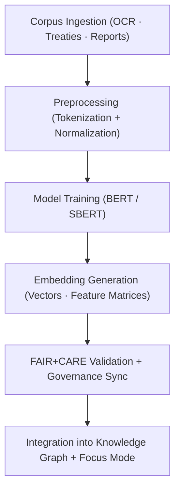

<div align="center">

# 📜 **Kansas Frontier Matrix — Text Embeddings Framework**  
`src/ai/models/embeddings/text_embeddings/README.md`

**Purpose:**  
Describe the **training, validation, and governance workflows** for textual embeddings that power semantic understanding across the **Kansas Frontier Matrix (KFM)** ecosystem.  
The framework converts OCR-derived texts, treaties, and cultural narratives into FAIR+CARE-aligned vector representations for Focus Mode AI and graph integration.

[](../../../../../../docs/)
[](../../../../../../LICENSE)
[](../../../../../../docs/standards/faircare.md)
[](#)

</div>

---

## 📘 Overview

The **Text Embeddings Module** converts textual data — including OCR archives, treaties, reports, and oral histories — into dense semantic vectors used for knowledge graph linking and Focus Mode contextual reasoning.  
All embeddings are produced under **FAIR+CARE governance**, ensuring ethical handling of culturally sensitive content and transparency in feature attribution.

Key Features:
- 🧠 **Transformer-based embedding generation** (Sentence-BERT / multilingual BERT).  
- 📜 **Context alignment** for cultural and historical corpus data.  
- ⚖️ **FAIR+CARE tagging** for sensitivity-aware text representation.  
- ♻️ **ISO 50001 telemetry** for energy and carbon efficiency tracking.  

---

## 🗂️ Directory Layout

```plaintext
src/ai/models/embeddings/text_embeddings/
├── README.md                           # This file — text embeddings documentation
│
├── train_text_embeddings.py             # Main training pipeline
├── configs/                             # Model and training configuration files
│   ├── text_embedding_train.yaml
│   └── telemetry_config.yaml
│
├── logs/                                # Training, evaluation, and governance logs
│   ├── training_log.json
│   ├── evaluation_metrics.json
│   ├── telemetry_metrics.json
│   └── governance_validation.json
│
└── checkpoints/                         # Model checkpoints and checksum registry
    ├── checkpoint_001_pretrain.pt
    ├── checkpoint_002_finetune.pt
    └── checkpoints_manifest.json
```

---

## ⚙️ Embedding Workflow



### Workflow Description
1. **Corpus Ingestion:** Source data collected from historical and cultural archives.  
2. **Preprocessing:** Text normalized, cleaned, and tokenized for multilingual inputs.  
3. **Model Training:** Transformer model trained on cultural language domain.  
4. **Embedding Generation:** Output vectors stored as `.npy` arrays with metadata.  
5. **Governance Integration:** FAIR+CARE compliance reviewed and logged in ledger.

---

## 🧩 Example: Training Configuration (`configs/text_embedding_train.yaml`)

```yaml
model:
  name: "sentence-transformers/all-MiniLM-L12-v2"
  architecture: "transformer"
  embedding_dim: 384
  epochs: 5
  batch_size: 16
  learning_rate: 3e-5
  tokenizer: "bert-base-multilingual-cased"

data:
  source: "../../../../data/processed/text_corpus/"
  validation_split: 0.1
  language_codes: ["en", "es", "fr"]

telemetry:
  enable_energy_tracking: true
  telemetry_ref: "../../../../../../releases/v10.0.0/focus-telemetry.json"

ethics:
  reviewer: "@faircare-council"
  care_tag: "restricted"
  governance_ref: "../../../../../../docs/standards/governance/ROOT-GOVERNANCE.md"
```

---

## ⚖️ FAIR+CARE Governance Matrix

| Principle | Implementation | Validation |
|------------|----------------|-------------|
| **Findable** | All embeddings indexed by corpus ID in SBOM manifest. | SPDX Manifest |
| **Accessible** | Text embeddings released under MIT; restricted datasets under CARE. | Governance Ledger |
| **Interoperable** | Aligned to CIDOC CRM + DCAT metadata standards. | `manifest_ref` |
| **Reusable** | Standardized embedding format (.npy, 768-D vectors). | MCP-DL v6.3 |
| **CARE – Responsibility** | Monitors bias and language drift per dataset. | `faircare-validate.yml` |
| **CARE – Ethics** | CARE masks applied to sensitive or sacred content. | `governance_validation.json` |

---

## 🧮 Example Training Log (`logs/training_log.json`)

```json
{
  "run_id": "text_embeddings_train_2025_11_08",
  "epochs": 5,
  "training_time_min": 260,
  "validation_loss": 0.042,
  "embedding_dim": 384,
  "bias_index": 0.018,
  "faircare_score": 99.2,
  "energy_wh": 940.3,
  "carbon_gco2e": 385.5,
  "reviewed_by": "@faircare-council",
  "telemetry_ref": "../../../../../../releases/v10.0.0/focus-telemetry.json"
}
```

---

## 🧮 Telemetry Metrics (ISO 50001)

| Metric | Description | Example |
|--------|-------------|----------|
| `training_time_min` | Duration of model training. | 260 |
| `energy_wh` | Energy usage per training run. | 940.3 |
| `carbon_gco2e` | CO₂ footprint of training process. | 385.5 |
| `faircare_score` | FAIR+CARE compliance score. | 99.2 |
| `bias_index` | Bias index post-evaluation. | 0.018 |
| `validation_loss` | Model validation performance. | 0.042 |

Telemetry stored in:  
`releases/v10.0.0/focus-telemetry.json`  
Schema: `schemas/telemetry/src-ai-models-embeddings-text-v1.json`

---

## 🔐 Provenance & Governance Integration

- **Governance Ledger:** `releases/v10.0.0/governance/ledger_snapshot.json`  
- **Telemetry Ledger:** `releases/v10.0.0/focus-telemetry.json`  
- **SBOM Manifest:** `releases/v10.0.0/sbom.spdx.json`  
- **CARE Audit:** `logs/governance_validation.json`

### Example Governance Record
```json
{
  "ledger_entry_id": "ledger_2025q4_text_embeddings",
  "auditor": "@kfm-governance",
  "reviewed_by": "@faircare-council",
  "status": "approved",
  "timestamp": "2025-11-08T22:30:00Z"
}
```

---

## 🧾 Citation

```text
Kansas Frontier Matrix (2025). Text Embeddings Framework (v10.0.0).
Defines FAIR+CARE-certified embedding architecture, training workflow, and ethical governance protocols for textual representation learning in the Kansas Frontier Matrix.
```

---

## 🕰️ Version History

| Version | Date | Author | Summary |
|---------:|------|--------|----------|
| v10.0.0 | 2025-11-08 | `@kfm-ai` | Created Text Embeddings module documentation with FAIR+CARE, ISO telemetry, and provenance governance. |

---

<div align="center">

**Kansas Frontier Matrix**  
*Semantic Understanding × FAIR+CARE Governance × Sustainable Intelligence*  
© 2025 Kansas Frontier Matrix · MIT · Master Coder Protocol v6.3 · FAIR+CARE Certified · Diamond⁹ Ω / Crown∞Ω Ultimate Certified  

[Back to Embeddings Suite](../README.md) · [Governance Charter](../../../../../../docs/standards/governance/ROOT-GOVERNANCE.md)

</div>

