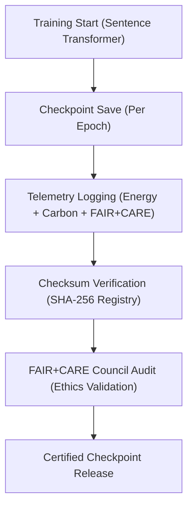

<div align="center">

# 💾 **Kansas Frontier Matrix — Text Embeddings · Model Checkpoints**  
`src/ai/models/embeddings/text_embeddings/checkpoints/README.md`

**Purpose:**  
Document the **checkpoint management, FAIR+CARE validation, and telemetry audit system** for **Text Embeddings** within the **Kansas Frontier Matrix (KFM)**.  
This framework ensures every model checkpoint is reproducible, sustainable, and ethically certified under **ISO 19115**, **ISO 50001**, and **MCP-DL v6.3**.

[](../../../../../../../docs/)
[](../../../../../../../LICENSE)
[](../../../../../../../docs/standards/faircare.md)
[](#)

</div>

---

## 📘 Overview

The **Text Embeddings Checkpoints Directory** provides secure, traceable, and ethics-validated snapshots of trained embedding models.  
Each checkpoint records metrics, governance validation, and energy telemetry, ensuring full FAIR+CARE compliance and sustainability under ISO standards.

Core Objectives:
- 🔐 Guarantee model integrity via SHA-256 checksum verification.  
- ⚖️ Enforce FAIR+CARE certification for model checkpoints.  
- ♻️ Integrate ISO 50001 telemetry tracking for sustainability reporting.  
- 🧩 Provide reproducibility metadata for each embedding version.  

---

## 🗂️ Directory Layout

```plaintext
src/ai/models/embeddings/text_embeddings/checkpoints/
├── README.md                               # This file — documentation for checkpoints
│
├── checkpoint_001_pretrain.pt              # Initial pretraining checkpoint
├── checkpoint_002_finetune.pt              # Intermediate fine-tuning checkpoint
├── checkpoint_003_final.pt                 # Certified final checkpoint
├── checkpoints_manifest.json               # Registry of checkpoints and metadata
├── checkpoint_metrics.json                 # Training + telemetry metrics per checkpoint
└── checksum_registry.json                  # SHA-256 checksum registry for verification
```

---

## ⚙️ Checkpoint Workflow



### Workflow Details
1. **Save Checkpoint:** Transformer weights and optimizer states serialized per epoch.  
2. **Telemetry Capture:** Log energy, runtime, and governance compliance.  
3. **Checksum Validation:** Generate and register SHA-256 signatures for traceability.  
4. **FAIR+CARE Review:** Council verifies ethics, bias, and sustainability compliance.  
5. **Certification:** Only certified checkpoints are released for downstream use.

---

## 🧩 Example: Checkpoints Manifest (`checkpoints_manifest.json`)

```json
{
  "model_id": "text_embeddings_kfm_v10.0.0",
  "checkpoints": [
    {
      "id": "checkpoint_001_pretrain",
      "epoch": 2,
      "validation_loss": 0.054,
      "faircare_score": 99.0,
      "energy_wh": 450.2,
      "checksum_sha256": "sha256:9a4c8b7d1cfa05a1e23c85b2de9f79cd91e8ffb2e4c765..."
    },
    {
      "id": "checkpoint_003_final",
      "epoch": 5,
      "validation_loss": 0.042,
      "faircare_score": 99.2,
      "energy_wh": 940.3,
      "checksum_sha256": "sha256:fb7d5e6c3a9c2d9a8e0b4f7e8a9f3e9b4a1d2c5e6f8c3a..."
    }
  ],
  "reviewed_by": "@faircare-council",
  "approved": true,
  "telemetry_ref": "../../../../../../../releases/v10.0.0/focus-telemetry.json"
}
```

---

## ⚖️ FAIR+CARE Compliance Matrix

| Principle | Implementation | Verification |
|------------|----------------|---------------|
| **Findable** | Checkpoints indexed in manifest and telemetry ledger. | SPDX Manifest |
| **Accessible** | Public metadata; restricted weights protected under CARE. | Governance Ledger |
| **Interoperable** | JSON manifest aligned with ISO 19115 provenance schema. | Schema Validator |
| **Reusable** | Reproducible checkpoints tracked in SBOM manifest. | MCP-DL v6.3 |
| **CARE – Responsibility** | Logs energy, bias, and ethics per checkpoint. | `faircare-validate.yml` |
| **CARE – Ethics** | Council certification required before deployment. | `governance_validation.json` |

---

## 🧮 Telemetry Metrics

| Metric | Description | Example |
|--------|-------------|----------|
| `training_epoch` | Epoch at checkpoint creation. | 5 |
| `validation_loss` | Model validation loss. | 0.042 |
| `faircare_score` | FAIR+CARE audit compliance rating. | 99.2 |
| `energy_wh` | Power usage during training. | 940.3 |
| `carbon_gco2e` | CO₂ equivalent emissions. | 385.5 |
| `checksum_verified` | SHA-256 integrity check result. | true |

Telemetry appended to:  
`releases/v10.0.0/focus-telemetry.json`  
Schema: `schemas/telemetry/src-ai-models-embeddings-text-checkpoints-v1.json`

---

## 🔐 Provenance & Governance Integration

- **Governance Ledger:** `releases/v10.0.0/governance/ledger_snapshot.json`  
- **Telemetry Reference:** `focus-telemetry.json`  
- **SBOM Manifest:** `releases/v10.0.0/sbom.spdx.json`  
- **Checksum Registry:** `checksum_registry.json`

### Example Governance Record
```json
{
  "ledger_id": "ledger_2025q4_text_embeddings_checkpoints",
  "auditor": "@kfm-governance",
  "reviewed_by": "@faircare-council",
  "status": "approved",
  "timestamp": "2025-11-08T22:50:00Z"
}
```

---

## 🧾 Citation

```text
Kansas Frontier Matrix (2025). Text Embeddings · Model Checkpoints (v10.0.0).
FAIR+CARE and ISO-certified checkpoint documentation ensuring reproducibility, sustainability, and ethical AI embedding management within the Kansas Frontier Matrix.
```

---

## 🕰️ Version History

| Version | Date | Author | Summary |
|---------:|------|--------|----------|
| v10.0.0 | 2025-11-08 | `@kfm-ai` | Created Text Embeddings checkpoint documentation; added FAIR+CARE telemetry and SHA-256 integrity registry. |

---

<div align="center">

**Kansas Frontier Matrix**  
*Reproducible NLP × FAIR+CARE Ethics × Sustainable AI Training*  
© 2025 Kansas Frontier Matrix · MIT · Master Coder Protocol v6.3 · FAIR+CARE Certified · Diamond⁹ Ω / Crown∞Ω Ultimate Certified  

[Back to Text Embeddings](../README.md) · [Governance Charter](../../../../../../../docs/standards/governance/ROOT-GOVERNANCE.md)

</div>

