<div align="center">

# 🧾 **Kansas Frontier Matrix — Text Embeddings · Training Logs**  
`src/ai/models/embeddings/text_embeddings/logs/README.md`

**Purpose:**  
Document the **performance, validation, and sustainability logs** generated during the training of **Text Embeddings models** for the **Kansas Frontier Matrix (KFM)**.  
All log entries comply with **FAIR+CARE governance**, **ISO 50001 sustainability standards**, and **MCP-DL v6.3** reproducibility for transparent and ethical AI training.

[](../../../../../../../docs/)
[](../../../../../../../LICENSE)
[](../../../../../../../docs/standards/faircare.md)
[](#)

</div>

---

## 📘 Overview

The **Text Embeddings Training Logs** record all runtime, validation, and audit metrics from the training of textual embedding models used throughout the Kansas Frontier Matrix ecosystem.  
These logs ensure reproducibility, transparency, and ethical compliance, forming part of the **FAIR+CARE governance and telemetry ledgers**.

All logs are verified for:
- Training runtime and energy consumption.  
- FAIR+CARE compliance and governance certification.  
- Bias detection and language fairness metrics.  
- Sustainability and ISO 50001 audit tracking.

---

## 🗂️ Directory Layout

```plaintext
src/ai/models/embeddings/text_embeddings/logs/
├── README.md                             # This file — documentation for training logs
│
├── training_log.json                     # Model training performance and runtime summary
├── evaluation_metrics.json               # Validation and accuracy results
├── bias_drift_report.json                # Bias and fairness audit
├── telemetry_metrics.json                # ISO 50001 energy telemetry
└── governance_validation.json            # FAIR+CARE audit and certification record
```

---

## ⚙️ Logging Workflow

```mermaid
flowchart TD
  A["Text Corpus (OCR · Treaties · Reports)"] --> B["Transformer Training"]
  B --> C["Evaluation & Bias Detection"]
  C --> D["Telemetry Tracking (Energy + Carbon)"]
  D --> E["Governance Audit (FAIR+CARE Validation)"]
  E --> F["Certification & Ledger Integration"]
```



### Log Categories
1. **Training Metrics:** Captures loss curves, runtime, and batch-level stats.  
2. **Evaluation Metrics:** Summarizes accuracy, cosine similarity, and F1 scores.  
3. **Bias Drift Report:** Tracks linguistic or cultural representation fairness.  
4. **Telemetry Metrics:** Records energy and carbon outputs per ISO 50001.  
5. **Governance Validation:** FAIR+CARE Council audit certification record.

---

## 🧩 Example: Training Log (`training_log.json`)

```json
{
  "run_id": "text_embeddings_train_2025_11_08_001",
  "epochs": 5,
  "training_time_min": 260,
  "validation_loss": 0.042,
  "embedding_dim": 384,
  "bias_index": 0.018,
  "faircare_score": 99.2,
  "energy_wh": 940.3,
  "carbon_gco2e": 385.5,
  "reviewed_by": "@faircare-council",
  "telemetry_ref": "../../../../../../../releases/v10.0.0/focus-telemetry.json"
}
```

---

## ⚖️ FAIR+CARE Integration Matrix

| Principle | Implementation | Verified By |
|------------|----------------|--------------|
| **Findable** | Logs indexed via UUID in telemetry and SBOM manifests. | SPDX Manifest |
| **Accessible** | Public metadata; private text datasets under CARE. | FAIR+CARE Council |
| **Interoperable** | JSON schemas conform to ISO 19115 and PROV-O. | Schema Validator |
| **Reusable** | FAIR+CARE audit data reusable across models. | MCP-DL Validation |
| **CARE – Responsibility** | Bias and fairness logged for all linguistic corpora. | `bias_drift_report.json` |
| **CARE – Ethics** | Restricted content redacted per Council rules. | `governance_validation.json` |

---

## 🧮 Example: Bias & Drift Report (`bias_drift_report.json`)

```json
{
  "report_id": "bias_audit_text_embeddings_2025_11_08",
  "language_distribution": {
    "en": 0.65,
    "es": 0.25,
    "fr": 0.10
  },
  "bias_index": 0.018,
  "drift_flag": false,
  "reviewed_by": "@faircare-council",
  "status": "certified",
  "timestamp": "2025-11-08T22:45:00Z"
}
```

---

## 🧮 Telemetry Metrics (ISO 50001)

| Metric | Description | Example |
|--------|-------------|----------|
| `training_time_min` | Duration of model training. | 260 |
| `energy_wh` | Energy usage during training. | 940.3 |
| `carbon_gco2e` | Carbon footprint. | 385.5 |
| `faircare_score` | FAIR+CARE compliance score. | 99.2 |
| `bias_index` | Linguistic fairness deviation. | 0.018 |

Telemetry recorded in:  
`releases/v10.0.0/focus-telemetry.json`  
Schema: `schemas/telemetry/src-ai-models-embeddings-text-logs-v1.json`

---

## 🔐 Governance & Provenance Integration

- **Governance Ledger:** `releases/v10.0.0/governance/ledger_snapshot.json`  
- **Telemetry Ledger:** `releases/v10.0.0/focus-telemetry.json`  
- **SBOM Manifest:** `releases/v10.0.0/sbom.spdx.json`  
- **CARE Compliance Log:** `governance_validation.json`

### Example Governance Record
```json
{
  "ledger_entry_id": "ledger_2025q4_text_embeddings_logs",
  "auditor": "@kfm-governance",
  "reviewed_by": "@faircare-council",
  "status": "approved",
  "timestamp": "2025-11-08T22:46:00Z"
}
```

---

## 🧾 Citation

```text
Kansas Frontier Matrix (2025). Text Embeddings · Training Logs (v10.0.0).
FAIR+CARE-certified logging framework capturing training metrics, bias audits, and sustainability telemetry for text embeddings within the Kansas Frontier Matrix.
```

---

## 🕰️ Version History

| Version | Date | Author | Summary |
|---------:|------|--------|----------|
| v10.0.0 | 2025-11-08 | `@kfm-ai` | Created Text Embeddings training logs documentation with FAIR+CARE governance and sustainability telemetry schema integration. |

---

<div align="center">

**Kansas Frontier Matrix**  
*Ethical NLP Training × FAIR+CARE Certification × Sustainable Intelligence*  
© 2025 Kansas Frontier Matrix · Internal FAIR+CARE Certified · Master Coder Protocol v6.3 · Diamond⁹ Ω / Crown∞Ω Ultimate Certified  

[Back to Text Embeddings](../README.md) · [Governance Charter](../../../../../../../docs/standards/governance/ROOT-GOVERNANCE.md)

</div>

